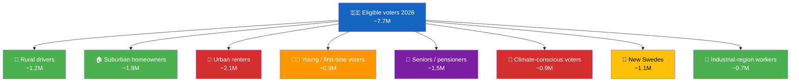
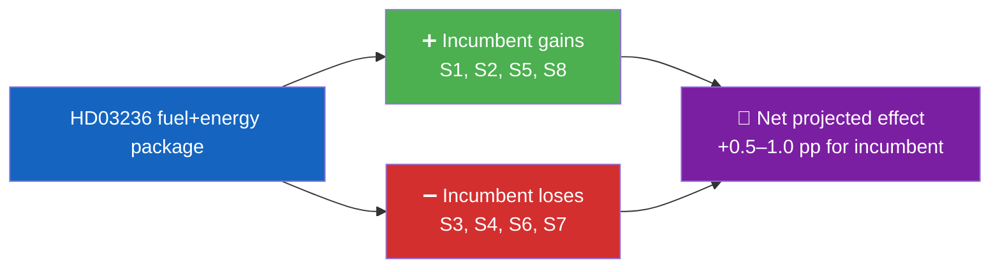

  

<h1 align="center">🫂 Voter Segmentation Template</h1>

  <strong>📊 Evidence-Based Voter-Segment Impact Analysis</strong> 
  <em>🎯 Size · Direction · Magnitude · Volatility · Campaign-Leverage</em>

  
  
  
  

**📋 Document Owner:** CEO | **📄 Version:** 1.0 | **📅 Last Updated:** 2026-04-21 (UTC)
**🏢 Owner:** Hack23 AB (Org.nr 5595347807) | **🏷️ Classification:** Public

> **📌 Template instructions:** Produce whenever a measure has a visible electoral effect (fiscal, welfare, migration, justice, climate). Save as `analysis/daily/${ARTICLE_DATE}/${DOC_TYPE}/voter-segmentation.md`. Segment definitions align with standard SCB demographic clusters plus political-behaviour clusters.

> **✨ What to produce:** A rigorous, SCB-grounded segmentation with population size, directional impact, confidence, volatility (turnout / swing), and the campaign narrative most likely to land. Every segment row includes at least one SCB or demographic source citation.

---

## 📋 Segmentation Context

| Field | Value |
|-------|-------|
| **Segmentation ID** | `VSG-YYYY-MM-DD-NNN` |
| **Generated** | `YYYY-MM-DD HH:MM UTC` |
| **Measure(s) under analysis** | `dok_ids` |
| **Segmentation taxonomy** | `SCB-Demographic v2 + Political-Behaviour v1` |
| **Universe (eligible voters 2026)** | `~7.7 M` |
| **Overall Confidence** | `🟩 HIGH` |

---

## 🗺️ Segmentation Overview

---

## 🗂️ Segment Impact Matrix

| # | Segment | Size | Direction | Magnitude (1–5) | Volatility | Current bloc lean | Source |
|:-:|---------|:----:|:---------:|:---------------:|:----------:|:----------------:|--------|
| S1 | Rural drivers (non-metro + private car primary) | 1.2 M | ➕ incumbent | 4 | Medium | Mixed | SCB Befolkning 2025; Vehicle register |
| S2 | Suburban homeowners with heating costs | 1.8 M | ➕ incumbent | 3 | Low | M/KD lean | SCB Boende 2025 |
| S3 | Urban renters | 2.1 M | ➖ opposition | 2 | High | S/V lean | SCB Boende 2025 |
| S4 | Young / first-time voters | 0.9 M | ➖ opposition | 3 | High | MP/V lean | SCB Åldersstatistik 2025 |
| S5 | Seniors / pensioners | 1.5 M | ➕ incumbent (energy rebate) | 3 | Low | Mixed | SCB Åldersstatistik 2025 |
| S6 | Climate-conscious voters | 0.9 M | ➖ opposition | 4 | Medium | MP/V/C lean | Cross-poll Naturvårdsverket |
| S7 | New Swedes (citizens by naturalisation) | 1.1 M | ➖ opposition (justice-package signal) | 3 | High | S/MP lean | SCB Befolkning 2025 |
| S8 | Industrial-region workers | 0.7 M | ➕ incumbent (wind-law compensation) | 2 | Medium | SD/M lean | Arbetsförmedlingen 2025 |

---

## 🔎 Segment Deep-Dive — S1 Rural Drivers (illustrative; repeat per segment)

| Attribute | Value |
|-----------|-------|
| **Definition** | Households in sparsely populated zones (H + glesbygd per SCB) where private car is the primary commute mode |
| **Size** | ~1.2 M eligible voters |
| **Geography** | Norrland inland, inner Småland, south-east Östergötland, rural Skåne |
| **Voting behaviour 2022** | 36 % M/KD/L, 24 % S, 25 % SD, balance across others |
| **Policy effect of HD03236** | SEK ~3 500/year pump-price saving per driver |
| **Signal strength** | 🟩 HIGH — visible at petrol station within 8 weeks |
| **Campaign narrative that lands** | "Your government delivered affordable driving" |
| **Counter-narrative (opposition)** | "Regressive cut; urban renters pay via missed climate investment" |
| **Volatility** | Medium — segment shifted to SD 2018, returned partially 2022 |
| **Turnout likelihood** | 81 % (above national 2022 average 84 %) |

---

## 🏗️ Cross-Segment Trade-Offs

| Trade-off axis | Incumbent wins | Incumbent loses | Net |
|----------------|---------------|----------------|:---:|
| Rural vs Urban | 🚗 1.2 M | 🏢 2.1 M | −0.9 M by raw headcount, but intensity skews pro-incumbent |
| Homeowner vs Renter | 🏠 1.8 M | 🏢 2.1 M | −0.3 M |
| Climate vs Affordability | 🛢️ 1.2 + 1.8 M | 🌱 0.9 M | +2.1 M in favour of affordability |

---

## 🎯 Campaign-Leverage Matrix

| Segment | Best messaging channel | Best messenger | Risk of backfire |
|---------|-----------------------|----------------|:---------------:|
| S1 Rural drivers | Community radio, regional press | Local M MP | 🟢 Low |
| S2 Suburban homeowners | Direct mail, Facebook | KD spokesperson | 🟢 Low |
| S3 Urban renters | Instagram, TV debate | V / S housing spokesperson | 🟠 Medium |
| S4 Young voters | TikTok, Twitch, YouTube Shorts | Young MP cohort | 🟠 Medium |
| S5 Seniors | Local newspaper, Svenskt Näringsliv | KD leader | 🟢 Low |
| S6 Climate-conscious | Podcasts, op-eds | MP / C leaders | 🟠 Medium |
| S7 New Swedes | Multilingual press, community networks | S spokespersons | 🟠 Medium |
| S8 Industrial workers | Union channels, local TV | SD / M industry spokes | 🟢 Low |

---

## 🧮 Quantified Net-Effect Model

**Assumptions:** SIFO baseline government-bloc support 47 %; opposition-bloc 51 %; undecided 2 %.

| Effect | Expected shift | Reasoning |
|--------|:-------------:|-----------|
| S1 turnout boost + 3 % retention | +0.3 pp | Fuel-saving visibility |
| S2 retention + 1 % swing | +0.2 pp | Energy rebate |
| S3 defection to S/V | −0.2 pp | Exclusion from measure |
| S6 defection to MP/C | −0.3 pp | Climate-coherence signal |
| **Net projected shift** | **+0.0 pp to +0.5 pp** | Small net positive; high dispersion |

---

## 📎 Sources

| Source | Use |
|--------|-----|
| `scb` MCP — Befolkning, Åldersstatistik, Boende | Segment sizing |
| SIFO / Novus / Demoskop monthly poll | Directional signals |
| Valmyndigheten 2022 result | Baseline voting behaviour |
| World Bank Development Indicators | Socio-economic controls |

---

**Document Control**
- **Template path:** `/analysis/templates/voter-segmentation.md`
- **Referenced by:** [ai-driven-analysis-guide.md § Step 5](../methodologies/ai-driven-analysis-guide.md#step-5--extensions-family-c--d-produced-when-warranted)
- **Classification:** Public
- **Next Review:** 2026-07-21
