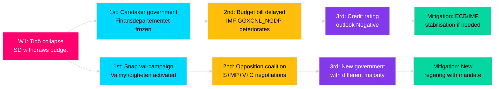
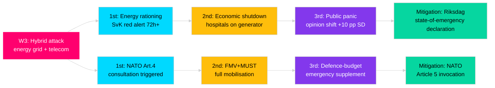
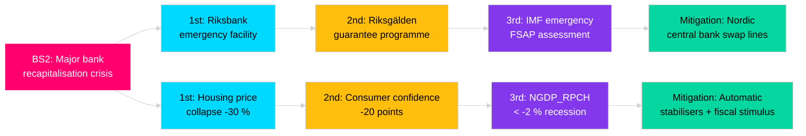

<!-- SPDX-FileCopyrightText: 2024-2026 Hack23 AB -->
<!-- SPDX-License-Identifier: Apache-2.0 -->

# Wildcards & Black-Swan Events — {{ARTICLE_TYPE}} · {{ARTICLE_DATE}}

> **Analytical supplementary (optional).** Captures low-probability / high-impact events that sit **outside** the 3–5 main scenarios in `scenario-analysis.md`. Useful for long-horizon forecasting (`monthly-review`), election-year aggregations, and any topic where cascading consequences are plausible. Pairs with `scenario-analysis.md` (adds tail), `risk-assessment.md` (extends posterior tail), and `forward-indicators.md` (early-warning triggers).
>
> **Methodology** → [`analysis/methodologies/analytical-supplementary-methodology.md § Wildcards & Black-Swans`](../methodologies/analytical-supplementary-methodology.md#wildcards--black-swans).
> **Not counted in the 23 core artifacts.** Non-blocking in `05-analysis-gate.md`.

## 🔄 Tradecraft Context

- **Artifact class** — Analytical supplementary (optional, never blocking)
- **Use when** — Long-horizon forecasting (`monthly-review`), election-year aggregations, or any topic where cascading consequences of tail events are plausible; minimum horizon 6 months; do not produce for routine daily runs unless a trigger event (§Scope) explicitly warrants
- **Pairs with** — `scenario-analysis.md` (adds tail beyond 3–5 main scenarios), `risk-assessment.md` (extends posterior tail), `forward-indicators.md` (early-warning triggers), `devils-advocate.md` (challenges the nominal-model priors)
- **Methodology** — [`analytical-supplementary-methodology.md § Wildcards & Black-Swans`](../methodologies/analytical-supplementary-methodology.md#wildcards--black-swans)
- **Workflow status** — Not counted in the 23 core artifacts; non-blocking in [`05-analysis-gate.md`](../../.github/prompts/05-analysis-gate.md)
- **Confidence floor** — This artifact should be labelled 🟡 by default; upgrade to 🟢 only when ≥ 3 independent historical analogues anchor each black-swan candidate
- **F3EAD stage** — Exploit (synthesise tail information from Find+Fix into structured foresight); do not conflate with scenario-analysis (which covers nominal distribution)

## 📋 Scope declaration

- **Horizon** — [3 m / 6 m / 12 m / 24 m / to-2030] (choose one; affects WEP calibration)
- **Domain filter** — [political / economic / security / social / technological / environmental / all] — list which domains are in-scope and why
- **Source set** — open-source red-teaming, historical analogues (Swedish + comparable democracies), expert elicitation (named where possible), scenario-analysis.md anchor, SÄPO/MSB annual threat reports, NATO/EU horizon-scanning documents
- **Trigger** — [identify the trigger event, election proximity, or analytical gap that prompted this file]
- **Analyst note** — Declare your **reference class forecast** baseline (what base-rate do you use for "political wildcard" in a stable Nordic democracy?) and justify any departure from it

## 🔑 Definitions (ICD 203-aligned)

- **Wildcard** — plausible low-probability event (WEP `Unlikely` to `Remote`, ≈ 5–37 %, per [`political-style-guide.md`](../methodologies/political-style-guide.md#-words-of-estimative-probability-wep--odni-confidence-overlay)) with material impact (≥ 2 on a 1–5 scale) on the political system. Must have a traceable causal mechanism, not just imaginative novelty.
- **Black-swan (in Taleb sense)** — an event outside the current model's probability distribution, recognisable only in hindsight. We document **candidate black-swans** — extreme-tail events our current priors would rate `Remote` or lower (typically < 5 %) but where a plausible causal chain exists once the mechanism is exposed. The act of listing them converts them to wildcards.
- **Cascade** — a sequence of ≥ 2 downstream consequences triggered by a single wildcard event, each amplifying or redirecting the original shock. Cascade length correlates with system fragility.
- **Resilience** — the system's (coalition, institution, economy) capacity to absorb a wildcard shock and return to functional equilibrium within the recovery lead time without structural change.

### WEP calibration anchor (ICD 203 / ODNI)

| WEP band | Approximate probability | Wildcard class |
|----------|------------------------|----------------|
| Remote | < 5 % | Black-swan candidate |
| Very unlikely | 5–20 % | Wildcard (extreme tail) |
| Unlikely | 20–45 % | Wildcard (moderate tail) |
| Even chance | ~50 % | Outside this artifact (use scenario-analysis) |

---

## 📅 Wildcard register (≥ 8; cite evidence for each)

> **Instructions** — For each row: describe the event precisely (not vague); assign WEP from the calibration anchor; name ≥ 1 trigger indicator that could be monitored in advance; estimate lead time (days between trigger signal and impact onset); identify impact vectors using domain codes (C = Coalition, F = Fiscal, S = Security, SC = Social contract, I = Institutional, E = Electoral); note counter-measures already in place.

| ID | Event | Domain | Prior WEP | Trigger indicator | Monitoring source | Lead time | Impact vector(s) | Counter-measures in place | Admiralty |
|----|-------|--------|-----------|-------------------|-------------------|-----------|------------------|---------------------------|-----------|
| W1 | Tidö coalition collapses mid-term (e.g. SD withdraws budget support) | Political | Very unlikely (≈ 15 %) | ≥ 3 consecutive SD defection votes on budget items; open SD leadership attacks on M | search_voteringar + search_anforanden | 2–6 weeks | C, F, E | Statsminister's confidence-management; Riksdag's 4-party coordination format | B2 |
| W2 | Riksbank forced to emergency rate cut ≥ 200 bps on recession shock | Economic | Very unlikely (≈ 10 %) | IMF WEO NGDP_RPCH SWE < -1 %; STIBOR spread inversion; housing price index -20 % MoM | IMF WEO vintage + SCB BO0501 | 3–6 months | F, SC, E | Riksbank's 9-member board; inflation mandate anchor; Finansinspektionen buffers | B2 |
| W3 | Major hybrid attack on Swedish critical infrastructure (energy grid / telecom) | Security | Unlikely (≈ 20 %) | SÄPO elevated threat level; MSB attribution report; NATO Article 5 debate | MSB/SÄPO reports + NATO SecGen | 1–4 weeks | S, I, C | FRA + MUST signals intelligence; MSB krisberedskap; NATO Article 5 | B2 |
| W4 | Mass social unrest triggered by housing/cost-of-living crisis in ≥ 3 cities | Social | Unlikely (≈ 25 %) | SCB Living-conditions HINK survey deterioration; SVT/Demoskop polarisation index ≥ +2 σ | SCB LE0101 + SVT opinion | 6–12 weeks | SC, E, C | Municipal social services; police kapacitet; arbetsmarknadens parter | B3 |
| W5 | AI-generated deepfake of Swedish party leader triggers election interference | Technological | Very unlikely (≈ 12 %) | NCSC/MSB AI-threat bulletin; viral video pre-election; Valmyndigheten integrity report | MSB/NCSC annual AI-threat + media monitoring | < 72 hours | E, I, S | Platform content moderation; MSB fact-check unit; Valmyndigheten protocols | C2 |
| W6 | Climate emergency declaration forces snap energy-rationing legislation | Environmental | Very unlikely (≈ 8 %) | SMHI extreme-drought index ≥ 3 consecutive seasons; SvK (Svenska Kraftnät) red alert | SMHI climate monitoring + SvK grid status | 1–3 months | F, SC, C | Energimyndigheten beredskapsplaner; Nordic energy-sharing agreements; EU Emergency Regulation | B2 |
| W7 | Sweden's NATO candidacy obligations trigger direct military commitment (active conflict) | Cross-domain | Very unlikely (≈ 10 %) | NATO Article 5 invocation; Baltic-state deterioration; defence-bill vote outcome | NATO official communiqués + FMV + FöU betänkanden | 2–8 weeks | S, F, C, I | 2028 defence bill ceiling; Nordic NORDEFCO; NATO command structure | B1 |
| W8 | Debt-ceiling or EU fiscal-rule breach forces Sweden into Commission excessive-deficit procedure | External (geo) | Remote (≈ 4 %) | IMF WEO GGXCNL_NGDP < -3 % for 2 years; Finansdepartementet mid-year forecast revision | IMF FM/WEO + Finansdepartementet + EU Commission | 6–18 months | F, I, E | Spring fiscal framework bill; Riksgälden debt-management mandate; EU SGP reform flexibility clauses | B2 |
| W9 | Constitutional crisis: Statsminister loses confidence vote and no replacement forms within 4 attempts | Political | Remote (≈ 3 %) | Talmannen's three PM-nominations failing; major party split; public disapproval ≥ 70 % | search_voteringar (confidence votes) + SVT opinion | Days | C, I, E | Regeringsformen 6:3–6:5 mandatory dissolution; Talmannen brokerage role | A2 |

---

## 🦢 Black-swan candidates (≥ 3)

> **Instructions** — A candidate black-swan is an event your current models explicitly under-weight (typically < 5 %). The task is to expose the causal mechanism that makes it conceivable, not to assign a high probability. Each candidate must: (a) explain why the current consensus under-weights it (cognitive/structural bias), (b) provide ≤ 4-step causal chain, (c) name an early-warning signal, (d) estimate recovery lead time (how long before political system restabilises).

| ID | Event | Why current models under-weight it | Minimum plausible causal chain (≤ 4 steps) | Early-warning signal | Recovery lead time |
|----|-------|-----------------------------------|--------------------------------------------|---------------------|--------------------|
| BS1 | Sweden votes in riksdag to suspend EU membership negotiation | Availability heuristic: Sweden's EU membership has been assumed stable since 1995; no mainstream party advocates exit. Anchoring on UK Brexit as "other country" blinds forecasters to domestic drift. | (1) SD achieves ≥ 30 % in 2026 election → (2) SD–M majority requires EU-sceptic concession package → (3) triggering referendum debate in government program → (4) narrow majority votes for consultative referendum | SD manifesto language shift toward "reverse EU powers to Riksdag"; SD–M bilateral meetings outside normal coalition format | 18–36 months of political turbulence; EU acquis suspension would take years |
| BS2 | Major bank (SEB / Swedbank / Handelsbanken) requires emergency state recapitalisation | Home-country bias: Swedish banks score highly on EBA stress tests; Baltic exposure risks treated as idiosyncratic. Analysts discount correlated real-estate + Baltic sovereign shock. | (1) Baltic sovereign debt crisis → (2) Swedish bank Baltic loan impairment > 15 % of Tier-1 capital → (3) Finansinspektionen downgrades capital adequacy → (4) Riksbank emergency facility fails to stem deposit flight | EBA stress test sensitivity sub-scores for Baltic sovereign; IMF FSAP Sweden satellite; covered bond spread | 12–24 months; structural fiscal cost 3–8 % GDP (historical banking crisis range) |
| BS3 | Assassination or serious incapacitation of Statsminister mid-term | Base-rate neglect: Western political assassination frequency is extremely low; forecasters treat it as outside the model. However, regional threat environment (hybrid warfare, lone-actor radicalisation) has elevated structural risk since 2022. | (1) Elevated adversary motivation (e.g. NATO-related retaliation) → (2) SÄPO threat level upgrade missed or delayed → (3) security gap in public appearance → (4) serious incident | SÄPO threat level for Swedish leadership targets; MSB/FRA threat bulletin; analogues in Nordic region (Olof Palme 1986) | Constitutional succession is clear (Talmannen/vice); political shock 6–18 months; confidence in institutions potentially lasting scar |

---

## ⛓ Cascading consequence trees (pick ≥ 2 from the registers)

> Each tree must have ≥ 3 consequence layers. Colour scheme: event=red, 1st-order=cyan, 2nd-order=yellow, 3rd-order=purple, mitigation lever=green.

### Cascade A — Tidö coalition collapse (W1)



### Cascade B — Hybrid attack on critical infrastructure (W3)



### Cascade C — Swedish bank recapitalisation (BS2)



---

## 📊 Historical analogues as prior anchors

> Each wildcard or black-swan candidate should be grounded in at least one historical analogue from Sweden or a comparator democracy. This section prevents model anchoring purely on the nominal scenario.

| Wildcard / BS | Historical analogue | Country | Year | Outcome | Key lesson for current assessment |
|---------------|---------------------|---------|------|---------|-----------------------------------|
| W1 (coalition collapse) | Centre-right minority lost confidence vote; hung parliament → snap election | SE | 2014 | S+MP minority formed government | Hung parliament resolvable under RF; risk is 6–12 month policy freeze |
| W2 (Riksbank emergency cut) | Riksbank raised to 500 % overnight rate to defend SEK peg | SE | 1992 | ERM exit + SEK float | Monetary credibility can shatter quickly; floating rate now a buffer but not panacea |
| W3 (hybrid attack) | Grid attacks preceded by months of disinformation; election-period critical-infra breach | EE | 2007 | NATO Article 4 consultations; rapid recovery | Small democracies recover faster with pre-positioned incident plans |
| BS2 (bank recapitalisation) | Nordbanken/Gota Bank crisis; state took over both | SE | 1991–92 | Full recapitalisation; 4 % GDP fiscal cost | Sweden has done this before and managed orderly recovery; public ownership not taboo |
| BS3 (leader assassination) | Olof Palme assassination; constitutional succession operated correctly | SE | 1986 | Ingvar Carlsson succeeded within days; political shock lasted years | RF succession chain is robust; psychological/trust impact is the durable damage |

---

## 🧭 Early-warning indicators (feed `forward-indicators.md`)

> Every row here MUST surface in at least one horizon section of `forward-indicators.md`. Record the data source tool, threshold, lead time, and the analyst/owner responsible for monitoring.

| Wildcard ID | Indicator | Data source / MCP tool | Threshold | Monitoring frequency | Lead time | Owner |
|-------------|-----------|------------------------|-----------|---------------------|-----------|-------|
| W1 | SD defection vote count per budget cycle | `search_voteringar` (party=SD, rost=Nej on government motion) | ≥ 3 defections in any 30-day window | Weekly | 2–6 weeks | Intelligence Operative |
| W1 | Open SD–M criticism in anföranden | `search_anforanden` (party=SD, text="Moderaterna") | Adversarial framing in ≥ 2 floor speeches | Weekly | 4–8 weeks | News Journalist |
| W2 | IMF WEO Sweden NGDP_RPCH | `tsx scripts/imf-fetch.ts weo --country SWE --indicator NGDP_RPCH` | < 0 % forecast for current year | Per WEO vintage (Apr/Oct) | 3–6 months | Data Pipeline |
| W2 | SCB housing price index (BOPris) | `scb` PxWeb `BO0501` | MoM < -5 % for 3 consecutive months | Monthly | 2–4 months | Data Pipeline |
| W3 | SÄPO annual threat report upgrade | MSB/SÄPO annual publications (monitor via news) | Threat level elevated to "high" or above | Annual + event-driven | 1–4 weeks | Security Architect |
| W5 | MSB/NCSC AI deepfake detection bulletin | MSB press page (news monitoring) | Any bulletin mentioning election candidates | Event-driven | < 72 hours | Intelligence Operative |
| W7 | NATO Article 4 consultation activation | NATO official communiqués | Any Article 4 invocation by Baltic state | Event-driven | 2–8 weeks | Intelligence Operative |
| W8 | EU Commission EDP monitoring letter | EUR-Lex / EC press | Any Swedish monitoring letter | Annual | 6–18 months | Data Pipeline |
| BS1 | SD manifesto language on EU | SD party congress documents (news monitoring) | "konsultativ folkomröstning" appearing in SD program | Per party congress | 12–24 months | Intelligence Operative |
| BS2 | EBA stress test Baltic sub-scores | EBA transparency exercise (public) | Baltic loan impairment ratio > 8 % | Annual | 6–12 months | Data Pipeline |

---

## 🛡 Resilience assessment

> Score each dimension 1–5 (5 = highest resilience). Cite evidence. Identify gaps and recommend improvements.

| Resilience dimension | Current state (1–5) | Evidence (source + date) | Gap | Recommendation | Priority |
|---------------------|---------------------|--------------------------|-----|----------------|----------|
| Institutional redundancy | 4 | Riksdag Riksmöte 2025/26 plenary continuity; caretaker-government mechanism under RF 6:5; Talmannen's four-nomination process (A1) | Single point of failure: RF requires ≥ 3 failed nominations before dissolution — adds weeks of policy vacuum | Pre-negotiate cross-bloc understanding on confidence thresholds; update RF 6 commentary (grundlags-utredning) | Medium |
| Fiscal buffer | 3 | IMF WEO 2026-Apr: GGXWDG_NGDP SWE ≈ 30 % (well below EU average); annual surplus target 0.33 % of GDP in financial policy framework (Finanspolitiska rådet 2025) | Buffer narrows if defence spending rises to 2.5 % GDP as pledged; structural balance sensitive to housing market shock | Maintain Riksgälden's buffer stock; review surplus target in light of new defence commitment | High |
| Coalition flexibility | 3 | Current Tidö four-party format is one of narrowest majority governments (174/349); 2022 election produced only 1-seat majority | Minimal flexibility: any 2 MP defections lose the kammaren majority; no institutionalised cross-bloc emergency coalition mechanism | Pre-negotiate emergency cooperation protocol with Centerpartiet as backstop; model 2–3 party alternative coalitions via `coalition-mathematics.md` | High |
| Information-integrity resilience | 3 | MSB "Informationsoperationer" annual report 2025; Valmyndigheten election-integrity programme; Swedish Press Council (PO) | AI-generated disinformation not yet systematically monitored pre-election; no compulsory platform takedown regime in Sweden | Expand MSB deepfake monitoring; accelerate EU DSA enforcement in Swedish context; brief Valmyndigheten | High |
| External alliance depth | 5 | NATO full membership (2024); Nordic NORDEFCO; EU defence cooperation; bilateral DCA with US (2025) | Alliance obligations now create new exposure (Art. 5 commitment) as well as security | Active NATO participation in planning; FMV deliveries per 2028 defence plan; maintain Nordic diplomatic channel | Low |

---

## 🗳️ Election 2026 implications

> This section is **mandatory** when `{{ARTICLE_TYPE}}` is `monthly-review`, `election-2026-analysis`, or `week-ahead` within 180 days of val-dag (expected September 2026). Wildcards and black-swans have outsized electoral impact because they compress decision timelines and amplify party-sorting effects.

| Wildcard / BS | Electoral impact mechanism | WEP | Favours (likely) | Penalises (likely) | Evidence basis |
|---------------|---------------------------|-----|-------------------|--------------------|----------------|
| W1 (coalition collapse) | Snap election; Tidö parties contest on record; centrist defection rewarded | Very unlikely (12 %) | S (opposition), C (gains from Tidö collapse) | M (accountability), SD (loses power-broker role) | Historical analogue: 2014 snap election |
| W3 (hybrid attack) | Security rally-round-flag; defence credibility dominates agenda | Very unlikely (15 %) | M+KD+SD (security-policy owners), KD (values-defence) | V+MP (anti-military record) | MSB scenario planning |
| W5 (deepfake) | Epistemic crisis; trust in all parties drops; incumbents disproportionately harmed | Very unlikely (12 %) | N/A — systemic harm | Governing coalition (responsibility narrative) | NCSC assessment |
| W8 (EU EDP) | Austerity framing; SP parties blamed for fiscal excess | Remote (3 %) | SD (EU-critical), V (social spending protectors) | M+KD (fiscal responsibility owners) | IMF / EC monitoring |

---

## 🎯 PIR feedback

| PIR | Addressed by wildcard(s) | Coverage quality | Gap | Recommended action |
|-----|--------------------------|-----------------|-----|-------------------|
| PIR-1 Coalition stability | W1, W9 | High — direct coverage | Intra-SD leadership dynamics not tracked | Add SD internal monitor to forward-indicators |
| PIR-2 Economic trajectory | W2, W8, BS2 | Medium — covers tail events, not central path | Central-path covered in scenario-analysis | No gap in this file |
| PIR-3 Security / external threats | W3, W7, BS3 | Medium — covers major attack and military commitment | Sub-threshold hybrid operations not listed | Add W10 for persistent low-level hybrid below Article 5 threshold |

---

## 🔗 Cross-links

- [`scenario-analysis.md`](scenario-analysis.md) — main scenarios; this file extends the long tail beyond those 3–5 scenarios
- [`risk-assessment.md`](risk-assessment.md) — tail-risk register rows cite wildcard IDs (W1–W9, BS1–BS3)
- [`forward-indicators.md`](forward-indicators.md) — trigger indicators in §Early-warning populate ≥ 1 horizon section there
- [`historical-parallels.md`](historical-parallels.md) — analogue events in §Historical analogues are sourced from that artifact
- [`devils-advocate.md`](devils-advocate.md) — hypothesis cluster for "current consensus mis-prices tail"
- [`coalition-mathematics.md`](coalition-mathematics.md) — W1 / W9 cascade A uses seat arithmetic from this file
- [`analysis/imf/README.md`](../imf/README.md) — fiscal / monetary indicators for W2, W8, BS2 — use `WEO:NGDP_RPCH`, `WEO:GGXCNL_NGDP`, `FM:GGXWDG_NGDP`

---

**Template version:** v2.0 · **Last updated:** 2026-04-25

---

## ✅ Pass-2 Self-Audit Checklist (v4.4 — required)

> **Purpose:** AI-FIRST principle requires a Pass-2 read-back-and-improve. After producing this artifact in Pass 1, re-read it end-to-end and verify each item below. Document any remediation in [`methodology-reflection.md`](methodology-reflection.md) §"Pass-2 audit log". Any unchecked ❌ box at the end of Pass 2 forces a Pass-3 rewrite of the affected section.

- [ ] **Tradecraft anchors honoured** — F3EAD stage matches the artifact's role; PIRs declared in the §Tradecraft Context block are actually addressed in the body; Admiralty grades attached to every external source; WEP band + ODNI confidence on every probabilistic judgement.
- [ ] **Source diversity floor met** — at least the minimum number of independent MCP sources required by the artifact's tradecraft block are cited; single-source claims are explicitly labelled `[SINGLE-SOURCE — corroboration pending]`.
- [ ] **Evidence specificity** — every quantified claim cites a `dok_id` (Riksdag), an SCB / IMF dataflow code, or a named external source with date; no "according to data" / "studies show" hand-waves.
- [ ] **Named-actor discipline** — every political claim names ≥ 1 person (party + role + dated act/quote) or labels the absence (`[diffuse — no named actor]`).
- [ ] **Counter-narrative present** — at least one explicit competing hypothesis, dissent quote, or framed objection appears in the body; "no opposition recorded" is itself a finding to label, not silence.
- [ ] **Election 2026 lens applied** — the §"Election 2026 Implications" subsection (or equivalent) addresses electoral salience, coalition pressure, and forward indicators; not boilerplate.
- [ ] **No illustrative content shipped as fact** — every `[REQUIRED]` placeholder is filled OR removed; every `Example:` block is clearly fenced or removed; no fabricated `dok_id`, vote count, or quote leaks into the final artifact.
- [ ] **Cross-references resolve** — every `[link](file.md)` in this artifact points to a file that exists in the run folder (`analysis/daily/$ARTICLE_DATE/$SUBFOLDER/`) or to a methodology / template under `analysis/`.
- [ ] **Mermaid renders** — every fenced ` ```mermaid ` block parses (no missing class definitions, no orphan nodes, no >40-node graphs that overflow viewport on mobile).
- [ ] **Line-floor check** — artifact length ≥ the per-artifact floor in [`reference-quality-thresholds.json`](../methodologies/reference-quality-thresholds.json); shorter artifacts trigger Pass-2 rewrite, never a `[truncated]` note.

