<!-- SPDX-FileCopyrightText: 2024-2026 Hack23 AB -->
<!-- SPDX-License-Identifier: Apache-2.0 -->

# ⚙️ Workflow Audit Template — Agentic Run Self-Assessment

> **📌 Template Instructions** — Copy to `analysis/daily/$ARTICLE_DATE/$SUBFOLDER/workflow-audit.md`. Produced at the end of Pass 2 as a structured self-audit of how the 7-module prompt pipeline was executed. See [`per-artifact-methodologies.md §workflow-audit`](../methodologies/per-artifact-methodologies.md#workflow-audit).

> **🎯 Purpose** — Transparent record of workflow execution: which phases ran, which MCP tools were called, which rules of [`ai-driven-analysis-guide.md`](../methodologies/ai-driven-analysis-guide.md) were satisfied, and where the run fell short. Combined with [`reference-analysis-quality.md`](reference-analysis-quality.md) it is the two-artifact pair that answers "was this a good run?".

## 🔄 Tradecraft Context

This artifact is produced at the end of **Pass 2** to verify that the workflow followed the repository's full analysis contract before article publication. It documents **actual execution**, not intentions: prompt modules run, MCP/tool usage, validation gates reached, deviations from standard procedure, and whether the required **AI FIRST** second-pass improvement was genuinely completed.

Use this template as an evidence-backed self-audit of tradecraft quality. Record where the run met the required methodology, where shortcuts or skips occurred, and what risks those deviations introduce for analytical completeness, reproducibility, or policy compliance. If fast paths, partial runs, or fallback behaviours were used, state them explicitly and assess their impact.

---

## 📋 Document Metadata

```yaml
articleType: [REQUIRED]
runId: [REQUIRED]
date: [REQUIRED: YYYY-MM-DD]
analysisPhase: workflow-audit
confidenceLevel: [REQUIRED: HIGH / MEDIUM / LOW]
rulesAudited: [REQUIRED: integer]
complianceRate: [REQUIRED: 0-100]
passTwoCompleted: [REQUIRED: true/false]
```


---

## 1️⃣ Prompt Module Execution Summary

```mermaid
%%{init: {"theme":"dark","themeVariables":{"primaryColor":"#1565C0","primaryTextColor":"#ffffff","lineColor":"#90CAF9","secondaryColor":"#2E7D32","tertiaryColor":"#FF9800","fontFamily":"Inter, Helvetica, Arial, sans-serif"}}}%%
flowchart LR
    M00["00 — base contract"] --> M01["01 — bash & shell"]
    M01 --> M02["02 — MCP access"]
    M02 --> M03["03 — data download"]
    M03 --> M04["04 — analysis pipeline (Pass 1 + Pass 2)"]
    M04 --> M05["05 — analysis gate"]
    M05 --> M06["06 — article generation"]
    M06 --> M07["07 — commit & PR"]
```



Annotate each node ✅ / ⚠️ / ❌.

| Module | Status | Wall-clock | Notes |
|--------|:------:|:----------:|-------|
| `00-base-contract.md` | `[…]` | `[min]` | — |
| `01-bash-and-shell-safety.md` | `[…]` | `[min]` | — |
| `02-mcp-access.md` | `[…]` | `[min]` | — |
| `03-data-download.md` | `[…]` | `[min]` | fast-path `SKIP_ANALYSIS` = `[true/false]` |
| `04-analysis-pipeline.md — Pass 1` | `[…]` | `[min]` | floor `[standard 15 / deep 20 / comprehensive 25]` |
| `04-analysis-pipeline.md — Pass 2` | `[…]` | `[min]` | floor `[standard 7 / deep 10 / comprehensive 12]` |
| `05-analysis-gate.md` | `[…]` | `[min]` | — |
| `06-article-generation.md` | `[…]` | `[min]` | — |
| `07-commit-and-pr.md` | `[…]` | `[min]` | — |

**Total runtime** — `[HH:MM:SS]`. Under 45 min → insufficient iteration (AI-FIRST violation). Over 70 min → likely infinite loop, investigate.

---

## 2️⃣ Phase-Checkpoint Log

| Checkpoint label | Time | Artifacts snapshotted | Recovery used? |
|------------------|------|-----------------------|:--------------:|
| `phase-04-pass1` | `[ts]` | `[#]` | `[y/n]` |
| `phase-04-pass2` | `[ts]` | `[#]` | `[y/n]` |
| `phase-05-gate` | `[ts]` | — | `[y/n]` |
| `phase-06-article` | `[ts]` | — | `[y/n]` |
| `phase-07-commit` | `[ts]` | — | `[y/n]` |

Missing checkpoint → ⚠️ flag, document cause.

---

## 3️⃣ Core-Principle Compliance Audit

Audit against the 11 core principles of [`ai-driven-analysis-guide.md`](../methodologies/ai-driven-analysis-guide.md). Mark ✅ / ⚠️ / ❌ with evidence.

| # | Principle | Status | Evidence |
|:-:|-----------|:------:|----------|
| 1 | Read all methodologies before writing | `[…]` | `[one tool call per file logged]` |
| 2 | Read all 23 templates before writing | `[…]` | `[…]` |
| 3 | Pass 1 produces all 23 artifacts | `[…]` | `[manifest of files created]` |
| 4 | Pass-1 snapshot copied to `pass1/` | `[…]` | `[ls pass1/`] |
| 5 | Pass 2 improves every artifact | `[…]` | `[diff summary from cross-run-diff if same-type]` |
| 6 | Evidence standard (dok_id / vote / named actor / URL + Admiralty) | `[…]` | `[spot-check table below]` |
| 7 | WEP + horizon on every forecast | `[…]` | `[sample]` |
| 8 | Party-neutrality arithmetic done | `[…]` | `[reference-analysis-quality §4]` |
| 9 | ≥ 10 SATs applied | `[…]` | `[methodology-reflection §SATs]` |
| 10 | `methodology-reflection.md` ICD 203 audit complete | `[…]` | `[link]` |
| 11 | DIW tiering coherent (L1/L2/L2+/L3) | `[…]` | `[significance-scoring §rank]` |

### Evidence spot-check (Principle 6)

Pick 5 random P0/P1 claims from `synthesis-summary.md`. Each must resolve:

| # | Claim (1 line) | dok_id / vote / actor | Admiralty | ✅/❌ |
|:-:|---------------|-----------------------|:---------:|:----:|
| 1 | `[REQUIRED]` | `[REQUIRED]` | `[A1/B2/…]` | `[…]` |
| 2 | … | … | … | … |
| 3 | … | … | … | … |
| 4 | … | … | … | … |
| 5 | … | … | … | … |

**Compliance rate** — `[#]/11` = `[%]` (target: 100%).

---

## 4️⃣ Deviations & Causes

For every ⚠️ or ❌ above, document:

### Deviation 1

**Principle / module** — `[REQUIRED]`  
**What happened** — `[1-sentence fact]`  
**Cause** — `[data / time / MCP / prompt-ambiguity / human-waiver]`  
**Mitigation in this run** — `[REQUIRED]`  
**Next-run follow-up** — `[concrete action]`  

(Repeat for each deviation.)

---

## 5️⃣ Time-Budget Attribution

| Module | Target | Actual | Variance | Verdict |
|--------|:------:|:------:|:--------:|:-------:|
| 03 — download | 3 min | `[min]` | `[±]` | `[…]` |
| 04 — Pass 1 | ≥ 20 min | `[min]` | `[±]` | `[…]` |
| 04 — Pass 2 | ≥ 10 min | `[min]` | `[±]` | `[…]` |
| 05 — gate | 2 min | `[min]` | `[±]` | `[…]` |
| 06 — article | 10 min | `[min]` | `[±]` | `[…]` |
| 07 — commit | 2 min | `[min]` | `[±]` | `[…]` |

AI-FIRST enforcement — Pass 2 < target ⇒ automatic ❌ on this row even if artifacts pass the line-count floor.

---

## 6️⃣ Tool-Call Histogram

Top 10 tools by call count:

| Rank | Tool | Calls | Avg latency | Notes |
|:----:|------|:-----:|:-----------:|-------|
| 1 | `[REQUIRED]` | `[#]` | `[ms]` | — |
| … | … | … | … | — |

Any tool with > 50 calls → flag potential inefficiency.

---

## 7️⃣ Next-Run Action List

1. `[REQUIRED — concrete action executable by next run]`
2. `[REQUIRED]`
3. `[REQUIRED]`

These flow into the next run's `methodology-reflection.md §Improvements` section.

---

## 🔗 Cross-References

- Methodology: [`../methodologies/per-artifact-methodologies.md#workflow-audit`](../methodologies/per-artifact-methodologies.md#workflow-audit)
- Core principles: [`../methodologies/ai-driven-analysis-guide.md`](../methodologies/ai-driven-analysis-guide.md)
- Prompt modules: [`../../.github/prompts/`](../../.github/prompts/)
