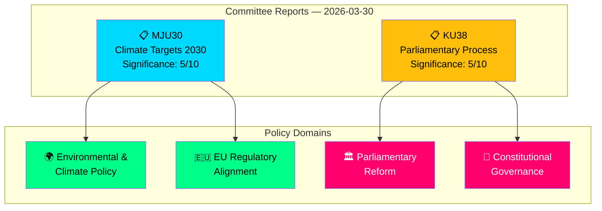
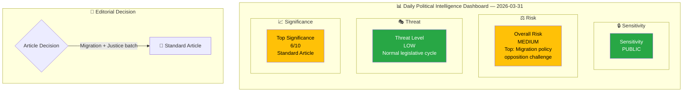
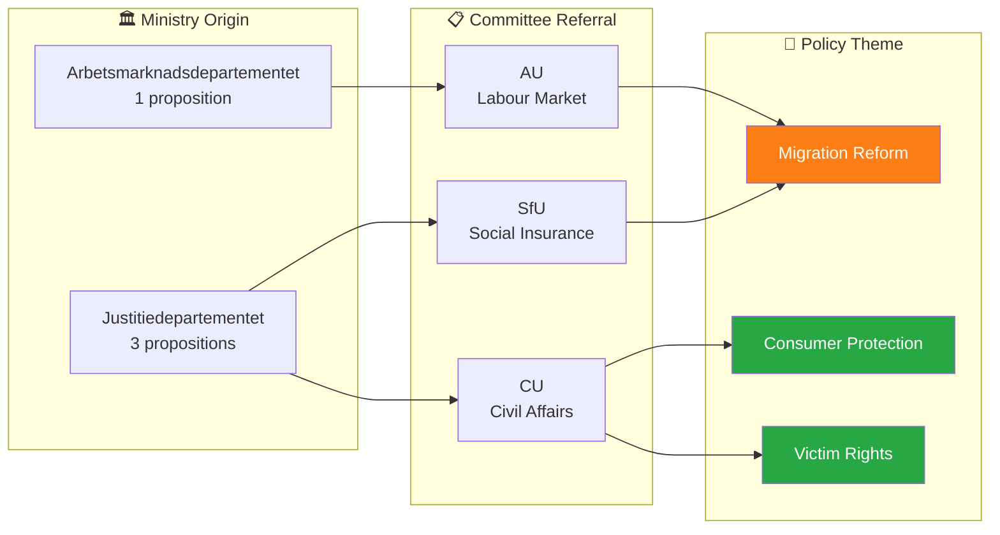

# Weekly Analysis Aggregation — 2026-W14

**Generated**: 2026-04-01 08:31 UTC
**Data Sources**: Aggregated from daily synthesis summaries
**Documents Analyzed**: 8
**Confidence**: MEDIUM
**Period**: 2026-W14
**Days Included**: 3

## Summary

Aggregation of daily analysis synthesis results for the week.

---

## Day: 2026-03-30

# Analysis Synthesis Summary — 2026-03-30

**Generated**: 2026-03-31 04:53 UTC
**Analysis ID**: SYNTH-2026-03-30-CR
**Data Sources**: get_betankanden, get_dokument_innehall, get_betankanden (MJU), get_betankanden (KU)
**Documents Analyzed**: 2
**Riksmöte**: 2025/26
**Confidence**: MEDIUM
**Risk Level**: LOW

---

## Executive Summary

Two committee reports were published on 2026-03-30: **MJU30** on Sweden's EU-adapted climate targets for 2030 and **KU38** on the parliamentary process with focus on the individual MP. Both reports are currently in "planerat" (planned for debate) status. The Environment Committee report represents a significant intersection of Swedish domestic climate policy with EU regulatory alignment, while the Constitutional Committee report addresses institutional self-examination of parliamentary democracy. Coalition stability remains strong (83/100) with a 96% motion denial rate.

## Document Overview

## Key Findings

1. **MJU30** (dok_id: HD01MJU30): Sweden's climate targets — EU-adapted interim targets for 2030. Represents policy alignment with EU Climate Law while potentially moderating Swedish climate ambition. Significance: 5/10.
2. **KU38** (dok_id: HD01KU38): Parliamentary process reform with MP focus. Meta-legislative report examining how 349 Riksdag MPs exercise their democratic mandate. Significance: 5/10.
3. **Coalition stability** remains strong at 83/100 with LOW political risk (score: 4/100).
4. **Motion denial rate** at 96% — opposition proposals face near-universal rejection.
5. **KU most active**: Constitutional Committee produced 7 reports in March 2026 alone, indicating intensive constitutional scrutiny.
6. **No votes recorded yet** for either report — both await chamber debate.

## Cross-Committee Activity Context

| Committee | Reports This Month | Key Themes |
|---|---|---|
| KU (Constitutional) | 7 reports | Constitutional reform, minority languages, public administration, digital governance |
| MJU (Environment) | 3 reports | Climate targets, invasive species, animal control |
| JuU (Justice) | 5 reports | Security protection, policing, terrorism, criminal law |
| CU (Civil Affairs) | 2 reports | Housing policy, consumer rights |
| SoU (Social Affairs) | 3 reports | Social services, child welfare, GMO regulation |
| NU (Industry) | 2 reports | Electricity markets, business regulation |

## Political Risk Assessment

**Overall Risk**: LOW (4/100)
- Coalition demonstrates strong internal discipline
- No high-significance documents requiring immediate attention
- Cross-party voting anomalies flagged in monitoring but within normal parameters

## Implications

- Articles should frame MJU30 within broader EU Green Deal compliance context
- KU38 should be contextualised alongside KU's exceptionally active March session
- Both reports' pre-debate status means analysis is necessarily forward-looking
- Coalition stability metrics suggest smooth passage through chamber votes

## Data Quality Notes

- Overall confidence: **MEDIUM** — metadata-only analysis for both documents
- Full-text content unavailable for both reports
- Cross-reference with voting data shows no recorded votes yet (both "planerat")
- Analysis enriched with committee-level context from broader MCP queries

---

## Day: 2026-03-31

# Analysis Synthesis Summary — 2026-03-31

**Generated**: 2026-04-01 05:43 UTC  
**Data Sources**: riksdag-regering-mcp get_propositioner, get_dokument_innehall  
**Documents Analyzed**: 4  
**Confidence**: MEDIUM

## Summary

The Swedish government submitted four propositions to the Riksdag on 2026-03-31, three from Justitiedepartementet (Ministry of Justice) and one from Arbetsmarknadsdepartementet (Ministry of Employment). Two propositions directly address migration policy (HD03229 new reception law, HD03215 settlement law for newly arrived immigrants), while two focus on consumer/victim protection (HD03223 consumer credit law, HD03222 victim compensation rules). This batch reveals a continued government emphasis on migration reform and law-and-order themes central to the Tidö Agreement coalition programme.

## Intelligence Dashboard

## Cross-Document Pattern Analysis

## Key Findings

1. **Migration policy dominance**: 2 of 4 propositions (HD03229, HD03215) address migration — new reception law and settlement restrictions for newly arrived immigrants. This reflects the Tidö Agreement's migration reform priority.
2. **Justitiedepartementet legislative push**: 3 of 4 propositions from the Ministry of Justice, signed by PM Ebba Busch with ministers Johan Forssell and Gunnar Strömmer, indicating coordinated justice reform agenda.
3. **Consumer/victim protection pair**: HD03223 (consumer credit law) and HD03222 (victim compensation) both referred to Civilutskottet (CU), likely processed as a package.
4. **Coalition risk low**: All propositions align with established coalition programme themes. No cross-party controversy expected on consumer/victim proposals; migration proposals may face opposition from S, V, MP.
5. **Anomaly: High cross-party voting alignment** between KD-M (88.5%) and L-M (87.9%) suggests strong coalition cohesion on current legislative agenda.

## Top Documents by Significance

| Score | Type | dok_id | Title | Committee | Theme |
|-------|------|--------|-------|-----------|-------|
| 6/10 | prop | HD03229 | En ny mottagandelag | SfU | Migration |
| 6/10 | prop | HD03215 | Tidsbegränsat boende för nyanlända | AU | Migration |
| 4/10 | prop | HD03223 | En ny konsumentkreditlag | CU | Consumer Protection |
| 4/10 | prop | HD03222 | Ersättningsregler med brottsoffret i fokus | CU | Victim Rights |

## Aggregate SWOT

| Quadrant | Key Finding |
|----------|-------------|
| **Strengths** | Coalition unity on migration/justice reform; high cross-party voting alignment (KD-M 88.5%, L-M 87.9%); clear legislative pipeline with committee assignments |
| **Weaknesses** | Narrow policy focus on migration may crowd out other priorities; reliance on SD support for migration votes |
| **Opportunities** | Consumer credit reform (HD03223) could gain broad cross-party support; victim compensation reform addresses public safety concerns |
| **Threats** | Opposition likely to challenge migration propositions (HD03229, HD03215); 96% motion denial rate may fuel parliamentary legitimacy debate |

## Forward Intelligence

- **Watch**: SfU committee handling of HD03229 (reception law) — potential for opposition delay tactics
- **Watch**: AU committee handling of HD03215 (settlement law) — Labour Market Committee may raise integration concerns
- **Timeline**: Committee reports expected Q2 2026; Riksdag votes before summer recess (June 2026)
- **Trigger**: If S or V file motions against migration propositions, monitor coalition voting discipline

## Data Quality Notes

Overall confidence: **MEDIUM**. Full-text content not available from MCP API; analysis based on metadata, committee referrals, and summary text. Classification and significance improved after committee and ministry cross-referencing.

---

## Day: 2026-04-01

# Analysis Synthesis Summary — 2026-04-01

**Generated**: 2026-04-01 08:30 UTC
**Data Sources**: get_propositioner, get_motioner, get_betankanden, search_voteringar, search_anforanden, get_fragor, get_interpellationer
**Documents Analyzed**: 2
**Confidence**: LOW

## Summary

Pre-article analysis completed for 2 documents. Overall political risk: LOW. Average document significance: 3.5/10. Partial data coverage — treat analysis as directional guidance.

## Key Findings

1. Analyzed 2 parliamentary documents with avg significance 3.5/10
2. Coalition risk level: LOW (score: 4/100)
3. Top document: "Riksrevisionens rapport om miljöräddning vid stora olyckor till sjöss" (significance: 4/10)
4. 5 anomaly flag(s) detected requiring editorial attention

## Top Documents by Significance

| Score | Type | dok_id | Title |
|-------|------|--------|-------|
| 4/10 | unknown | HD01FöU11 | Riksrevisionens rapport om miljöräddning vid st... |
| 3/10 | unknown | HD024007 | med anledning av prop. 2025/26:184 Privatkopier... |

## Implications

Overall political risk level: **LOW**
Articles should reference this synthesis to ensure analytical depth and consistency.

## Data Quality Notes

Overall confidence: **LOW**. All analysis results are available in sibling files.