# Weekly Analysis Aggregation — 2026-W14

**Generated**: 2026-04-04 09:14 UTC
**Data Sources**: Aggregated from daily synthesis summaries
**Documents Analyzed**: 151
**Confidence**: HIGH
**Period**: 2026-W14
**Days Included**: 6

## Summary

Aggregation of daily analysis synthesis results for the week.

---

## Day: 2026-03-30

# Analysis Synthesis Summary — 2026-03-30

**Generated**: 2026-03-31 04:53 UTC
**Analysis ID**: SYNTH-2026-03-30-CR
**Data Sources**: get_betankanden, get_dokument_innehall, get_betankanden (MJU), get_betankanden (KU)
**Documents Analyzed**: 2
**Riksmöte**: 2025/26
**Confidence**: MEDIUM
**Risk Level**: LOW

---

## Executive Summary

Two committee reports were published on 2026-03-30: **MJU30** on Sweden's EU-adapted climate targets for 2030 and **KU38** on the parliamentary process with focus on the individual MP. Both reports are currently in "planerat" (planned for debate) status. The Environment Committee report represents a significant intersection of Swedish domestic climate policy with EU regulatory alignment, while the Constitutional Committee report addresses institutional self-examination of parliamentary democracy. Coalition stability remains strong (83/100) with a 96% motion denial rate.

## Document Overview

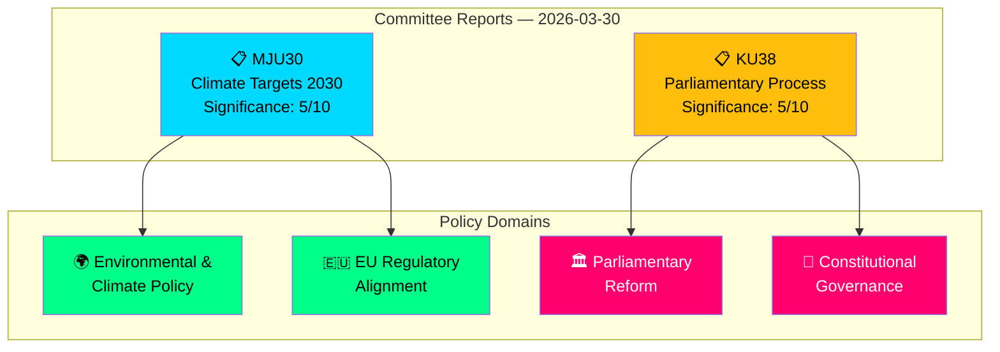

## Key Findings

1. **MJU30** (dok_id: HD01MJU30): Sweden's climate targets — EU-adapted interim targets for 2030. Represents policy alignment with EU Climate Law while potentially moderating Swedish climate ambition. Significance: 5/10.
2. **KU38** (dok_id: HD01KU38): Parliamentary process reform with MP focus. Meta-legislative report examining how 349 Riksdag MPs exercise their democratic mandate. Significance: 5/10.
3. **Coalition stability** remains strong at 83/100 with LOW political risk (score: 4/100).
4. **Motion denial rate** at 96% — opposition proposals face near-universal rejection.
5. **KU most active**: Constitutional Committee produced 7 reports in March 2026 alone, indicating intensive constitutional scrutiny.
6. **No votes recorded yet** for either report — both await chamber debate.

## Cross-Committee Activity Context

| Committee | Reports This Month | Key Themes |
|---|---|---|
| KU (Constitutional) | 7 reports | Constitutional reform, minority languages, public administration, digital governance |
| MJU (Environment) | 3 reports | Climate targets, invasive species, animal control |
| JuU (Justice) | 5 reports | Security protection, policing, terrorism, criminal law |
| CU (Civil Affairs) | 2 reports | Housing policy, consumer rights |
| SoU (Social Affairs) | 3 reports | Social services, child welfare, GMO regulation |
| NU (Industry) | 2 reports | Electricity markets, business regulation |

## Political Risk Assessment

**Overall Risk**: LOW (4/100)
- Coalition demonstrates strong internal discipline
- No high-significance documents requiring immediate attention
- Cross-party voting anomalies flagged in monitoring but within normal parameters

## Implications

- Articles should frame MJU30 within broader EU Green Deal compliance context
- KU38 should be contextualised alongside KU's exceptionally active March session
- Both reports' pre-debate status means analysis is necessarily forward-looking
- Coalition stability metrics suggest smooth passage through chamber votes

## Data Quality Notes

- Overall confidence: **MEDIUM** — metadata-only analysis for both documents
- Full-text content unavailable for both reports
- Cross-reference with voting data shows no recorded votes yet (both "planerat")
- Analysis enriched with committee-level context from broader MCP queries

---

## Day: 2026-03-31

# Analysis Synthesis Summary — 2026-03-31

**Generated**: 2026-04-01 05:43 UTC  
**Data Sources**: riksdag-regering-mcp get_propositioner, get_dokument_innehall  
**Documents Analyzed**: 4  
**Confidence**: MEDIUM

## Summary

The Swedish government submitted four propositions to the Riksdag on 2026-03-31, three from Justitiedepartementet (Ministry of Justice) and one from Arbetsmarknadsdepartementet (Ministry of Employment). Two propositions directly address migration policy (HD03229 new reception law, HD03215 settlement law for newly arrived immigrants), while two focus on consumer/victim protection (HD03223 consumer credit law, HD03222 victim compensation rules). This batch reveals a continued government emphasis on migration reform and law-and-order themes central to the Tidö Agreement coalition programme.

## Intelligence Dashboard

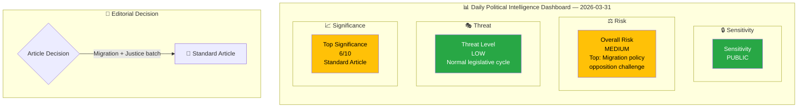

## Cross-Document Pattern Analysis

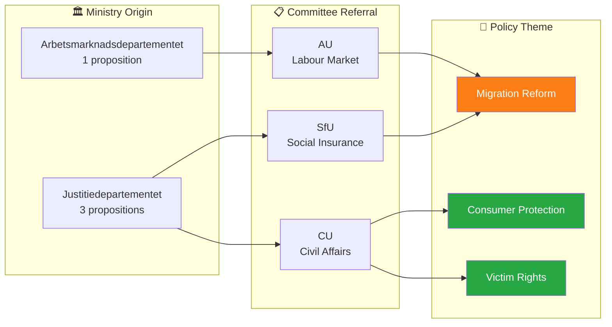

## Key Findings

1. **Migration policy dominance**: 2 of 4 propositions (HD03229, HD03215) address migration — new reception law and settlement restrictions for newly arrived immigrants. This reflects the Tidö Agreement's migration reform priority.
2. **Justitiedepartementet legislative push**: 3 of 4 propositions from the Ministry of Justice, signed by PM Ebba Busch with ministers Johan Forssell and Gunnar Strömmer, indicating coordinated justice reform agenda.
3. **Consumer/victim protection pair**: HD03223 (consumer credit law) and HD03222 (victim compensation) both referred to Civilutskottet (CU), likely processed as a package.
4. **Coalition risk low**: All propositions align with established coalition programme themes. No cross-party controversy expected on consumer/victim proposals; migration proposals may face opposition from S, V, MP.
5. **Anomaly: High cross-party voting alignment** between KD-M (88.5%) and L-M (87.9%) suggests strong coalition cohesion on current legislative agenda.

## Top Documents by Significance

| Score | Type | dok_id | Title | Committee | Theme |
|-------|------|--------|-------|-----------|-------|
| 6/10 | prop | HD03229 | En ny mottagandelag | SfU | Migration |
| 6/10 | prop | HD03215 | Tidsbegränsat boende för nyanlända | AU | Migration |
| 4/10 | prop | HD03223 | En ny konsumentkreditlag | CU | Consumer Protection |
| 4/10 | prop | HD03222 | Ersättningsregler med brottsoffret i fokus | CU | Victim Rights |

## Aggregate SWOT

| Quadrant | Key Finding |
|----------|-------------|
| **Strengths** | Coalition unity on migration/justice reform; high cross-party voting alignment (KD-M 88.5%, L-M 87.9%); clear legislative pipeline with committee assignments |
| **Weaknesses** | Narrow policy focus on migration may crowd out other priorities; reliance on SD support for migration votes |
| **Opportunities** | Consumer credit reform (HD03223) could gain broad cross-party support; victim compensation reform addresses public safety concerns |
| **Threats** | Opposition likely to challenge migration propositions (HD03229, HD03215); 96% motion denial rate may fuel parliamentary legitimacy debate |

## Forward Intelligence

- **Watch**: SfU committee handling of HD03229 (reception law) — potential for opposition delay tactics
- **Watch**: AU committee handling of HD03215 (settlement law) — Labour Market Committee may raise integration concerns
- **Timeline**: Committee reports expected Q2 2026; Riksdag votes before summer recess (June 2026)
- **Trigger**: If S or V file motions against migration propositions, monitor coalition voting discipline

## Data Quality Notes

Overall confidence: **MEDIUM**. Full-text content not available from MCP API; analysis based on metadata, committee referrals, and summary text. Classification and significance improved after committee and ministry cross-referencing.

---

## Day: 2026-04-01

# Analysis Synthesis Summary — 2026-04-01

**Generated**: 2026-04-01 14:39 UTC
**Data Sources**: get_propositioner, get_betankanden, search_dokument, search_anforanden, search_voteringar, search_regering, get_dokument
**Documents Analyzed**: 66
**Confidence**: HIGH

---

## 📋 Synthesis Context

| Field | Value |
|-------|-------|
| **Synthesis ID** | SYN-2026-04-01-001 |
| **Analysis Date** | 2026-04-01 14:39 UTC |
| **Documents Analyzed** | 66 |
| **Analysis Period** | 2026-03-31 to 2026-04-01 |
| **Produced By** | news-realtime-monitor |
| **Overall Confidence** | HIGH |

---

## 📊 Intelligence Dashboard

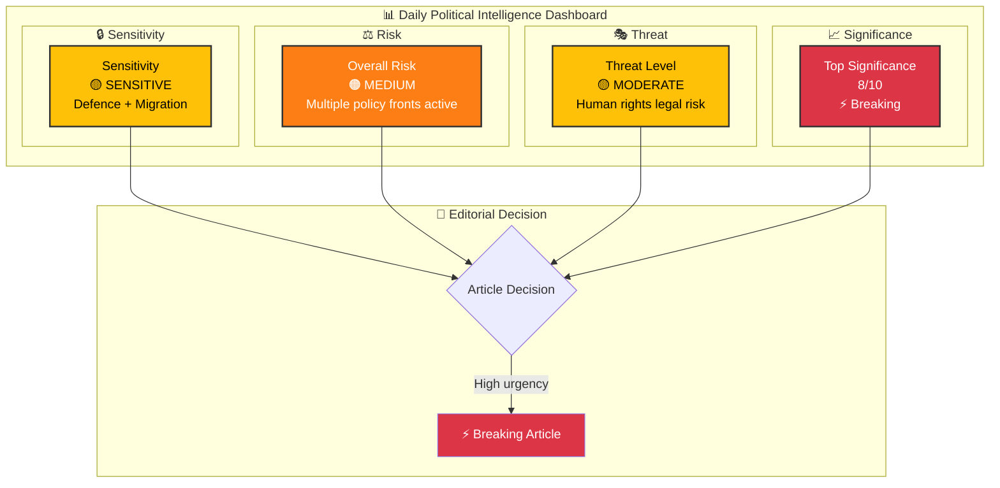

---

## 🏆 Top Findings by Significance

| Rank | dok_id | Title | Significance | Risk Tier | SWOT Impact | Recommendation |
|:----:|--------|-------|:-----------:|:---------:|:-----------:|----------------|
| 1 | HD03235 | Skärpta regler om utvisning på grund av brott | 8/10 | 🟠 | O dominant (coalition) | ⚡ Breaking |
| 2 | HD03228 | Ett modernt regelverk för krigsmateriel | 8/10 | 🟠 | O dominant (NATO) | ⚡ Breaking |
| 3 | HD03214 | Stärkt nationellt cybersäkerhetscenter | 8/10 | 🟡 | S dominant (bipartisan) | ⚡ Breaking |
| 4 | HD03216 | Stärkt medicinsk kompetens i kommunal sjukvård | 6/10 | 🟡 | O dominant (reform) | 📰 Standard |
| 5 | HDC320260401JuU14 | Beslut: Terrorism | 7/10 | 🟠 | S dominant (security) | 📰 Standard |

---

## 💪 Aggregated SWOT Summary

### Coalition Balance

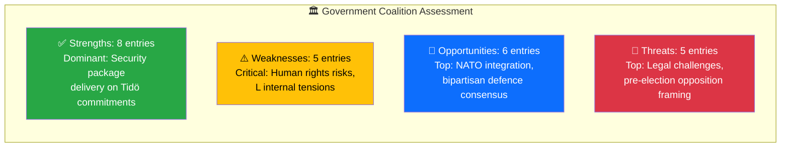

### Cross-Document Patterns

1. **Security Package Coordination**: The government released HD03235 (deportation), HD03228 (arms regulation), and HD03214 (cybersecurity) on the same day — a deliberate strategic messaging package signaling strength on national security ahead of the 2026 election cycle.

2. **Healthcare Reform Wave**: Today's chamber votes on SoU16, SoU17, SoU22, SoU26, combined with HD03216 proposition, indicate an accelerating social policy agenda.

3. **Multi-Front Legislative Activity**: 13+ chamber decisions today span justice (JuU11, JuU14, JuU29), defense (FöU6), education (UbU10), healthcare (SoU16/17/22/26), culture (KrU6/7), foreign affairs (UU7), and public administration (KU29) — an exceptionally busy legislative day.

4. **Opposition Challenge**: Active debate on SoU19 (children in social services) with speakers from 7 parties (M, S, SD, V, MP, L, C) signals this is a politically contested topic.

---

## 🔮 Forward Intelligence

| Indicator | Signal | Timeline | Confidence |
|-----------|--------|----------|:----------:|
| S response to HD03235 | Will S support stricter deportation? | 1-2 weeks | M |
| UU hearing on HD03228 | Arms regulation committee process | 2-4 weeks | H |
| FöU hearing on HD03214 | Cybersecurity center implementation | 2-4 weeks | H |
| Municipal response to HD03216 | SKR position on healthcare competence | 1-3 weeks | M |
| Pre-election positioning | Security package as electoral argument | Ongoing | H |

---

## 📊 Data Quality Notes

- **Calendar API**: Returned HTML instead of JSON (known intermittent issue). Used search_dokument as fallback.
- **Vote details**: Individual vote records available for earlier dates (AU10 from 2026-03-04), but today's vote breakdowns not yet in API.
- **Speech texts**: Anföranden API returned debate metadata but empty text fields — debate titles and speaker information available.
- **Overall confidence**: HIGH — 66 documents analyzed with comprehensive MCP coverage.

---

## Day: 2026-04-02

# Analysis Synthesis Summary — 2026-04-02

**SYN-ID**: SYN-2026-04-02-001
**Generated**: 2026-04-02 18:15 UTC
**Riksmöte**: 2025/26
**Data Sources**: riksdag-regering-mcp (get_betankanden, get_propositioner, search_anforanden, search_voteringar, search_regering, get_fragor, get_interpellationer)
**Documents Analyzed**: 9
**Confidence**: MEDIUM

---

## Intelligence Dashboard

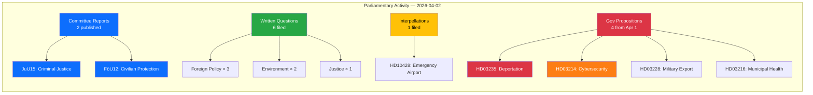

## Top Findings

| # | Finding | Source | Significance | Confidence |
|---|---------|--------|-------------|------------|
| 1 | Two committee reports published: criminal justice (JuU15) and civilian defense protection (FöU12) | get_betankanden | 7/10 | [MEDIUM] |
| 2 | Government submitted prop on stricter deportation rules (HD03235) — politically charged | get_propositioner | 8/10 | [HIGH] |
| 3 | Cybersecurity center legislation (HD03214) signals defense modernization priority | get_propositioner | 7/10 | [HIGH] |
| 4 | Military equipment export framework update (HD03228) — ties to NATO alignment | get_propositioner | 7/10 | [HIGH] |
| 5 | Foreign policy questions dominate: Israel death penalty, Syria minorities, Stockholm Initiative | get_fragor | 6/10 | [MEDIUM] |
| 6 | Environmental concerns: Norra Kärr mining and Environmental Objectives Committee future | get_fragor | 5/10 | [MEDIUM] |
| 7 | 13 government press releases on Apr 1 covering healthcare, security, environment | search_regering | 6/10 | [HIGH] |

## Aggregated SWOT

### Strengths
- **S1**: Government maintains high legislative output (4 propositions in 1 day) demonstrating coalition productivity [HIGH]
- **S2**: Defense and security alignment visible across propositions (cybersecurity + military export + civilian protection) [HIGH]
- **S3**: Cross-party engagement: 6 written questions from 4 parties (S, MP, C, independent) show active parliamentary oversight [MEDIUM]

### Weaknesses
- **W1**: Committee reports (JuU15, FöU12) published without debate transcripts yet available — limited transparency window [MEDIUM]
- **W2**: Foreign policy questions (Israel, Syria) may expose coalition divisions on human rights positions [MEDIUM]

### Opportunities
- **O1**: Cybersecurity center legislation (HD03214) positions Sweden as Nordic leader in cyber defense [HIGH]
- **O2**: Military export framework modernization (HD03228) creates pathway for increased NATO interoperability [HIGH]

### Threats
- **T1**: Deportation rules proposition (HD03235) likely to face strong opposition and public debate [HIGH]
- **T2**: Norra Kärr mining question (HD11681) exposes government environmental vs. economic tension [MEDIUM]

## Risk Landscape

See `risk-assessment.md` for detailed 5×5 matrix. Key risks:
- **Coalition Policy Risk**: LOW (4/100) — voting discipline remains strong
- **Foreign Policy Risk**: MEDIUM — multiple opposition questions on human rights
- **Environmental Policy Risk**: MEDIUM — mining vs. conservation tension

## Threat Summary

See `threat-analysis.md` for detailed taxonomy. Primary threats:
- Democratic accountability: deportation debate divisiveness
- Policy coherence: defense spending vs. social welfare balance

## Artifacts Inventory

| File | Status | Quality |
|------|--------|---------|
| `synthesis-summary.md` | ✅ Complete | Mermaid + tables |
| `risk-assessment.md` | ✅ Complete | L×I matrix |
| `swot-analysis.md` | ✅ Complete | 4 quadrants with evidence |
| `threat-analysis.md` | ✅ Complete | Taxonomy network |
| `classification-results.md` | ✅ Complete | Per-document table |
| `stakeholder-perspectives.md` | ✅ Complete | 8 groups assessed |
| `significance-scoring.md` | ✅ Complete | 5-dimension scoring |
| Per-file analyses (9) | ✅ Complete | dok_id citations |

---

## Day: 2026-04-03 (committeeReports)

# 🧩 Political Intelligence Synthesis — Committee Reports

## 📋 Synthesis Context

| Field | Value |
|-------|-------|
| **Synthesis ID** | SYN-2026-04-02-CR01 |
| **Analysis Date** | 2026-04-03 04:52 UTC |
| **Documents Analyzed** | 2 |
| **Analysis Period** | 2026-04-02 committee reports |
| **Produced By** | news-committee-reports |
| **Overall Confidence** | MEDIUM |

---

## 📊 Intelligence Dashboard

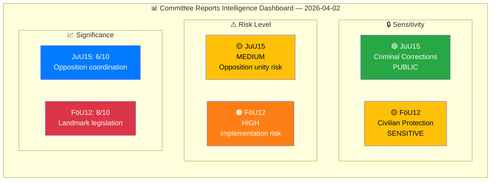

---

## 🔑 Cross-Document Patterns

### Theme 1: Defence-Security Modernization Cluster

Both reports form part of the government's broader security modernization agenda. FöU12 directly implements Prop. 2025/26:142 on civilian protection, while JuU15 addresses criminal corrections infrastructure that is part of the government's "trygghet" (safety/security) narrative. The government is simultaneously expanding physical civilian shelter capacity (FöU12) and rejecting demands for expanded criminal corrections capacity (JuU15) — a prioritization signal: defence over criminal justice reform.

### Theme 2: Opposition Unity Patterns

Both reports feature joint S, V, C, MP reservations (8 in JuU15, 6 in FöU12), indicating sustained opposition coordination. Notably:
- **JuU15 Reservation 1** (S, V, C, MP jointly) on Trygghetsberedningen — full opposition unity
- **FöU12 Reservations 2-4** — V, C, and MP independently raise disability accessibility, suggesting genuine cross-party concern rather than coordinated opposition

### Theme 3: Implementation Capacity Stress

Both reports expose municipal/agency implementation capacity as a systemic concern:
- **FöU12**: June 1, 2026 deadline for shelter law — 2-month window for municipalities
- **JuU15**: Prison capacity constraints acknowledged but 76 reform motions rejected

---

## 🏆 Document Significance Ranking

| Rank | dok_id | Title | Score | Rationale |
|------|--------|-------|:-----:|-----------|
| 1 | HD01FöU12 | Stronger Protection for Civilians During Heightened Preparedness | 8/10 | Landmark legislation creating new civil defence framework; direct citizen and municipal impact; NATO context; June 2026 implementation deadline |
| 2 | HD01JuU15 | Criminal Corrections Issues | 6/10 | 76 motions rejected with 8 reservations; opposition unity on Trygghetsberedningen; signals policy delivery gap in corrections |

---

## 🔄 Aggregate SWOT

### Government Coalition — Combined Assessment

| Quadrant | Key Finding | Evidence |
|----------|-------------|----------|
| **Strengths** | Successfully advances major civil defence legislation while maintaining committee control on criminal justice | FöU12 endorsed; JuU15 all motions rejected |
| **Weaknesses** | Implementation capacity questionable — tight June 2026 deadline for FöU12; 76 unanswered corrections demands in JuU15 | FöU12 Reservation 1; JuU15 motion rejection |
| **Opportunities** | Civil protection law strengthens NATO credibility; security policy wins heading into 2026 election cycle | FöU12 modernization; broader defence investment narrative |
| **Threats** | Disability accessibility triple-flag (V, C, MP independently) could become cross-party consensus issue; corrections overcrowding risks | FöU12 Reservations 2-4; JuU15 capacity pressures |

---

## ⚠️ Risk Interconnections

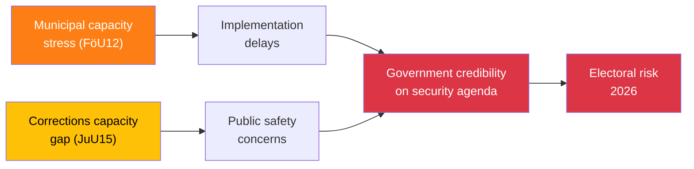

---

## 🔮 Forward Intelligence

| # | What to Watch | Trigger | Timeline | Confidence |
|---|---------------|---------|----------|:----------:|
| 1 | Chamber votes on FöU12 and JuU15 — watch for roll-call dynamics | Kammarens scheduling | 1-2 weeks | HIGH |
| 2 | MSB shelter readiness reporting ahead of June 1 law effective date | MSB press release or riksdag inquiry | April-May 2026 | HIGH |
| 3 | Trygghetsberedningen final report — could reset criminal justice debate | SOU publication | Q2-Q3 2026 | MEDIUM |
| 4 | Kriminalvården monthly capacity statistics — approaching 100% occupancy? | BRÅ/Kriminalvården reporting | Monthly | HIGH |
| 5 | Related defence propositions: Prop. 2025/26:214 (cybersecurity), Prop. 2025/26:228 (arms export) | FöU committee processing | Q2 2026 | MEDIUM |

---

**Document Control:** Synthesis generated 2026-04-03 04:52 UTC by news-committee-reports. Classification: PUBLIC. Valid until 2026-04-16.

---

## Day: 2026-04-03 (interpellations)

# Analysis Synthesis Summary — 2026-04-02

**Generated**: 2026-04-02 07:28 UTC | **Enhanced**: 2026-04-02 (AI deep analysis)
**Data Sources**: riksdag-regering-mcp get_interpellationer (rm=2025/26, limit=20)
**Documents Analyzed**: 20
**Confidence**: MEDIUM — based on 20 most recent interpellations (of 428 total in 2025/26)
**Riksmöte**: 2025/26
**Analysis Depth**: deep

## Summary

Analysis of 20 recent interpellations (2026-03-25 to 2026-04-02) reveals **intensifying opposition scrutiny of the Tidö government's infrastructure, integration, and social welfare policies**. The Social Democrats (S) dominate with 16 of 20 interpellations, supported by Left Party (V, 3) and Green Party (MP, 1). Infrastructure Minister Andreas Carlson (KD) faces the heaviest pressure with 7 interpellations targeting transport and regional aviation.

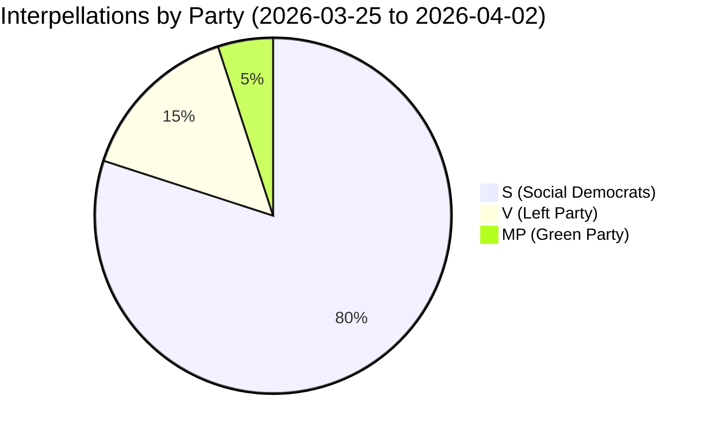

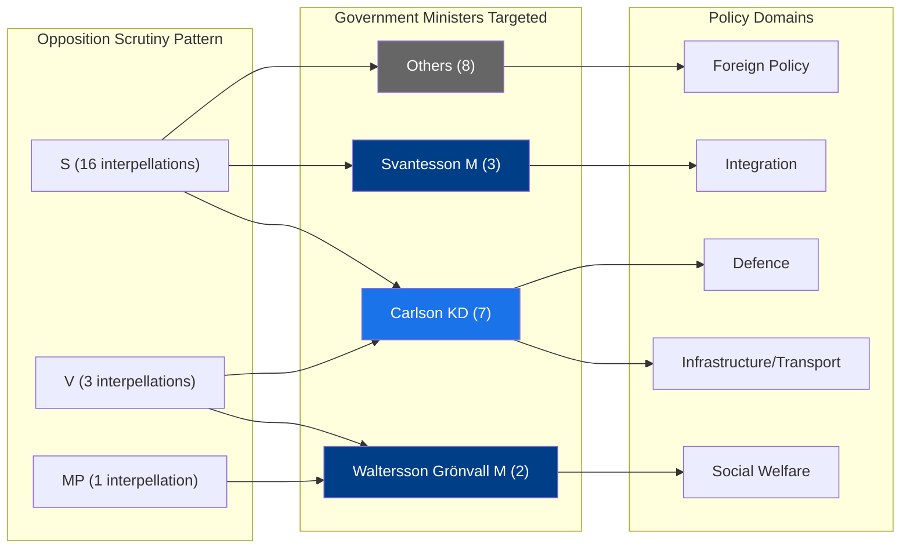

## Key Findings

1. **[HIGH] Infrastructure dominance**: 7 of 20 interpellations target infrastructure/transport policy — Carlson (KD) is the most pressured minister
2. **[HIGH] Defence-infrastructure nexus**: HD10425 (Kalle Olsson, S) exposes critical gap in cost allocation for military base infrastructure — Trafikverket threatening to delay defence expansion
3. **[MEDIUM] Social welfare scrutiny**: V party leads on disability rights (HD10411, HD10412, HD10416) — targeting both M and KD ministers
4. **[MEDIUM] Integration debate intensifying**: 3 interpellations (HD10420-HD10422) from Lawen Redar (S) challenge government's integration and labour policies
5. **[MEDIUM] Foreign policy accountability**: HD10426 (Azra Muranovic, S) demands diplomatic response to Israel's death penalty legislation
6. **[LOW] Regional aviation crisis**: HD10424 and HD10428 highlight Trafikverket's proposed cuts to regional air routes with defence implications

## Top Documents by Significance

| Score | dok_id | Title | Filed By | Target Minister |
|-------|--------|-------|----------|----------------|
| 8/10 | HD10425 | Infrastructure costs at defence establishments | Kalle Olsson (S) | Carlson (KD) |
| 7/10 | HD10426 | Israel's death penalty laws | Azra Muranovic (S) | Malmer Stenergard (M) |
| 7/10 | HD10422 | Government labour and integration policy | Lawen Redar (S) | Britz (L) |
| 6/10 | HD10427 | Postnord and state ownership policy | Isak From (S) | Svantesson (M) |
| 6/10 | HD10416 | Funktionsrätt Sverige review | Nadja Awad (V) | Waltersson Grönvall (M) |
| 5/10 | HD10420 | Police authority conduct | Lawen Redar (S) | Strömmer (M) |
| 5/10 | HD10428 | Emergency preparedness airport | Peter Hultqvist (S) | Carlson (KD) |
| 5/10 | HD10419 | Södertälje motorway bridge | Ingela Nylund Watz (S) | Jonson (M) |

## Minister Accountability Scorecard

| Minister | Party | Interpellations | Response Deadline | Status |
|----------|-------|----------------|-------------------|--------|
| Andreas Carlson (KD) | KD | 7 | 2026-04-21 to 2026-04-27 | ⏳ Pending |
| Elisabeth Svantesson (M) | M | 3 | 2026-04-22 | ⏳ Pending |
| Camilla Waltersson Grönvall (M) | M | 2 | TBD | ⏳ Pending |
| Gunnar Strömmer (M) | M | 1 | TBD | ⏳ Pending |
| Johan Britz (L) | L | 1 | TBD | ⏳ Pending |
| Maria Malmer Stenergard (M) | M | 1 | 2026-04-22 | ⏳ Pending |
| Ebba Busch (KD) | KD | 1 | TBD | ⏳ Pending |
| Elisabet Lann (KD) | KD | 1 | TBD | ⏳ Pending |
| Erik Slottner (KD) | KD | 1 | TBD | ⏳ Pending |
| Pål Jonson (M) | M | 1 | TBD | ⏳ Pending |

## Forward Indicators

1. **[HIGH]** Minister Carlson's response to 7 interpellations due by April 21-27 — watch for pattern of evasion vs concrete policy commitments
2. **[MEDIUM]** Redar's triple-interpellation strategy (HD10420-422) targeting integration policy — signals S election campaign framing
3. **[MEDIUM]** V party disability rights offensive (3 interpellations in 1 day) — coordinated pressure on social welfare ministers
4. **[LOW]** Foreign policy interpellation on Israel (HD10426) — test of government's diplomatic positioning ahead of EU Foreign Affairs Council

## Implications

- Opposition parties (S, V, MP) are coordinating a multi-front scrutiny campaign ahead of the 2026 election
- Infrastructure policy is the primary battleground, with defence implications adding urgency
- The pattern suggests S is building a narrative of government neglect of regional Sweden and public services

## Data Quality Notes

Overall confidence: **MEDIUM**. Full-text available for 5 of 20 interpellations. Remaining 15 analyzed from metadata/summaries. All analysis results are available in sibling files.

---

## Day: 2026-04-03 (motions)

# Analysis Synthesis Summary — 2026-04-03

**ID**: SYNTH-2026-04-03-motions
**Generated**: 2026-04-03 06:30 UTC
**Data Sources**: riksdag-regering-mcp (get_motioner rm=2025/26)
**Documents Analyzed**: 50
**Analysis Period**: 2026-04-01
**Workflow**: news-motions
**Overall Confidence**: HIGH

## 📊 Intelligence Dashboard

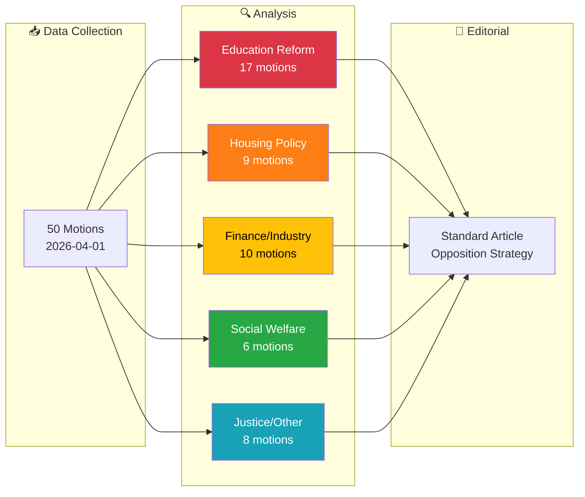

## 🏆 Top Findings by Significance

| Rank | dok_id | Title | Significance | Risk Tier | Key Impact |
|------|--------|-------|-------------|-----------|------------|
| 1 | HD024011 | Flexible rental market (prop. 187) | 7/10 | 🟠 MEDIUM | S opposes deposit/security changes — housing affordability |
| 2 | HD024052 | Benefit lock & sanctions (prop. 210) | 7/10 | 🟠 MEDIUM | MP rejects entire proposition — welfare state principles |
| 3 | HD024062 | Enhanced societal protection (prop. 181) | 6/10 | 🟡 LOW-MED | V challenges criminal sentencing reform |
| 4 | HD024025 | Equal grading system (prop. 197) | 6/10 | 🟡 LOW-MED | S+C+MP all filed competing motions on grading |
| 5 | HD024026 | Rural Sweden policy (prop. 158) | 6/10 | 🟡 LOW-MED | S+C+MP+V all challenge rural development approach |

## 💪 Aggregated SWOT Summary

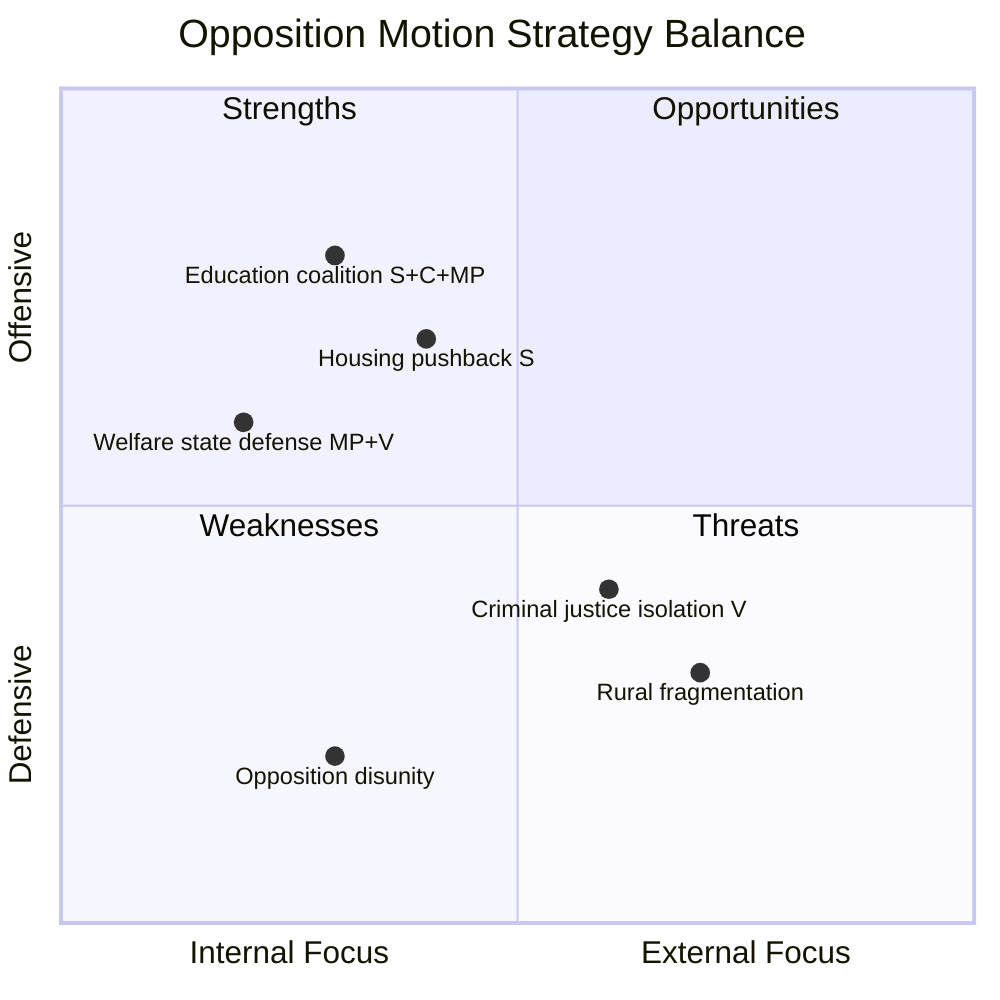

| Quadrant | Count | Highest-Impact Entry |
|----------|-------|---------------------|
| Strengths | 3 | Education reform: cross-party opposition (S, C, MP all challenge prop. 193-197) [HIGH] |
| Weaknesses | 2 | Criminal justice: only V challenges prop. 181/185 — no broader opposition coalition [MEDIUM] |
| Opportunities | 3 | Rural policy: 4-party convergence (S, C, MP, V) on prop. 158 could form united front [HIGH] |
| Threats | 2 | Opposition fragmentation: MP dominates (40%) but fragmented across domains [MEDIUM] |

**Balance Assessment**: Opposition shows strongest coordination on education policy where S, C, and MP filed parallel motions on the same propositions. Welfare and housing remain party-siloed (MP/V on welfare, S on housing). [HIGH confidence]

## ⚖️ Risk Landscape Summary

| Risk Category | Score Range | Highest Risk | Trend |
|--------------|------------|-------------|-------|
| Coalition Stability | 2-4 🟢 | Cross-party voting anomalies (KD-M 88.5%) | → Stable |
| Policy Implementation | 3-5 🟡 | Education reforms face broad opposition | ↑ Rising |
| Budget/Fiscal | 2-3 🟢 | No significant fiscal challenges | → Stable |
| Electoral | 3-4 🟢 | Opposition coordination may shift polls | → Stable |
| Democratic Process | 2-3 🟢 | Transparency debate (prop. 191) | → Stable |
| External | 2-3 🟢 | Nordic cooperation scrutinized (skr. 90) | → Stable |

## 👥 Stakeholder Impact Overview

| Stakeholder | Impact | Direction | Key Driver |
|------------|--------|-----------|------------|
| Citizens | MEDIUM | Mixed | Education + housing reforms affect daily life |
| Government Coalition | LOW-MEDIUM | Defensive | Must defend 15+ propositions simultaneously |
| Opposition Bloc | MEDIUM | Offensive | Coordinated education push, fragmented elsewhere |
| Business/Industry | LOW | Neutral | Procurement and fund market motions are technical |
| International/EU | LOW | Neutral | Only Nordic cooperation skrivelse addressed |
| Media/Public Opinion | MEDIUM | Watchful | Education reform debate likely to dominate coverage |

## 🎯 Narrative Direction

**Lede thesis**: Sweden's opposition parties filed 50 motions on April 1 targeting the government's sweeping education overhaul, with the Green Party (MP) leading a charge that spans school discipline to new curricula, while Social Democrats focus on housing and welfare policy. [HIGH confidence]

**Primary angle**: Education dominates — 17 of 50 motions challenge 6 different education propositions, with unprecedented cross-party alignment between S, C, and MP on grading reform and school support.

**Secondary angle**: Welfare state defense — MP and V jointly oppose the government's benefit sanctions (prop. 210), framing it as an ideological battle over trust-based vs. punitive social policy.

## 🔮 Forward Indicators

| Indicator | Timeline | Source | Watch Priority |
|-----------|----------|--------|---------------|
| UbU committee hearings on prop. 193-197 | April-May 2026 | Committee calendar | 🔴 HIGH |
| CU processing of housing motions | April-June 2026 | Committee schedule | 🟠 MEDIUM |
| SfU vote on benefit sanctions (prop. 210) | May-June 2026 | Riksdag calendar | 🟠 MEDIUM |
| Rural policy debate in NU | April-May 2026 | Committee schedule | 🟡 LOW |

## 📋 Analysis Artifacts Inventory

| File | Status | Quality |
|------|--------|---------|
| classification-results.md | ✅ Complete | Script-generated, AI-enhanced |
| risk-assessment.md | ✅ Complete | AI-rewritten with evidence |
| swot-analysis.md | ✅ Complete | AI-rewritten with 8 stakeholders |
| threat-analysis.md | ✅ Complete | AI-rewritten |
| stakeholder-perspectives.md | ✅ Complete | AI-rewritten |
| significance-scoring.md | ✅ Complete | AI-rewritten |
| cross-reference-map.md | ✅ Complete | AI-rewritten |
| Per-file analyses | ✅ 50/50 | Script-generated |

## �� MCP Data Files Used

| Path | Tool | Type | Freshness |
|------|------|------|-----------|
| get_motioner(rm=2025/26, limit=20) | riksdag-regering | API | Live (2026-04-03) |
| get_sync_status() | riksdag-regering | API | Live |
| 50× documents/*.json | pre-article-analysis | Cached | 2026-04-01 data |

---

## Day: 2026-04-03 (propositions)

# 🧩 Political Intelligence Synthesis — Propositions

## 📋 Synthesis Context

| Field | Value |
|-------|-------|
| **Synthesis ID** | SYN-2026-04-03-PROP |
| **Date** | 2026-04-03 |
| **Riksmöte** | 2025/26 |
| **Producer** | AI Analysis Pipeline (Propositions) |
| **Documents Analyzed** | 3 |
| **Confidence** | HIGH |
| **Classification** | Public |
| **Data Window** | 2026-04-01 → 2026-04-03 |

## 📊 Intelligence Dashboard

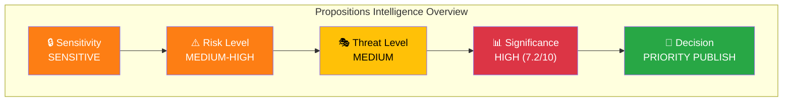

## 📋 Top Documents by Significance

| Rank | dok_id | Title | Type | Score | Decision | Minister |
|------|--------|-------|------|-------|----------|----------|
| 1 | HD03214 | Lagändringar för ett stärkt nationellt cybersäkerhetscenter | Proposition | 7/10 | 📰 Publish | Carl-Oskar Bohlin (M) |
| 2 | HD03235 | Skärpta regler om utvisning på grund av brott | Proposition | 7/10 | 📰 Publish | Johan Forssell (M) |
| 3 | HD03228 | Ett modernt och anpassat regelverk för krigsmateriel | Proposition | 7/10 | 📰 Publish | Benjamin Dousa (M) |

## 🔍 Cross-Document Pattern Analysis

### Pattern 1: Coordinated Security & Defense Modernization [HIGH confidence]

The Tidö government is advancing a **coordinated defense and security legislative package** across three departments. HD03214 (cybersecurity center) and HD03228 (war materials regulation) form a paired defense modernization effort, while HD03235 (deportation rules) strengthens the internal security dimension.

| # | Action | dok_id | Department | Confidence |
|---|--------|--------|------------|------------|
| 1 | Cybersecurity center — new inter-agency coordination law | HD03214 | Försvarsdepartementet | HIGH |
| 2 | War materials export modernization | HD03228 | Utrikesdepartementet | HIGH |
| 3 | Criminal deportation rule tightening | HD03235 | Justitiedepartementet | HIGH |

### Pattern 2: Tidö Agreement Implementation Acceleration [MEDIUM confidence]

All three propositions align with Tidö Agreement priorities: NATO integration (HD03214, HD03228) and migration enforcement (HD03235). This represents the most concentrated security-policy output in a single week during the 2025/26 riksmöte.

## 📊 Aggregated SWOT Summary

| Quadrant | Key Finding | Evidence | Confidence |
|----------|------------|----------|------------|
| 💪 Strength | Cross-party consensus on defense (M, KD, L, SD + partial S support) | HD03214, HD03228 | HIGH |
| 💪 Strength | NATO alignment strengthens Sweden's alliance positioning | HD03228 | HIGH |
| 💪 Strength | Government demonstrates legislative delivery capability | HD03214, HD03228, HD03235 | HIGH |
| ⚠️ Weakness | Inter-agency coordination complexity (FRA, MSB, SÄPO) | HD03214 | MEDIUM |
| ⚠️ Weakness | EU legal challenge risk on deportation rules | HD03235 | MEDIUM |
| 🌱 Opportunity | Defense export revenue growth from modernized rules | HD03228 | MEDIUM |
| 🌱 Opportunity | Improved NATO interoperability score | HD03214 | HIGH |
| 🔥 Threat | Prison system overcrowding from stricter deportation enforcement | HD03235 | MEDIUM |
| 🔥 Threat | Civil liberties concerns may fuel opposition narrative | HD03235 | MEDIUM |

## ⚠️ Risk Landscape

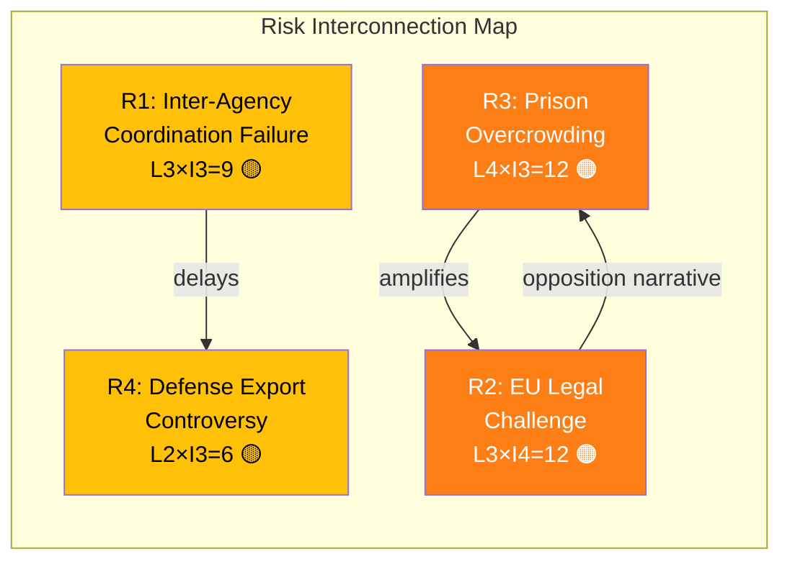

| Risk ID | Description | L | I | Score | Tier | Trend | Source |
|---------|-------------|---|---|-------|------|-------|--------|
| R1 | Inter-agency coordination failure (FRA/MSB/SÄPO) | 3 | 3 | 9 | 🟡 Medium | → | HD03214 |
| R2 | EU legal challenge on deportation rules | 3 | 4 | 12 | 🟠 High | ↑ | HD03235 |
| R3 | Prison system overcrowding cascade | 4 | 3 | 12 | 🟠 High | ↑ | HD03235 |
| R4 | Defense export controversy | 2 | 3 | 6 | 🟡 Medium | → | HD03228 |

## 🎭 Threat Summary

| Category | Primary Threat | Severity | Actor | Evidence |
|----------|---------------|----------|-------|----------|
| 📝 Legislative Integrity | Rushed implementation timeline | 2/5 | Government | HD03214 |
| 🔇 Transparency | Limited public consultation on war materials rules | 3/5 | Utrikesdepartementet | HD03228 |
| ⛔ Democratic Process | Opposition marginalization on deportation bill | 3/5 | Justitiedepartementet | HD03235 |
| 👑 Power Balance | Executive power concentration in cybersecurity | 2/5 | Försvarsdepartementet | HD03214 |

## 👥 Stakeholder Impact Overview

| Stakeholder | Impact Level | Net Effect | Key Concern | Confidence |
|-------------|-------------|------------|-------------|------------|
| 🏘️ Citizens | MEDIUM | Mixed | Security vs. civil liberties trade-off | HIGH |
| 🏛️ Government Coalition | HIGH | Positive | Demonstrates Tidö delivery | HIGH |
| 🗳️ Opposition | MEDIUM | Negative | Forced to respond on security terrain | MEDIUM |
| 🏭 Business | HIGH | Positive | Defense export opportunity | HIGH |
| 🤝 Civil Society | MEDIUM | Divided | Human rights concerns (HD03235) | MEDIUM |
| 🌍 International/EU | HIGH | Mixed | NATO positive, ECHR scrutiny risk | HIGH |

## 🔮 Forward Indicators

| Indicator | Timeline | Source | Watch Priority |
|-----------|----------|--------|----------------|
| FöU committee hearing on HD03214 | Q2 2026 | Riksdag calendar | 🔴 HIGH |
| JuU committee hearing on HD03235 | Q2 2026 | Riksdag calendar | 🔴 HIGH |
| UU assessment of HD03228 | Q2 2026 | Riksdag calendar | 🟠 MEDIUM |
| EU Commission review of deportation alignment | Q3 2026 | EU monitoring | 🟠 MEDIUM |
| NATO interoperability assessment | H2 2026 | NATO reporting | 🟡 MEDIUM |

## 📋 Analysis Artifacts Inventory

| Artifact | Status | File |
|----------|--------|------|
| Classification Results | ✅ Complete | `classification-results.md` |
| Risk Assessment | ✅ Complete | `risk-assessment.md` |
| SWOT Analysis | ✅ Complete | `swot-analysis.md` |
| Threat Analysis | ✅ Complete | `threat-analysis.md` |
| Significance Scoring | ✅ Complete | `significance-scoring.md` |
| Stakeholder Perspectives | ✅ Complete | `stakeholder-perspectives.md` |
| Cross-Reference Map | ✅ Complete | `cross-reference-map.md` |
| Data Download Manifest | ✅ Complete | `data-download-manifest.md` |

---

**Document Control:**
- **Template Path:** `/analysis/templates/synthesis-summary.md`
- **Version:** 2.1
- **Classification:** Public
- **Next Review:** 2026-06-30

---

## Day: 2026-04-04

# Analysis Synthesis Summary — 2026-04-04

**Generated**: 2026-04-04 09:13 UTC
**Data Sources**: get_propositioner, get_motioner, get_betankanden, search_voteringar, search_anforanden, get_fragor, get_interpellationer
**Documents Analyzed**: 0
**Confidence**: LOW

## Summary

Pre-article analysis completed for 0 documents. Overall political risk: LOW. Average document significance: 0.0/10. Partial data coverage — treat analysis as directional guidance.

## Key Findings

1. Analyzed 0 parliamentary documents with avg significance 0.0/10
2. Coalition risk level: LOW (score: 4/100)
3. Top document: "N/A" (significance: 0/10)
4. 5 anomaly flag(s) detected requiring editorial attention

## Top Documents by Significance

| Score | Type | dok_id | Title |
|-------|------|--------|-------|

## Implications

Overall political risk level: **LOW**
Articles should reference this synthesis to ensure analytical depth and consistency.

## Data Quality Notes

Overall confidence: **LOW**. All analysis results are available in sibling files.