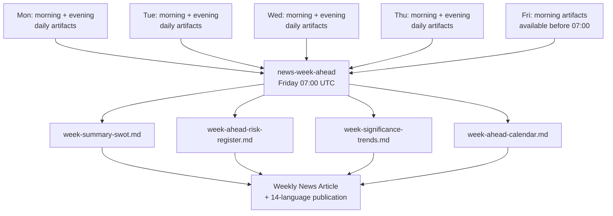

<p align="center">
  
</p>

<h1 align="center">📅 Weekly Analysis Directory</h1>

<p align="center">
  <strong>📊 Per-Week Aggregated Analysis from Daily Agentic Workflow Artifacts</strong><br>
  <em>🎯 YYYY-WNN ISO naming · Week-ahead intelligence · Aggregated risk & SWOT</em>
</p>

<p align="center">
  <a href="#"></a>
  <a href="#"></a>
  <a href="#"></a>
  <a href="#"></a>
</p>

**📋 Document Owner:** CEO | **📄 Version:** 1.0 | **📅 Last Updated:** 2026-03-26 (UTC)  
**🏢 Owner:** Hack23 AB (Org.nr 5595347807) | **🏷️ Classification:** Public

---

## 🎯 Purpose

The `analysis/weekly/` directory stores weekly aggregated analysis artifacts. Each week that the `news-week-ahead` workflow runs (Fridays 07:00 UTC), a new subdirectory is created using the ISO 8601 week number format `YYYY-WNN`. Weekly artifacts use the latest available daily analyses (typically Monday–Thursday and any early Friday runs) to produce week-ahead strategic intelligence for the upcoming ISO week.

---

## 📅 Naming Convention

```
analysis/weekly/
├── YYYY-WNN/           ← ISO 8601 week number (always zero-padded)
│   ├── week-summary-swot.md
│   ├── week-ahead-risk-register.md
│   ├── week-significance-trends.md
│   └── week-ahead-calendar.md
```

**Rules:**
- Always use `YYYY-WNN` — zero-pad the week number: `2026-W03` not `2026-W3`
- ISO 8601 weeks start on **Monday** and end on **Sunday**
- Week 1 of a year is the week containing the first Thursday of January (ISO 8601 standard)
- Week 53 occurs only in some years — check ISO 8601 calendar
- Never use locale-specific week numbering (US weeks start Sunday — do not use)

**Examples:**
```
2026-W01/    ← Week 1: Mon 2025-12-29 to Sun 2026-01-04
2026-W13/    ← Week 13: Mon 2026-03-23 to Sun 2026-03-29
2026-W52/    ← Week 52: Mon 2026-12-21 to Sun 2026-12-27
```

---

## 📁 Files Created Per Week

All weekly files are created by the `news-week-ahead` workflow (runs **Fridays 07:00 UTC** to preview the upcoming parliamentary week):

| File | Format | Purpose | Source Data |
|------|--------|---------|-------------|
| `week-summary-swot.md` | Markdown | Aggregated SWOT from the week's daily SWOT artifacts | Mon–Thu `evening-swot-update.md` + available morning SWOT inputs from the current week, merged and deduplicated |
| `week-ahead-risk-register.md` | Markdown | Forward-looking risk register for the coming week based on legislative calendar | Daily risk snapshots + upcoming Riksdag calendar |
| `week-significance-trends.md` | Markdown | Trending political topics by significance score across the week | Daily `morning-significance-scores.json` aggregated |
| `week-ahead-calendar.md` | Markdown | Key parliamentary events, votes, and committee meetings for the coming week | riksdag-regering-mcp `get_calendar_events` |

---

## 🔗 How Weekly Files Aggregate Daily Analyses



### Aggregation Rules

- **SWOT aggregation:** New entries from daily SWOTs are added; duplicate entries are deduplicated by topic; confidence levels are re-assessed using the full week's evidence
- **Risk aggregation:** Daily risk scores are tracked as time series; the week's maximum score for each risk ID is used in the weekly register; resolved risks are marked CLOSED
- **Significance trends:** Events appearing in significance scores across multiple days are flagged as "sustained significance"; one-day spikes are noted but weighted lower
- **Calendar sources:** Next week's calendar is fetched fresh from `get_calendar_events` during the Friday 07:00 UTC `news-week-ahead` run — not aggregated from daily data

---

## 📊 Monthly Aggregation Cross-Reference

Weekly artifacts are intended to be aggregated into monthly strategic briefs. The monthly aggregation pipeline is **planned but not yet implemented** (see [analysis/monthly/README.md](../monthly/README.md)). When implemented, it will run on the last calendar day of each month, read all weekly files for the month, and produce:

- `analysis/monthly/YYYY-MM/monthly-intelligence-brief.md`
- `analysis/monthly/YYYY-MM/monthly-swot-consolidated.md`
- `analysis/monthly/YYYY-MM/monthly-risk-register.md`
- `analysis/monthly/YYYY-MM/monthly-significance-report.md`
- `analysis/monthly/YYYY-MM/monthly-threat-landscape.md`

See [analysis/monthly/README.md](../monthly/README.md) for full monthly aggregation documentation.

---

## 🗑️ Retention Policy

| Age | Status | Retention Action |
|-----|--------|-----------------|
| 0–12 weeks | **Active** | Full git history; all files present |
| 13–26 weeks | **Recent** | Retained; monthly aggregation is primary reference |
| 27–52 weeks | **Historical** | Consider compression; monthly files are the canonical record |
| 52+ weeks | **Archive** | External archival; quarterly and annual summaries supersede |

**Note:** Weekly files represent the highest-value intermediate analysis product. Monthly briefs aggregate weekly files; annual intelligence reviews aggregate monthly files.

---

**Document Control:**  
- **Path:** `/analysis/weekly/README.md`  
- **Classification:** Public  
- **Next Review:** 2026-06-26
