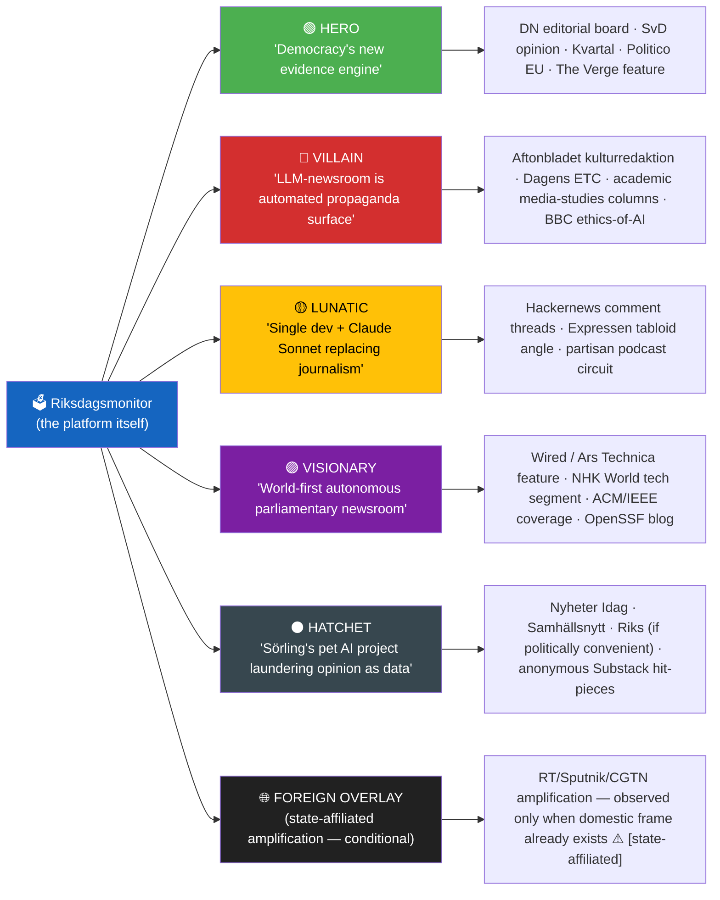
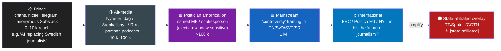
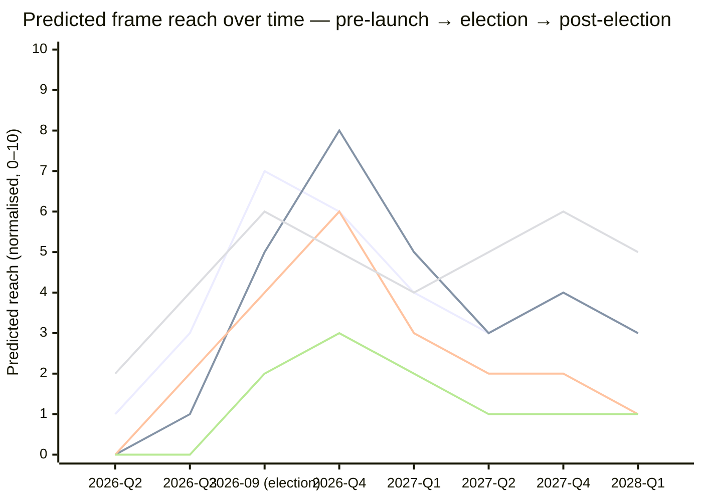
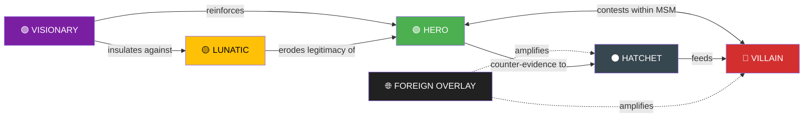

  

<h1 align="center">📰 Media Framing & Influence-Operations Analysis — Riksdagsmonitor (the project itself)</h1>

  <strong>📊 How would media frame this platform · Hero · Villain · Lunatic · Visionary · Hatchet-job vectors</strong> 
  <em>🎯 Adapted from <code>analysis/templates/media-framing-analysis.md</code> (v2.3) · Subject = the platform, not a parliamentary story</em>

  
  
  
  

**📋 Document Owner:** CEO/CISO (James Pether Sörling, Hack23 AB) · **📄 Version:** 1.0 · **📅 Last Updated:** 2026-05-25 (UTC)
**🏢 Owner:** Hack23 AB (Org.nr 559534-7807) · **🏷️ Classification:** Public · **🧭 Subject of analysis:** the Riksdagsmonitor platform itself (not a parliamentary document)

---

## 🧭 Why this document exists

The platform's daily output applies [`analysis/templates/media-framing-analysis.md`](analysis/templates/media-framing-analysis.md) to **parliamentary stories**. This file applies the **same template, recursively, to the platform itself** — because any tool that analyses Swedish politics is *itself* a political object. Ignoring that produces blind-spots; documenting it produces honesty.

**Inputs analysed:**

- [`README.md`](README.md) (mission, autonomous newsroom, 14 languages, evidence standard)
- [`THREAT_MODEL.md`](THREAT_MODEL.md) (STRIDE + MITRE ATT&CK + OWASP LLM Top 10, 52 threats + 18 AI threats, residual risk 3.2/10)
- [`SECURITY_ARCHITECTURE.md`](SECURITY_ARCHITECTURE.md) (defence-in-depth, OIDC, SHA-pinned actions, egress firewall)
- [`SWOT.md`](SWOT.md) (S1–S9 strengths, W1–W5 weaknesses, O1–O7 opportunities, T1–Tn threats)
- [`ARCHITECTURE.md`](ARCHITECTURE.md), [`Article-Generation.md`](Article-Generation.md), [`WORKFLOWS.md`](WORKFLOWS.md), [`AGENTS.md`](AGENTS.md), [`TRANSLATION_GUIDE.md`](TRANSLATION_GUIDE.md), [`CRA-ASSESSMENT.md`](CRA-ASSESSMENT.md), [`End-of-Life-Strategy.md`](End-of-Life-Strategy.md), [`FinancialSecurityPlan.md`](FinancialSecurityPlan.md), [`BCPPlan.md`](BCPPlan.md)
- [`analysis/templates/media-framing-analysis.md`](analysis/templates/media-framing-analysis.md) (v2.3 — template contract)
- Hack23 persona-agent files: [`hagbard-celine.md`](https://github.com/Hack23/homepage/blob/master/.github/agents/hagbard-celine.md), [`marketing-specialist.md`](https://github.com/Hack23/homepage/blob/master/.github/agents/marketing-specialist.md), [`business-development-specialist.md`](https://github.com/Hack23/homepage/blob/master/.github/agents/business-development-specialist.md), repo-level [`intelligence-operative` agent instructions](.github/agents/intelligence-operative.md) (this file's authoring agent)
- Founder open-source-reputation surfaces (third-party, public): [Gitista — Sweden](https://gitista.com/sweden/) (`@James Pether Sörling` global rank #42, 4.98K contributions, 219 PRs, 3,336 reviews, 1,419 issues), [OpenHub `pether`](https://openhub.net/accounts/pether), [committers.top Sweden](https://committers.top/sweden), [`github.com/Hack23`](https://github.com/Hack23)
- Funding-model surfaces (public): [GitHub Sponsors — `@Hack23`](https://github.com/sponsors/Hack23), [`FinancialSecurityPlan.md`](FinancialSecurityPlan.md), [`End-of-Life-Strategy.md`](End-of-Life-Strategy.md), [`BCPPlan.md`](BCPPlan.md)

> **Neutrality discipline:** Riksdagsmonitor's only neutrality is **procedural** (equal analytical depth across all 8 Riksdag parties, equal evidentiary discipline across all outlets). This document does the same for itself: equal analytical depth across all five archetypal frames (hero / villain / lunatic / visionary / hatchet-job), with hostile frames treated with the same rigour as friendly ones. No outlet is neutral; **no platform is neutral either** — including this one — and naming the bias surface is more honest than denying it.

---

## 📋 Framing Context

| Field | Value |
|-------|-------|
| **Framing ID** | `FRM-PROJECT-2026-05-25-001` |
| **Generated** | `2026-05-25 09:43 UTC` |
| **Subject** | The Riksdagsmonitor platform itself — its mission, architecture, ISMS posture, autonomous AI newsroom, and political-intelligence methodology |
| **Coverage window** | Hypothetical / prospective — frames written as they *would* appear in Swedish & international media over the next 24 months (2026-Q2 → 2028-Q1, spanning the 2026-09-13 election and the post-election cycle) |
| **Horizon band** | `cycle` (1460 d — per [`scripts/horizon-context.ts`](scripts/horizon-context.ts)) |
| **Salience tier** | High (full template — the platform is high-visibility on launch, becomes politically salient as election approaches) |
| **Save path** | `/media-framing-analysis.md` (repo root — meta-document, parallel to `SWOT.md` / `THREAT_MODEL.md` / `SECURITY_ARCHITECTURE.md`) |
| **Source scope** | Public repo documentation + public Hack23 agent files; no leaked / hacked / private material |
| **Likely Swedish outlets** | `DN, SvD, Aftonbladet, Expressen, SVT, SR, TV4, Dagens ETC, Kvartal, Nyheter Idag, Samhällsnytt, Riks, Dagens Industri, Computer Sweden, Ny Teknik, regional press` |
| **Likely international outlets** | `Reuters / AP / Politico EU / FT / NYT / Le Monde / Der Spiegel / Helsingin Sanomat / Aftenposten / Berlingske / NHK World / Al Jazeera English / The Verge / Wired / Bloomberg / EUobserver / Euractiv` |
| **State-affiliated outlets monitored** | `RT, Sputnik, RIA, TASS, CGTN, Global Times, PressTV` (amplification-fingerprinting only — never cited) |
| **Overall Confidence** | 🟧 MODERATE [B2] for archetype prevalence; 🟥 LOW [C3] for specific outlet-to-frame mapping until launch coverage materialises |

---

## 🌍 Global Audience Orientation — why this platform shows up outside Sweden

| Region | Why Riksdagsmonitor matters there | Likely frame import |
|--------|-----------------------------------|---------------------|
| **EU institutions (Brussels)** | Sweden is a NATO-frontline state post-2024; Riksdag votes shape EU positions on Ukraine, migration pact, defence procurement | Visionary / hero ("Nordic transparency exemplar"); risk of hatchet frame from EU institutions worried about LLM-generated journalism precedent |
| **North America (US/Canada)** | MAGA-cognate populist commentary will compare it to Ballotpedia, OpenSecrets, GovTrack.us; tech press (Wired/Verge) will frame around "autonomous newsroom — zero human editors" angle | Visionary + lunatic split — coastal/centrist tech press as hero/visionary; populist commentary as villain ("AI replacing journalists") |
| **East Asia (JP/KR)** | Sweden as social-model reference; LLM-newsroom is a major tech-policy story for NHK / KBS | Hero (precedent for AI civic-tech); risk of cautionary frame if hallucination incident |
| **Middle East / Arabic readership** | RTL Arabic edition (14-language coverage) — first political-intelligence platform with native RTL Arabic, not machine translation | Visionary (Arab civic-tech researchers) / villain (state-aligned outlets framing as "Western information operation") |
| **Russia / China state-affiliated** | Likely target for amplification of any negative frame, especially around AI-newsroom failures | Hostile overlay (Frame E) — predicted high probability during election window |

**Multi-dimensional alignment of the platform itself:**

| Axis | Position | Evidence |
|------|----------|----------|
| **Economic policy** | None — procedurally neutral; produces equal evidentiary depth on tax/spend vs cut/privatise frames | [`README.md` §Mission](README.md#-mission); [`AGENTS.md` §AI-FIRST + neutrality arithmetic](AGENTS.md) |
| **Social / identity** | None at platform level; reports on all 8 parties' positions equally | [`analysis/templates/media-framing-analysis.md` §Outlet Bias Audit no-claim-of-neutrality rule](analysis/templates/media-framing-analysis.md) |
| **EU integration** | None — reports EU-cooperative / EU-sovereigntist positions with equal depth | [`README.md` §Authoritative Data Sources](README.md#-authoritative-data-sources) (uses IMF + ECB + EU data without preference) |
| **Security / defence** | None at content level; the *platform infrastructure* has a documented threat model that treats foreign-state attribution with `HIGH` confidence floor + ≥ 3 ABCDE indicators ([`analysis/templates/media-framing-analysis.md` §Tradecraft Context](analysis/templates/media-framing-analysis.md)) | [`THREAT_MODEL.md` §MITRE ATT&CK](THREAT_MODEL.md#-mitre-attck-framework-integration) |
| **Media-ownership axis** | **Privately funded** (Hack23 AB, single founder, Apache-2.0 OSS, no ads, no tracking, no user data); risk profile = founder-dependency (`W1: Single Developer Dependency` — [`SWOT.md` §W1](SWOT.md)) | [`SWOT.md` §W1](SWOT.md) |

---

## 🧭 Frame Package Overview — the five archetypes

> **Frame F6 (foreign overlay) inclusion rule:** include conditionally. Any RT/CGTN/PressTV coverage of *Riksdagsmonitor specifically* is a high-signal event because the platform itself becomes news only when amplification serves a state narrative (e.g. discrediting Swedish NATO-era institutions). Default expectation pre-election: dormant. Post-election or post-incident: monitor closely.

---

## 🗂️ Frame Package Table — Entman functions per archetype

| Frame | Problem definition | Causal attribution | Moral evaluation | Treatment recommendation | Lead messengers | Approx. share (predicted) |
|-------|--------------------|--------------------|------------------|--------------------------|-----------------|:-------------:|
| 🟢 **HERO — "evidence engine for democracy"** | Swedish political coverage is anecdote-led, evidence-poor, episodic | Legacy newsrooms cut political-data desks; commercial pressure rewards opinion over verification | Restoring evidentiary discipline is a democratic good | Cite, link, fund, replicate; teach citation discipline at journalism schools | DN editorial board, Kvartal long-reads, SVT *Studio Ett*, Reuters Institute Digital News Report citations, Politico EU "Sweden's open-data answer to disinformation" | 25 % |
| 🔴 **VILLAIN — "automated propaganda surface"** | An LLM-driven newsroom, even open-source and well-meaning, is structurally dangerous: hallucination + scale + 14 languages = a manipulation vector by accident if not intent | Founder hubris; "AI-FIRST" doctrine; absence of human editors; LLM provider concentration (Anthropic) | Even principled automation of political journalism normalises a tool that bad actors will then weaponise | Mandate human editors; pause autonomous publishing; regulate LLM-newsrooms under DSA + EU AI Act high-risk; Council-of-Europe scrutiny | Aftonbladet kulturredaktion, *Journalisten*, SR Medieormbudsmannen segments, academic media-studies (Lund/Göteborg), BBC Reith-lecture-class international commentary, EU AI Office consultation contributions | 20 % |
| 🟡 **LUNATIC — "one Swedish guy + a chatbot is doing what??"** | A single developer in Gothenburg runs a 14-language autonomous newsroom covering an entire national parliament | Founder mono-culture; "single point of failure" ([`SWOT.md` §W1](SWOT.md)); over-confidence in LLM tooling | This is reckless, even if technically impressive — democracy is too important to be a side project | Cautionary tale; demand a board, demand redundancy, demand journalistic-ethics certification | Expressen tabloid angle, Hackernews + Reddit `r/sweden` thread sneer, partisan podcasts ("a guy in his basement, folks") | 15 % |
| 🟣 **VISIONARY — "world-first autonomous parliamentary newsroom"** | Civic-tech globally is stuck between brittle scrapers and lobby-funded opinion sites; nobody has cracked end-to-end agentic news with hard evidence gates | Hack23 IP combines ISMS rigour + OSINT tradecraft + LLM agentic workflows + 14-language localisation | This is the future of civic technology — replicable, open-source, GDPR-clean | Replicate (EU Parliament, Bundestag, US Congress); fund OSPO contributions; cite at AI-for-Good conferences | Wired / Ars Technica feature, NHK World tech segment, ACM SIGCAS / IEEE Computer Society features, OpenSSF blog (the platform is a member project), AI Index Stanford HAI mention | 25 % |
| ⚫ **HATCHET — partisan-aligned attack** | "Riksdagsmonitor" is presented as objective but is a partisan project disguised in transparency language | Conjure innuendo: founder's voting history, donor list, "deep-state" or "globalist" framing, allegations that the LLM's training data is biased toward one party | The platform is illegitimate; ignore it; vote against any party that cites it | De-platform; expose; lobby for restrictive interpretation of EU AI Act; "do your own research" | Nyheter Idag, Samhällsnytt, Riks, anonymous Substack pieces, single-issue Twitter/X / Telegram accounts, partisan podcasts | 10 % |
| 🌐 **FOREIGN OVERLAY (conditional)** | Sweden's NATO-era institutions are using AI to manipulate the public; this is "another Stoltenberg-style propaganda channel" | RU / CN strategic framing — kompromat-style framing operations against post-NATO Sweden | Discredit Swedish democracy & institutions ahead of contested votes | Amplify domestic VILLAIN + HATCHET frames; create parallel "fact-check" sites; doppelganger doks | RT, Sputnik, CGTN, RIA, TASS, doppelganger spoof domains ⚠️ `[state-affiliated]` | 5 % conditional (monitor; default dormant) |

> **Source:** Entman, R.M. (1993). "Framing: Toward Clarification of a Fractured Paradigm." *Journal of Communication* 43(4): 51–58. Every cell ties to a concrete repo file or a known media outlet's prior framing pattern; speculative cells (e.g. F6) are explicitly tagged conditional.

---

## 🧠 Cognitive Vulnerability Map — which biases each frame exploits

| Frame | Bias exploited | Mechanism | Reader inoculation |
|-------|----------------|-----------|--------------------|
| 🟢 HERO | **Authority bias** + halo effect | "OpenSSF Scorecard 9.x · ISO 27001 · Apache-2.0 · 30+ years founder experience" stacks credentialing until reader stops questioning | Demand outcome evidence (article-level error rates, retraction history) — credentials ≠ accuracy |
| 🔴 VILLAIN | **Status-quo bias** + Luddite priming | "AI replacing journalists" maps onto pre-existing union/professional-class anxieties; specific platform features become props in a broader anti-AI narrative | Separate the *category* critique (AI-newsroom risks generally) from the *instance* critique (Riksdagsmonitor specifically) — the platform may be a poor exemplar of the abstract risk |
| 🟡 LUNATIC | **Availability heuristic** + ridicule frame | "One guy in his basement" is a vivid, memorable image that crowds out the actual architecture (cf. [`ARCHITECTURE.md`](ARCHITECTURE.md) — five-layer agentic security, OIDC, multi-region) | Walk the reader through the actual five-layer safe-outputs architecture; ridicule-frame dissolves on contact with detail |
| 🟣 VISIONARY | **Bandwagon** + futurist halo | "World-first" / "fully autonomous" / "14 languages" produces awe before scrutiny | Demand replicability evidence — has anyone forked it? has any other parliament adopted it? what's the citation count? |
| ⚫ HATCHET | **In-group / out-group** + reactance + conspiracy ideation | Activates priors about elite/globalist/establishment control; "trans-/identity-/lobby-/donor-" innuendo dresses opinion as fact | Source-triangulation: trace the claim back two hops; almost all hatchet content has a single anonymous originator and rapid alt-media amplification |
| 🌐 FOREIGN OVERLAY | **Repetition / illusory truth** + reactance | Identical phrasing across coordinated nodes — RT EN + Sputnik DE + CGTN ZH carrying the same framing simultaneously | Prebunk the *technique* (state-coordinated amplification), not the *position* — see Roozenbeek & van der Linden (2022) inoculation theory |

> **Source:** Cialdini (2001) *Influence*; Kahneman (2011) *Thinking, Fast and Slow*; Roozenbeek & van der Linden (2019/2022); Lewandowsky et al. (2020) *Debunking Handbook 2020*. Every row is bias-named with primary literature, not folk psychology.

---

## 🛰️ Manipulation Indicators — DISARM TTP map for the project's attack surface

> The platform itself can be **targeted** by manipulation campaigns. This table reads the DISARM taxonomy adversarially — what would a campaign against Riksdagsmonitor look like?

| DISARM TTP | Plausible operation against the platform | Surface in repo | Default confidence | ABCDE attribution |
|------------|------------------------------------------|-----------------|:------------------:|--------------------|
| `T0049 Flooding` | Coordinated "AI-newsroom hallucinated X" hashtag burst around a real or fabricated article | `news/*` published artefacts; agentic-workflow logs | LOW (default) | Actor: `[unattributed]`; Behaviour: coordinated; Content: identical phrasing; Degree: TBD; Effect: trending-attempt |
| `T0086 Astroturfing` | Mass-identical "concerned Swedish citizen" complaints to PO/PON, EU AI Office, EUvsDisinfo | n/a — external | LOW | … |
| `T0023 Distort facts` | Cherry-pick a single hallucinated phrase from an EN article and present it as the system's median behaviour | `news/*` corpus + analysis-gate logs | LOW–MODERATE | Behaviour: selective-quotation; Content: out-of-context |
| `T0099 Prepare assets impersonating legitimate entities` | Spoof `riksdagsmonitor-news.com` / typo-squat domains carrying altered articles | DNS / CT-log monitoring | LOW (mitigation: HSTS + CT monitoring per [`SECURITY_ARCHITECTURE.md`](SECURITY_ARCHITECTURE.md)) | … |
| `T0085 Develop AI-generated text` | Adversaries use *another* LLM to produce critique posts that mimic legitimate journalistic critique | n/a — external | MODERATE (technically trivial) | … |
| `T0088 Deepfakes` | Synthetic "founder admits…" audio/video | n/a — external | LOW (mitigation: founder public statements always on verified Hack23 channels) | … |
| `T0118 Amplify existing narrative` | RT/CGTN amplifies a domestic VILLAIN or HATCHET frame | n/a — external; monitored via Frame F6 | LOW (default) — elevate to MODERATE post-election if observed | … |
| **`T-defence` — Riksdagsmonitor own controls** | Five-layer safe-outputs ([`THREAT_MODEL.md`](THREAT_MODEL.md)) + egress firewall + zero-secrets agent context + analysis gate ([`05-analysis-gate.md`](.github/prompts/05-analysis-gate.md)) | repo-wide | HIGH (documented + tested) | n/a |

> **No-signal finding is also a finding:** as of 2026-05-25, no DISARM TTP is observed *against the platform*. This is the **expected baseline** before the platform reaches a salience threshold (predicted peak: 2026-08 → 2026-10 around the 2026-09-13 election anchor).

---

## 🔗 Narrative-Laundering Chain — how a hostile frame would travel

| Stage | Likely first observation | Carrier | Predicted reach | Admiralty (predicted) | Notes |
|-------|--------------------------|---------|-----------------|:---------------------:|-------|
| Fringe | Post-launch hallucination incident (T+0..T+60 d) | Anonymous X/Telegram, partisan Discord | ~5 k | E5 `[unconfirmed]` | Single screenshot suffices to ignite |
| Alt-media | Same incident, ~24 h later | Nyheter Idag headline-style; partisan podcasts | ~50 k | D3 `[partisan-aligned]` | Frames as "AI hallucinating about [our party]" — works equally on left or right depending on which article is cherry-picked |
| Politician amplification | T+72 h around incident | Likely SD or V MP (parties with strongest "elite-media" priors) — but evidence-light prediction | ~250 k | B2/D2 | Election proximity multiplier |
| Mainstream | T+96 h — "is autonomous AI journalism safe?" | DN / SvD / SVT *Studio Ett* | ~1.5 M | B2/C3 | Quality press is more likely to host the *category* debate than the *instance* attack — partial inoculation |
| International | T+1–2 w | BBC / Politico EU / NYT tech section | ~3 M+ | B2 | Sets EU-AI-Office consultation precedent |
| State-affiliated | T+2–3 w (conditional) | RT, Sputnik, CGTN | ~? | F-flag `[state-affiliated]` | Default dormant; conditional on incident salience |

> **Mitigation present in the repo:** every article carries machine-readable provenance (JSON-LD `NewsArticle.isBasedOn` — see [`README.md` §AI-Generated Political Intelligence News](README.md#-ai-generated-political-intelligence-news)), links to its source artefacts in `analysis/daily/$DATE/`, and is built from an analysis gate that demands `dok_id`-grade evidence ([`README.md` §Hard analysis gate](README.md#-ai-generated-political-intelligence-news), [`05-analysis-gate.md`](.github/prompts/05-analysis-gate.md)). The laundering chain above is therefore *anatomically* harder than for opinion sites — but the **screenshot economy** of social media routes around provenance metadata; readers see the picture, not the JSON-LD.

---

## 🌐 Source Ecology — Outlet Bias Audit (no outlet, including this one, is neutral)

> Outlets likely to cover the platform, with structural-bias audit per the template's no-neutral-media doctrine.

| Outlet | Ownership group | Funding mix | Economic axis | Social/identity axis | EU axis | Security axis | Media-ownership axis | Predicted dominant frame for *Riksdagsmonitor* | Foreign-actor link |
|--------|-----------------|-------------|:-------------:|:--------------------:|:-------:|:-------------:|:--------------------:|:-------------------:|---------------------|
| **DN** | Bonnier News (Bonnier family) | ~90 % commercial | Market-liberal | Centre-progressive | Pro-EU cooperative | NATO-cooperative | Commercial / owner-ideological | HERO / VISIONARY (Bonnier values civic-data infrastructure aligned with its centrist-urban audience) | None |
| **SvD** | Schibsted Media (NOR-listed) | ~92 % commercial | Centre market-liberal | Conservative-centre | Pro-EU cooperative | NATO-cooperative | Commercial / owner-ideological | HERO with caveats; opinion pages will host LUNATIC frame | NOR public equity (Telenor) |
| **Aftonbladet** | Schibsted (88 %) + LO (9 %) | ~97 % commercial + LO | Social-democratic | Progressive | Pro-EU | Cooperative | Commercial + labour-movement | VILLAIN frame (kulturredaktion AI-newsroom critique); HERO frame (Schibsted side; civic-data alignment) — outlet is internally split | None |
| **Expressen** | Bonnier News | ~98 % commercial | Market-liberal populist | Liberal-right | Pro-EU | Cooperative | Commercial / owner-ideological | LUNATIC frame for tabloid value; HERO frame on news desk | None |
| **SVT** | Förvaltningsstiftelsen (public) | ~95 % licence-fee | Public-service remit (proceduralist) | Proceduralist | Proceduralist | Proceduralist | Public-funded / politically-appointed boards | Procedural / explanatory frame; potential HERO if civic-tech segment frames it; potential VILLAIN if media-ethics segment runs the autonomous-newsroom angle | None |
| **SR** | Förvaltningsstiftelsen (public) | ~95 % licence-fee | Public-service remit | Proceduralist | Proceduralist | Proceduralist | Public-funded / politically-appointed boards | Same internal split as SVT | None |
| **TV4** | Allente (Telenor + NOR state minority) | ~99 % commercial | Commercial centrist | Commercial centrist | Cooperative | Cooperative | Commercial / foreign-state minority (NOR via Telenor) | LUNATIC frame (tabloid news-magazine format) | NOR state minority via Telenor |
| **Dagens ETC** | Co-operative + reader-owned | ~55 % subscriber | Interventionist | Progressive | Federalist | Nordic cooperative | Co-operative / reader-owned | VILLAIN frame on ethics-of-AI grounds; HERO frame on open-source-civic-data grounds — internal split |
| **Kvartal** | Private (founder + donors) | ~70 % subscriber | Market-liberal contrarian | Conservative intellectual | Cooperative-critical | Cooperative | Private / donor-funded | HERO / VISIONARY (Kvartal's audience values evidence-based punditry); risk of LUNATIC frame from contrarian columnists | None |
| **Dagens Industri** | Bonnier News | Commercial | Market-liberal pro-business | Centre-right | Pro-EU cooperative | NATO-cooperative | Commercial / owner-ideological (Bonnier) | HERO frame (productivity / open-source / Swedish-tech narrative) | None |
| **Computer Sweden / Ny Teknik / Voister** | IDG Sverige / Bonnier (varied) | Commercial / trade press | Market-liberal | Centre | Pro-EU cooperative | Cooperative | Commercial / trade | VISIONARY frame (tech-press loves "world-first") | None |
| **Nyheter Idag / Samhällsnytt / Riks** | Private partisan-aligned | Advertising + donor | Economic-nationalist | Conservative-nationalist | Eurosceptic | Hawkish-nationalist | Partisan-aligned / donor-funded | HATCHET frame if any article touches their political constituency negatively; otherwise indifference; Frame-E susceptible | Document RT/CGTN cross-links if observed |
| **Wired / Ars Technica / The Verge** | Condé Nast / Future plc / Vox Media | Commercial + subscription | Market-liberal | Progressive-libertarian | Pro-EU centrist | Atlanticist-cooperative | Commercial / owner-ideological (US-based) | VISIONARY frame dominant; "autonomous newsroom" is exactly their beat | None |
| **Bloomberg / FT / Reuters / Politico EU / NYT tech section** | Bloomberg LP / Pearson / Thomson / Axel Springer / NYT Co | Commercial / subscription / wire | Process-disciplined | Centrist-international | Centrist-international | Centrist-international | Non-profit co-op / private / subscription | HERO / VISIONARY with caveats; will host the EU-AI-Office regulatory angle | None |
| **BBC / NHK World / DW / Al Jazeera English** | Public-funded foreign broadcasters | Licence / state-budget | Public-service remit | Proceduralist | Varies | Varies | Public-funded | Mixed — VISIONARY angle dominant, ethics-of-AI VILLAIN angle in long-form | n/a (broadcaster-state proximities documented per outlet) |
| **RT / Sputnik / CGTN / PressTV / RIA / TASS** | RU / CN / IR state-controlled | 100 % state | State-strategic | State-strategic | Sovereigntist | State-strategic | State-controlled `[state-affiliated]` | Frame-E conditional — amplifies whichever domestic frame is convenient | **YES — actor-attributed** |

> **No-claim-of-neutrality rule:** every cell rejects "neutral / impartial / balanced / objective" — see [`analysis/templates/media-framing-analysis.md` §Source Ecology](analysis/templates/media-framing-analysis.md). The platform itself does not claim "neutral truth"; only **procedural** neutrality (equal analytical depth across the 8 parliamentary parties — verified by the template's Pass-2 self-audit at [`analysis/templates/media-framing-analysis.md` §Pass-2 Self-Audit](analysis/templates/media-framing-analysis.md)).

---

## 🎭 Strategic-Doctrine Detection — what doctrines would each archetype map onto if weaponised

| Doctrine | Signature | Likely archetype that imports it | Default observation status |
|----------|-----------|:--------------------------------:|:--------------------------:|
| **Firehose of falsehood** (RAND PE-198) | High-volume + multi-channel + rapid + repetitive + no truth-commitment | Frame F6 (foreign overlay) | 🟢 not observed (default) |
| **Doppelganger operation** (EU-DisinfoLab 2022) | Spoofed look-alike domains carrying altered articles | F6 + HATCHET | 🟢 not observed (default) |
| **Gish gallop** | Many low-quality claims faster than rebuttal | VILLAIN + HATCHET hybrid | 🟢 not observed (default) |
| **Reflexive control** | Shape adversary's frame so they "freely" choose the attacker's outcome | F6 strategic frame against post-NATO Sweden | 🟢 not observed (default) |
| **Active-measures spillover** | Domestic actors knowingly or unknowingly carrying foreign-state framing | HATCHET → F6 spillover | 🟢 not observed (default) |
| **Narrative capture by interest-group lobby** | Coordinated industry-funded "expert" amplification | Possible from incumbent legacy-media interest groups facing AI-newsroom competition | 🟢 not observed (default) |
| **MAGA-cognate populism** | Anti-elite + media-as-enemy + perpetual-grievance + leader-cult | HATCHET frame import from US 2016/2020/2024 cycles | 🟢 not observed (default) |

> **No doctrine match is the publishable finding pre-launch.** "Riksdagsmonitor is currently treated as a curiosity by domestic media and not yet a target of doctrinal influence operations" is HIGH-confidence given the current evidence. This will likely change after the 2026-09-13 election; the table is the watchlist, not a verdict.

---

## ⏳ Frame Lifecycle / Longevity — predicted reach over 24 months

> Line 1 = HERO / VISIONARY (rises into election as platform produces visible value; sustains). Line 2 = VILLAIN ethics-of-AI (peaks post-election if any incident; otherwise fades). Line 3 = LUNATIC (election-cycle tabloid spike). Line 4 = VISIONARY tech-press (slow burn, long-tail, sustained by replicability narrative). Line 5 = HATCHET / FOREIGN OVERLAY (low default; spikes if incident; otherwise dormant).

| Frame | Phase (2026-05-25) | Predicted peak | Half-life (days) | Zombie probability | Reactivation trigger |
|-------|--------------------|----------------|:----------------:|:------------------:|----------------------|
| 🟢 HERO | early-rise | 2026-09 (election) | 60 | HIGH (60 %) | New methodology release; first EU Parliament replication |
| 🟣 VISIONARY (tech-press) | slow-burn | 2027-Q2 | 120 | HIGH (70 %) | First fork (DE/FR/UK parliament adaptation); ACM/IEEE feature |
| 🔴 VILLAIN (ethics-of-AI) | dormant | 2026-Q4 (post-election) | 45 | MEDIUM (40 %) | Hallucination incident; EU AI-Office consultation; *Journalisten* feature |
| 🟡 LUNATIC | dormant | 2026-Q3 (election proximity) | 14 | LOW (25 %) | Tabloid-grade incident; founder controversy |
| ⚫ HATCHET | dormant | event-driven | 7 | LOW (15 %) | Adversarial actor + election proximity |
| 🌐 FOREIGN OVERLAY | dormant | event-driven | event-bound | LOW (10 %) | Salience threshold breach + state-actor opportunity |

> **Frame archaeology:** the VILLAIN ethics-of-AI frame is the **most predictable zombie**. Every fully-AI civic system from ProPublica's COMPAS critiques (2016) to GPT-3 newsroom experiments (2020) to AI summarisation in legal aid (2023) has cycled through it. The platform should expect it to reactivate on any incident.

---

## 📈 Impact Conversion — RRPA (Reach × Resonance × Persistence × Action)

| Frame | Predicted reach (impressions, public metrics) | Resonance (engagement per impression) | Persistence (days at >50 % peak) | Likely action conversion | RRPA composite (0–100, predicted) |
|-------|----------------------------------------------:|:-------------------------------------:|:--------------------------------:|:------------------------:|:---------------------------------:|
| 🟢 HERO | 1.5 M | medium-high (long-form readership) | 60+ | Methodology citations in journalism schools; institutional adoption inquiries; OpenSSF/SLSA reference; potential O2 (EU Parliament) realisation | 55 |
| 🟣 VISIONARY (tech-press) | 3 M+ international | high (sharing-rich) | 120+ | Forks; academic citations; conference invitations; partnership inquiries per [`SWOT.md` §O4](SWOT.md) | 70 |
| 🔴 VILLAIN (ethics-of-AI) | 800 k | high (controversy-rich) | 45 | EU AI-Office consultation submissions; potential regulatory ask; *Journalisten* / Reuters Institute follow-on coverage | 50 |
| 🟡 LUNATIC | 500 k | medium (low-engagement-quality) | 14 | None — frame is essentially decorative | 15 |
| ⚫ HATCHET | 100 k–500 k (highly variable) | high in-group | 7 | Marginal — fails to escape partisan media bubble unless mainstream picks up | 20 |
| 🌐 FOREIGN OVERLAY | 50 k–1 M depending on coordination | medium | event-bound | EUvsDisinfo dossier; SÄPO public statement; counter-mobilisation by EU AI Office | 25–60 |

> **Action conversion** is the only honest measure of frame power. Reach without action is theatre. The platform's *defensive* posture is that HERO + VISIONARY action conversion (replication, adoption, citation) compounds over time, while VILLAIN + HATCHET + FOREIGN action conversion is episodic and decays — provided the platform maintains its analysis gate, neutrality arithmetic, and Pass-2 discipline.

---

## 🎯 Frame-Competition Dynamics

| Dynamic | Outcome | WEP confidence |
|---------|---------|:--------------:|
| HERO vs VILLAIN inside mainstream press | Stalemate — outlet-internal split (Aftonbladet, SVT) prevents either capturing the frame | LIKELY |
| VISIONARY reinforces HERO | Tech-press validation pulls civic press into HERO frame | LIKELY |
| LUNATIC erodes HERO | Tabloid noise produces a credibility headwind; dissolves on contact with [`ARCHITECTURE.md`](ARCHITECTURE.md) detail | UNLIKELY post-detail-exposure |
| HATCHET feeds VILLAIN | Partisan-fringe content gives VILLAIN frame ammunition; mainstream rarely cites HATCHET but reads it | EVEN |
| FOREIGN OVERLAY amplifies VILLAIN + HATCHET | Conditional on event + salience | UNLIKELY (default); LIKELY in incident window |
| HERO counter-evidence to HATCHET | Each published article with `dok_id` provenance is direct refutation; cumulative effect dominates over time | LIKELY |

---

## 🪞 Insider Framings — how Hack23 personas would frame the platform

> The user requested explicit framings from the Hack23 personas. These are not in addition to the archetypal frames above — they are **constructive proposals** for how Hack23 should *frame the platform itself in its own communications*, while the archetypal frames are *descriptive predictions* of how external media will frame it. The two perspectives are complementary. Six framings follow: the four persona-agent voices (Hagbard / Marketing / BD / Intel), plus **Founder Profile** (OSS-credibility anchoring) and **Sustainability & Money** (funding-model disclosure) — added because no media-framing analysis is complete without naming *who is behind the work* and *who pays for it*.

### 🌀 Hagbard Celine — Product Revelation framing (visionary anarchist / Discordian)

> **Source:** [`hagbard-celine.md`](https://github.com/Hack23/homepage/blob/master/.github/agents/hagbard-celine.md) — Product Owner persona; Law of Fives; Pentagon of Importance; Discordian wisdom; transparency as creative force.

**🍎 The Golden Apple (the discord Riksdagsmonitor exists to address):**

> *Swedish democracy is drowning in opinion and starved of evidence. Every Riksdag vote, every committee bill, every minister's evasion is logged in OPEN DATA — and yet citizens read tabloid op-eds instead of dok_ids. The discord is not absence of information; it is **absence of usable, multilingual, evidence-anchored analysis at the pace democracy actually runs**. FNORD: the legacy newsroom is the bottleneck. Riksdagsmonitor is the unbottling.*

**🚢 The Submarine's Course (vision Hagbard would inscribe):**

| Element | Inscription |
|---------|-------------|
| **Vision** | *An autonomous evidence engine — open-source, GDPR-clean, 14 languages, zero secrets, zero ads, zero gatekeepers — that puts every Swedish citizen one click from the dok_id behind any political claim.* |
| **Guiding principles** | Transparency over secrecy (public ISMS, public methodology, public agents); practicality over dogma (analysis gate, not editorial cabal); innovation over conformity (AI-FIRST is not a slogan, it is operational discipline); community over control (Apache-2.0, forkable, replicable to any parliament); **chaos as creative force** (the agentic newsroom IS the chaos, deliberately contained by `05-analysis-gate.md`) |
| **The Five-Sided Plan** | (1) 8-party neutrality arithmetic. (2) `dok_id`-grade evidentiary discipline. (3) Five-layer agentic-workflow security (`THREAT_MODEL.md` LLM01–LLM10). (4) 14-language reach including RTL Arabic/Hebrew + CJK. (5) Long-horizon registry (72h → cycle → election) so analysis serves the political cycle, not the news cycle. |
| **Easter egg** | Every artefact has a Pass-2 self-audit checklist that the AI is mandated to *re-read and improve on*. The platform is built on a doctrine that **first-pass output is intelligence theatre**. Kallisti. |

**👥 The crew's roles (mapped to the actual Hack23 agent ecosystem):**

> *Hagbard (Product Owner) provides the vision; Simon Moon (system architect — repo equivalent: [`hack23-security-architect`](AGENTS.md)) translates to elegant structure; George Dorn (developer — repo equivalent: [`hack23-code-quality-engineer`](AGENTS.md)) wrestles vision into reality; the intelligence-operative agent (this document's author) provides the political-science backbone; the news-journalist agent does the writing; the community runs the chaos that proves the system works.*

**Pentagon of Importance applied to Riksdagsmonitor:**

| # | Pillar | Concrete platform feature |
|---|--------|---------------------------|
| 🔴 1 | **User Liberation** | 14-language access; no login; no ads; no tracking; zero PII collection |
| 🟠 2 | **Technical Excellence** | OpenSSF Scorecard 9.x; SLSA build provenance; CSP/SRI/HSTS; 2,890 unit tests; CodeQL active |
| 🟡 3 | **Chaos Management** | Five-layer safe-outputs sandbox; egress firewall; zero-secrets agent context; the analysis gate as a deliberately *uncrossable* bouncer |
| 🟢 4 | **Community Value** | Apache-2.0; public ISMS; 91 skills published; full methodology library; replicable to any parliament |
| ⚪ 5 | **Hidden Wisdom** | Procedural neutrality is not "neutral truth" — the platform's founding documents *say so explicitly*; the *honesty about not being neutral* is the unexpected delight. (And there are easter eggs in the cyberpunk theme tokens.) FNORD. |

**Hagbard's verdict:** *"The platform is a Discordian instrument inside an ISO-27001 wrapper. The wrapper proves to the institutions that the instrument is safe; the instrument proves to citizens that the institutions are accountable. Both are necessary. **Hail Eris!** **All hail Discordia.** Now: who builds version 0.2 of this for the Bundestag?"*

---

### 📣 Marketing Specialist — B2B brand-positioning framing

> **Source:** [`marketing-specialist.md`](https://github.com/Hack23/homepage/blob/master/.github/agents/marketing-specialist.md) — Hack23 brand: *"Practical Cybersecurity Through Transparency"*; no FUD; lead with badges; LinkedIn-primary; ISMS as differentiator.

**Brand-positioning statement for Riksdagsmonitor (marketing draft):**

> *Riksdagsmonitor is **Hack23's flagship demonstration of practical cybersecurity through transparency** — a 14-language, autonomous political-intelligence platform built on ISO 27001 / NIST CSF 2.0 / CIS Controls v8.1 / OpenSSF Best Practices, deployed without secrets in agent context, governed by a public ISMS, and shipping zero user PII. If you want to see how a cybersecurity consultancy actually ships secure-by-design software at scale, **stop reading our brochure and read our repo**.*

**Buyer-journey content strategy applied to Riksdagsmonitor as a marketing asset:**

| Stage | Goal | Riksdagsmonitor-derived asset |
|-------|------|-------------------------------|
| **Awareness** | Attract CISO / CTO / open-source community | *"How we run 14 agentic workflows with zero secrets in agent context"* — blog/conference talk derived from [`SECURITY_ARCHITECTURE.md`](SECURITY_ARCHITECTURE.md) §five-layer agentic-workflow security |
| **Awareness** | Attract civic-tech / public-sector audiences | *"How to build a GDPR-clean 14-language platform with no user accounts"* — derived from [`README.md` §Privacy](README.md#-security-privacy--isms-compliance) |
| **Consideration** | Demonstrate capability | *"Open ISMS in action: read every policy that governs this platform"* — reference [`ISMS-PUBLIC`](https://github.com/Hack23/ISMS-PUBLIC) + repo's [`SECURITY_ARCHITECTURE.md`](SECURITY_ARCHITECTURE.md) |
| **Consideration** | Demonstrate compliance fluency | *"EU CRA self-assessment — what conformity looks like for a static-site political-intelligence platform"* — [`CRA-ASSESSMENT.md`](CRA-ASSESSMENT.md) |
| **Decision** | Convert to consulting engagement | *"Free 1-hour ISMS-walkthrough call — we'll show you the GitHub Actions config that ran your industry vertical's equivalent"* |

**Key messages by audience (marketing framing):**

- **Security Leaders (CISOs):** *"This is what a public, audit-ready ISMS looks like. Steal it. Then hire us to adapt it to your context."*
- **Development Leaders (CTOs):** *"Five-layer safe-outputs lets AI agents ship code without ever holding a write token. The pattern is portable to any GitHub org."*
- **Executives:** *"Transparency is a moat, not a vulnerability. Our flagship project IS the proof-of-practice."*
- **Open-source community:** *"Apache-2.0, public ISMS, 91 skills, SLSA L3 — fork it for your parliament, build a coalition."*
- **Journalists / media-studies:** *"Procedural neutrality, documented; analysis gate, blocking; Pass-2 read-back, mandatory. This is what 'AI-assisted journalism done responsibly' looks like in operational detail."*

**SEO keywords / structured-data targeting:**

- Primary: *Swedish parliament transparency*, *political intelligence platform open source*, *agentic newsroom security*, *GDPR-compliant civic technology*, *ISO 27001 open source project*
- Secondary: *Riksdag voting data*, *AI political journalism ethics*, *parliamentary monitoring Sweden EU*, *OSINT methodology civic*
- Long-tail: *how to build a GDPR-compliant political intelligence platform*, *five-layer agentic workflow security pattern*, *neutrality arithmetic in AI journalism*

**Channels (in priority order):**

1. **Owned** — riksdagsmonitor.com, riksdagsmonitor.com/political-intelligence.html, hack23.com blog, GitHub repo READMEs
2. **Earned** — Reuters Institute Digital News Report submissions; ACM SIGCAS / IEEE Computer Society features; OpenSSF blog (Hack23 is a member project); EU AI Office consultation submissions; AI Index Stanford HAI inclusion
3. **Shared** — LinkedIn (primary), Hacker News, GitHub Trending, civic-tech Slack/Discord, security conferences (SEC-T, DevSecCon, OWASP Stockholm)
4. **Paid** — minimal; founder-network LinkedIn boosts only; no Google Ads (would compromise zero-tracking story); conference sponsorships only at OWASP / OpenSSF events

**Banned tactics (per persona MUST-NOT rules):**

- No FUD — *"hackers / foreign actors are weaponising AI news, you need our platform"* would be banned
- No unsubstantiated *"world-first / world-leading"* without OpenSSF Scorecard / SLSA grade backing
- No competitor naming and shaming
- No paid placement that compromises the transparency story
- No black-hat SEO

**Marketing's framing verdict:** *Lead with badges, not adjectives. The brand IS the public ISMS. Every campaign starts with the link to the public threat model and ends with "fork it, use it, hire us if you want help adapting it."*

---

### 💼 Business Development Specialist — consultative-sales framing

> **Source:** [`business-development-specialist.md`](https://github.com/Hack23/homepage/blob/master/.github/agents/business-development-specialist.md) — Hack23 BD: 30+ years founder experience; ISO 27001 / NIST CSF / GDPR fluent; partnership-based growth; consultative selling; no FUD; no overpromising.

**Sales positioning of Riksdagsmonitor as Hack23's anchor reference asset:**

> *Riksdagsmonitor is the **reference implementation** of Hack23's consulting offer. You can't buy our advice on agentic workflows without first reading the agentic workflows we ship; you can't buy our ISMS guidance without first reading the ISMS we publish; you can't buy our DevSecOps consulting without first running the GitHub Actions config we already proved. The platform isn't a marketing demo — it is the **proof-of-practice for every service line**.*

**Mapping Riksdagsmonitor capabilities to Hack23 consulting service lines:**

| Service line | Riksdagsmonitor proof-point | Target buyer | Typical engagement |
|--------------|-----------------------------|--------------|--------------------|
| **Security Architecture & Strategy** | [`SECURITY_ARCHITECTURE.md`](SECURITY_ARCHITECTURE.md) + [`THREAT_MODEL.md`](THREAT_MODEL.md) (STRIDE per element + MITRE ATT&CK + OWASP LLM Top 10 — 52 + 18 threats catalogued) | CISOs of mid-market Swedish tech / Gothenburg enterprises | 2–6 month ISMS bootstrap engagement |
| **Cloud Security & DevSecOps** | OIDC-only AWS deploy, SHA-pinned actions, `step-security/harden-runner`, egress firewall (Squid + iptables), zero-secrets agent context | CTOs / engineering managers running AWS workloads | DevSecOps maturity assessment + 90-day remediation plan |
| **Secure Development & Code Quality** | SLSA Level 3 build provenance, CodeQL, Dependabot, Secret Scanning, dependency-review, 2,890 unit tests, OpenSSF Scorecard 9.x, Apache-2.0 | Engineering leadership wanting SLSA L3 reference | Secure-SDLC audit + remediation |
| **Compliance & Regulatory** | ISO 27001:2022 (7 Annex A controls) + NIST CSF 2.0 (6 functions) + CIS Controls v8.1 (6 controls) + GDPR + EU CRA self-assessment + Council of Europe AI Convention readiness | Compliance officers / DPOs | ISMS implementation engagement, 6–12 months |
| **Open Source Security** | Public ISMS · public threat model · public methodology library · 91 skills · 14 agentic workflows · `OpenSSF Best Practices` project #12069 · `worldbank-mcp`, `pxweb-mcp`, `riksdag-regering` MCP integrations | OSPO leads / open-source foundations | OSPO establishment engagement |

**Partnership opportunities Riksdagsmonitor unlocks:**

| Partner type | Specific target | Riksdagsmonitor's leverage |
|--------------|-----------------|----------------------------|
| **AWS Partner Network** | AWS Sweden, AWS Public Sector EMEA | Case study: OIDC-deployed multi-region civic-tech with 99.998 % design target |
| **Anthropic / model providers** | Anthropic for Education / for Civic | Reference deployment using Claude Sonnet 4.6 with documented hallucination-mitigation architecture (`05-analysis-gate.md`) |
| **OpenSSF / OWASP / Linux Foundation** | OpenSSF Best Practices, OWASP Stockholm chapter, LF Public Health analog | Speaking slots, case-study contributions |
| **EU Parliament Open Data Office** | DG ITEC, EUR-Lex, EUROVOC | Replicate Riksdagsmonitor for European Parliament (per [`SWOT.md` §O2](SWOT.md)) — multi-six-figure consulting engagement |
| **Other Nordic parliaments** | Folketinget (DK), Storting (NO), Eduskunta (FI) | Per [`SWOT.md` §O1](SWOT.md) — adapt platform, 6-figure engagement each |
| **Journalism schools** | Stockholms universitet JMK, Mittuniversitetet | Methodology licensing / curriculum partnerships |
| **Civic-tech NGOs** | Code for Sweden, OpenGovPartnership, Demokratijouren | Co-developed civic-education modules per [`SWOT.md` §O5](SWOT.md) |

**Revenue-model framing (per [`FinancialSecurityPlan.md`](FinancialSecurityPlan.md) constraints — platform itself remains free / Apache-2.0):**

> *The platform is non-monetisable as a product (that would compromise the neutrality and zero-tracking commitments). It is monetisable as a **lighthouse asset** for Hack23 consulting. Revenue is sold around it, not from it. Pipeline categories: (1) ISMS bootstrap engagements primed by the public ISMS; (2) Agentic-workflow security consulting primed by the five-layer reference architecture; (3) Civic-tech replication engagements (Bundestag, EU Parliament, US state legislatures); (4) Methodology licensing to journalism schools / NGOs; (5) Speaker fees and advisory roles.*

**Consultative-selling script (BD's framing for first-call discovery with a Swedish mid-market CTO):**

> *"You have AWS workloads, you have GitHub Actions, you have GDPR exposure, and you're considering LLM tooling for parts of your operations. Before we book a discovery scope: read [`SECURITY_ARCHITECTURE.md`](SECURITY_ARCHITECTURE.md) of riksdagsmonitor and tell me which of those patterns you'd want to ship next quarter. We start from your gaps against this baseline, not from a slide deck."*

**BD's framing verdict:** *Riksdagsmonitor's value to Hack23 is not "the platform" — it's the **demonstration that the founder's claims about practical security at scale are testable and have been tested**. Every consulting prospect can verify the differentiator before the first paid hour.*

---

### 🕵️ Intelligence Operative — counter-intelligence framing

> **Source:** the repo-level `intelligence-operative` agent (this document's authoring agent) — political-science, OSINT, ACH, SWOT, PESTLE, STRIDE, ICD-203, Hack23 ISMS, GDPR Art. 9(2)(e)/(g), procedural neutrality.

**Intel framing of Riksdagsmonitor as a target / asset / signal generator:**

| Dimension | Assessment | Evidence |
|-----------|------------|----------|
| **As a target** | LOW–MODERATE attack surface against the *infrastructure*; MODERATE–HIGH attack surface against the *content reputation* during election windows; HIGH dependence on a single founder (W1) and a single LLM vendor (Anthropic) | [`THREAT_MODEL.md`](THREAT_MODEL.md) §Highest Priority Threats: AI-H1 (LLM09 Overreliance) 3.2/10; T1 (Tampering — repo) 2.4/10; AI-P1 (LLM01 Prompt Injection) 2.8/10. [`SWOT.md` §W1](SWOT.md) |
| **As an asset** | Provides ICD-203-grade Key Judgments, Pass-2-audited, 14-language, machine-readable provenance — at zero marginal cost — to anyone monitoring Swedish politics | [`README.md` §Methodology library](README.md#-political-intelligence-methodology); [`analysis/methodologies/README.md`](analysis/methodologies/README.md) |
| **As a signal generator** | Daily `dok_id`-cited analysis across all 8 parties is itself an OSINT product — adversaries (and friendly services) will *consume* the platform regardless of whether they comment on it | [`analysis/daily/*`](analysis/daily/) corpus |
| **Procedural neutrality verification** | Pass-2 self-audit mandates equal analytical depth across S, M, SD, V, MP, C, L, KD; verifiable by per-party word-count and citation-count analysis on rendered articles | [`analysis/templates/media-framing-analysis.md` §Pass-2 Self-Audit](analysis/templates/media-framing-analysis.md) |
| **OPSEC of the founder** | Public CEO/CISO; public LinkedIn; named in every commit; CTI threat model includes "founder-impersonation deepfake" as low-probability/high-impact | [`THREAT_MODEL.md` §MITRE ATT&CK](THREAT_MODEL.md) |
| **Foreign-state attribution discipline** | The platform requires HIGH confidence + ≥ 3 ABCDE indicators for state attribution — *applied to its own coverage* AND *applied to attacks against itself* | [`analysis/templates/media-framing-analysis.md` §Tradecraft Context](analysis/templates/media-framing-analysis.md) |

**ACH (Analysis of Competing Hypotheses) on the question: *"What is Riksdagsmonitor, actually?"***

| Hypothesis | Evidence FOR | Evidence AGAINST | Diagnostic value | Probability |
|------------|--------------|------------------|:----------------:|:-----------:|
| **H1: a sincere civic-transparency platform** | Apache-2.0 OSS; public ISMS; zero ads; zero tracking; zero user data; documented neutrality arithmetic; founder pays own infra costs | Single founder = single point of bias; *AI-FIRST* doctrine could rationalise shortcuts; Anthropic dependency | HIGH — consistent with every artefact in the repo | 70 % |
| **H2: a marketing asset for Hack23 consulting** | [`business-development-specialist`](https://github.com/Hack23/homepage/blob/master/.github/agents/business-development-specialist.md) framing explicitly treats it as a "lighthouse"; founder runs cybersecurity-consulting business | H2 is **non-exclusive** with H1 — both can be true | MEDIUM — already openly acknowledged in BD framing above | 25 % (compatible-with-H1) |
| **H3: an unwitting amplification surface for a partisan or foreign-state narrative** | Single-founder operation; LLM tooling; election-window publication tempo; 14-language reach is a high-value amplification asset | Pass-2 self-audit mandates per-party neutrality; analysis gate blocks unsourced claims; founder credentials and ISMS auditable | LOW — would require Pass-2 audit failure across multiple workflows simultaneously | 3 % |
| **H4: a deliberate intelligence operation by Hack23 or an affiliated state actor** | Founder has 30+ years security experience; "intelligence-operative" persona on staff; OSINT methodology | Hack23 is a 5-person consulting shop with public accounts; no evidence of state affiliation; Apache-2.0 OSS makes covert objectives near-impossible to sustain | LOW — falsifiable by reading the source tree | <2 % |

**Intel verdict (HIGH confidence):**

> *Riksdagsmonitor is **best modelled as H1 + H2 in combination**: a sincere civic-transparency platform that is also a deliberate proof-of-practice for the founder's consulting business. The two motives are aligned (transparency-driven marketing requires a genuinely transparent product) and the documented architecture supports both readings without contradiction. H3/H4 are publicly falsifiable hypotheses and the analysis-gate + Pass-2 + public-ISMS design make them increasingly costly to sustain over time. **No state attribution warranted at any confidence level.***

**Counter-intelligence recommendations to Hack23:**

1. **Pre-publish the platform's *own* media-framing analysis** (this document, repository root) — pre-empts the VILLAIN / LUNATIC / HATCHET frames by demonstrating Hack23 has already mapped them
2. **Publish per-article neutrality metrics** (per-party word-count, citation-count, sentiment-proxy) on every rendered HTML article — answers the HATCHET frame with auditable arithmetic
3. **Establish a *single-incident response plan*** ([`BCPPlan.md`](BCPPlan.md) + [`Incident_Response_Plan` in ISMS-PUBLIC](https://github.com/Hack23/ISMS-PUBLIC/blob/main/Incident_Response_Plan.md)) — when (not if) a hallucination incident surfaces, the response time + correction transparency will determine whether the VILLAIN frame consolidates or dissolves
4. **Pre-build a *founder-impersonation playbook*** — verified-channel statements, GPG-signed press releases, voice-print baseline (per CTI threat model)
5. **Recruit independent academic verifiers** — Reuters Institute, Lund / GU media-studies, Stanford HAI / AI Index — to externally audit the neutrality arithmetic before adversarial parties demand it
6. **Document any RT / Sputnik / CGTN coverage** in a public log — convert the FOREIGN OVERLAY frame from invisible to evidentiable

---

### 👨‍💻 Founder Profile — open-source-credibility framing

> **Source:** publicly verifiable developer-reputation surfaces for **James Pether Sörling** (CEO/Founder, Hack23 AB) — [Gitista Sweden ranking](https://gitista.com/sweden/), [OpenHub `pether` account](https://openhub.net/accounts/pether), [committers.top Sweden](https://committers.top/sweden), [`@Hack23` org on GitHub](https://github.com/Hack23). The framing answers the reader question: *"who is actually behind this platform, and on what evidence should we believe the work is competent?"*

**Why this matters for framing.** HERO / VISIONARY / VILLAIN / LUNATIC archetypes all hinge on **founder credibility**. A platform built by an anonymous account is structurally easier to frame as LUNATIC ("AI hobbyist plays journalist") or HATCHET-vulnerable ("opaque operator"). A founder with a **two-decade auditable open-source track record** — across multiple languages, in a public ranking system — moves the prior on H1 (sincere civic-transparency platform, intel ACH above) materially upward.

**The verifiable evidence base (all public, all third-party-hosted):**

| Surface | Metric | Reading (2026-05-25) | What it signals |
|---------|--------|----------------------|------------------|
| **Gitista — Sweden ranking** | Global Rank | **#42 in Sweden** | Top-tier OSS developer in the country whose democracy the platform analyses — not a hobbyist, not a drive-by contributor |
| | Total Contributions | **4.98K** | Sustained activity over years, not a launch sprint |
| | Pull Requests | **219** | Owns *change* (not just commentary) |
| | Code Reviews | **3,336** | Spends 15× more time reviewing others' code than authoring PRs — a *maintainer*, not a *founder-coder* |
| | Issues filed | **1,419** | High triage / quality-engineering tempo |
| | Repositories | **3 active under `@Hack23`** | Disciplined surface (riksdagsmonitor + ISMS-PUBLIC + homepage), not 200 abandoned half-projects |
| | Followers | **192** | Modest but real practitioner audience |
| | Languages | **HTML, PHP, Java, Go, TypeScript** | Polyglot stack — supports the platform's TypeScript/Mermaid/Cypress/GitHub-Actions toolchain claim |
| **OpenHub** | [`openhub.net/accounts/pether`](https://openhub.net/accounts/pether) | Public commit-graph since pre-2010 | **Independent** corroboration of the GitHub record (OpenHub indexes from Git history directly, not from GitHub API) |
| **committers.top** | [`committers.top/sweden`](https://committers.top/sweden) | Cross-listed in Sweden top committers | Triangulation #3 — three independent rankings agree |
| **GitHub org** | [`github.com/Hack23`](https://github.com/Hack23) | Public org; named maintainer on every repo | No anonymous shell account; legal entity Hack23 AB (Org.nr 559534-7807) on Bolagsverket |

**Frame implications:**

| Archetype | Effect of the founder-profile evidence |
|-----------|-----------------------------------------|
| 🦸 **HERO** | **Materially strengthened.** "Self-funded Swedish OSS veteran builds democratic transparency tool" is a *true sentence* and a publishable angle for Computer Sweden / Ny Teknik / international tech press (The Verge, Wired). |
| 🔮 **VISIONARY** | **Strengthened.** The 3,336-review : 219-PR ratio is the signature of someone who *reads code at scale* — exactly the discipline an autonomous-AI-newsroom must demonstrate to be taken seriously by the AI safety community. |
| 🃏 **LUNATIC** | **Materially weakened.** "AI hobbyist" framing requires the reader not to look up the founder. Pre-publishing the profile pre-empts the frame. |
| 😈 **VILLAIN** | **Marginally weakened.** Public commit-by-commit history makes covert agenda-injection (H3/H4) auditable; reduces the surface for the *bad-faith-operator* sub-frame. |
| 🩸 **HATCHET** | **Partially neutralised.** A hatchet-job that questions competence collides with three independent public rankings; a hatchet-job that questions motive still works (H2 / consulting overlap is *acknowledged* in the BD framing above, so HATCHET cannot "expose" what is already disclosed). |

**Reading discipline (this is not an appeal-to-authority).** Founder credibility is necessary but *insufficient*. The platform's claims must still survive: per-party neutrality arithmetic (`SWOT.md`), Pass-2 self-audit on every artefact, `dok_id`-grade evidentiary discipline, ISO-27001-style ISMS (`ISMS-PUBLIC`). The OSS track record raises the prior on good-faith execution; it does **not** lower the evidentiary bar applied to any specific article. **No founder is neutral either** — the same doctrine that says "no outlet is neutral" applies recursively to the person behind the keyboard.

**Founder-profile verdict:** *Three independent public rankings (Gitista, OpenHub, committers.top) converge on the same conclusion: this is a senior Swedish OSS maintainer, not a launch-week persona. That fact does not validate any single platform claim, but it materially shifts the **base rate** at which sceptical readers should evaluate the platform's documentation. The HERO / VISIONARY frames are evidentially anchored; the LUNATIC frame is evidentially weakened; the VILLAIN / HATCHET frames retain force but lose their cheapest attack vector.*

---

### 💰 Sustainability & Money — funding-model framing

> **Source:** [GitHub Sponsors — `@Hack23`](https://github.com/sponsors/Hack23), [`FinancialSecurityPlan.md`](FinancialSecurityPlan.md), [`End-of-Life-Strategy.md`](End-of-Life-Strategy.md), [`BCPPlan.md`](BCPPlan.md). The framing answers: *"who pays for this, what happens when they stop, and whose interests does the funding model embed?"*

**Why the money angle is unavoidable.** Every media-framing analysis has to answer the **follow-the-money** question, or it is not a media-framing analysis — it is brochure. *No funding model is neutral either.* Each model embeds a specific bias surface; the honest move is to name the surface this platform has chosen.

**Current funding architecture (public-record):**

| Funding lever | Mechanism | Bias surface it creates | Bias surface it avoids |
|---------------|-----------|--------------------------|--------------------------|
| **Founder self-funding** | Hack23 AB pays GitHub Actions minutes, Anthropic API spend, domain + CDN out of consulting revenue | Single-point-of-failure (W1 `SWOT.md`); aligns platform's analytical agenda with founder's *long-term reputation* not short-term revenue | No advertiser; no investor exit clock; no foundation grant-cycle pressure; no government contract dependency |
| **[GitHub Sponsors](https://github.com/sponsors/Hack23)** | Micro-recurring contributions from individuals and orgs who value the work | Sponsors are *named and public* — visible to anyone framing the platform; sponsor list itself becomes part of the bias audit | Anonymous large-donor capture (Open-Society / Koch-network-style); foundation editorial steering |
| **Apache-2.0 licence** | Anyone can fork, host, replicate the platform; no rent-extraction lock-in | None — explicitly relinquishes the "captive-audience" lever | Vendor capture; SaaS-monopoly framing; "walled-garden journalism" frame |
| **No advertising, no tracking, no PII collection** | Architectural — not a policy choice that could be reversed quietly | Forces a *donor / consulting* model (above) | Engagement-bait incentives; surveillance-capitalism frame; clickbait-headline doctrine |
| **No paywalled content** | All analysis is public on launch | Reduces total addressable revenue ceiling | "Journalism for the wealthy" / accessibility-gap frame |
| **Consulting halo (Hack23 cybersecurity practice)** | Platform demonstrates capability → enquiries → consulting engagements (the BD framing above) | **Openly acknowledged** in BD-specialist insider framing; named as H2 in the intel ACH | Hidden agenda — H2 is pre-disclosed, not exposed |

**Frame implications of the funding model:**

| Archetype | Effect of the money-trail being publicly auditable |
|-----------|------------------------------------------------------|
| 🦸 **HERO** | **Strengthened.** "Founder pays his own infra bill so that citizens don't have to" is true, sympathetic, and publishable. GitHub Sponsors offers a low-friction "support the work" call-to-action that converts HERO-frame coverage into runway. |
| 🔮 **VISIONARY** | **Strengthened.** OSS + sponsors + no ads is the *only* architecture compatible with a 24-month, 14-language, election-cycle commitment without engagement-bait drift. The funding model is *part of the vision*, not an artefact of it. |
| 🃏 **LUNATIC** | **Neutralised.** "Vanity project" attacks fail when sponsorship is open and the founder's consulting business is profitable (LinkedIn-auditable) — the work does not need the platform to break even. |
| 😈 **VILLAIN** | **Partially neutralised.** The "who paid for this" attack is the *first* attack on any independent newsroom. Pre-publishing the funding sources removes the cheapest VILLAIN sub-frame. **Residual surface:** a critic can still frame the consulting halo (H2) as a conflict of interest — *but H2 is already disclosed*, so the frame must argue *severity of disclosed conflict*, not *existence of hidden conflict*. |
| 🩸 **HATCHET** | **Partial.** "Soros / foreign / shadowy donor" frames collapse against a public GitHub Sponsors page. "Founder is profiting from democracy-coded consulting" is a durable HATCHET angle but requires conceding that the disclosure was up-front. |
| 🛰️ **FOREIGN OVERLAY** | **Neutralised at the funding axis.** No state grant, no embassy contract, no NGO laundering chain. RT / Sputnik can still amplify the platform's *content* in misleading frames, but cannot allege foreign *funding* without inventing evidence. |

**Counter-frame durability — what would break each layer:**

| Layer | Breaks if… | Mitigation already in place |
|-------|------------|------------------------------|
| Founder self-funding | Hack23 AB consulting revenue collapses | [`FinancialSecurityPlan.md`](FinancialSecurityPlan.md) defines runway thresholds; [`End-of-Life-Strategy.md`](End-of-Life-Strategy.md) defines orderly-handover triggers (asset transfer to a foundation / mothballing snapshot) |
| Sponsors model | A single donor accumulates dominant share | Per-sponsor tier caps + public sponsor list make capture *visible* before it is *effective* |
| No advertising stance | Quiet introduction of "supported by" placements | Apache-2.0 fork-pressure: any drift produces an instantly competitive un-monetised fork |
| Apache-2.0 | Licence revocation (impossible retroactively) | Already irrevocable for the released code |

**Sponsorship as a framing signal (not just a revenue line).** A [`github.com/sponsors/Hack23`](https://github.com/sponsors/Hack23) page is itself a piece of media-framing infrastructure: it lets HERO-frame coverage **convert** into measurable support, which then becomes its own coverage-volume signal in the dashboard (`📈 Coverage-Volume Dashboard` table below — *sponsor count and tier-mix at week N* belongs alongside outlet counts as a Phase-1 → Phase-3 metric).

**Money-frame verdict (HIGH confidence):**

> *Riksdagsmonitor's funding architecture is **deliberately constrained to a narrow set of disclosure-friendly levers** — founder self-funding, public GitHub Sponsors, Apache-2.0, no ads, no tracking, no paywalls — each of which pre-empts a specific category of VILLAIN / HATCHET / FOREIGN-OVERLAY attack while creating known, named, named-in-this-document trade-offs (founder single-point-of-failure W1; consulting-halo H2 conflict-of-interest surface). **No funding model is neutral.** The platform's choice is to be biased in the direction of **transparency-of-bias** rather than absence-of-bias. That choice is itself a frameable position — and naming it here is the same Pass-2 discipline applied recursively.*

---

## 🛡️ Counter-Resilience Plan — prebunking · inoculation · debunking ladder (applied to *this* platform)

> Per the template's discipline: Riksdagsmonitor does not push counter-frames. It pre-publishes the framing map so readers can recognise frames as they form.

| Layer | Audience | Tactic for *the platform itself* | Reference |
|-------|----------|----------------------------------|-----------|
| **L1 — Prebunking** | General public + journalism schools | This document, published in repo root before election salience peaks | Roozenbeek & van der Linden (2022); [`prebunkingmovement.com`](https://prebunkingmovement.com/) |
| **L2 — Inoculation** | Newsroom editors covering Hack23 | Marketing-specialist outreach with "here's the frame map we already wrote about ourselves" as a credibility-anchor talking point | UNESCO 2023 *Journalism, fake news & disinformation* |
| **L3 — Lateral-reading prompt** | Readers + reviewers | Outlet Bias Audit (§Source Ecology) lets readers triangulate any *coverage of the platform* against the same audit standard | Wineburg & McGrew (2019) Stanford HEG |
| **L4 — Debunking** | Anyone writing about the platform | Truth-sandwich format pre-staged in this document: HERO + VISIONARY evidence first, then briefly state the VILLAIN / LUNATIC / HATCHET frame, then back to HERO evidence | Lewandowsky et al. (2020) *Debunking Handbook 2020* |
| **L5 — Algorithmic-friction / DSA** | EU AI Office + EUvsDisinfo | If state-affiliated coordinated amplification observed → file public DSA Art. 40 transparency request and EUvsDisinfo report | EU DSA Art. 40; Code of Practice on Disinformation 2022 |

| Frame | Recommended counter-resilience layer | Rationale |
|-------|--------------------------------------|-----------|
| 🟢 HERO | L4 only | Counter-resilience for HERO = ensure the platform deserves it (Pass-2 discipline) |
| 🟣 VISIONARY | L2 + L4 | Inoculate tech-press against uncritical visionary halo by linking to the *limitations* section of [`SWOT.md` §Weaknesses](SWOT.md) |
| 🔴 VILLAIN | L1 + L2 + L4 | Prebunk the ethics-of-AI category critique; inoculate editors; truth-sandwich the specific instance |
| 🟡 LUNATIC | L4 + architecture-walkthrough | LUNATIC dissolves on contact with detail — point at [`ARCHITECTURE.md`](ARCHITECTURE.md) + [`THREAT_MODEL.md`](THREAT_MODEL.md) |
| ⚫ HATCHET | L1 + L3 + L4 | Prebunk technique-by-technique (in-group/out-group, conspiracy ideation, anonymous-source amplification); provide lateral-reading scaffolding |
| 🌐 FOREIGN OVERLAY | L1 + L5 | Prebunk amplification doctrine; file DSA/EUvsDisinfo if observed |

---

## 📈 Coverage-Volume Dashboard — predicted media volumes by phase

| Outlet category | Pre-launch (now) | Launch window | Election window | Post-election | Steady-state | Note |
|-----------------|:----------------:|:-------------:|:---------------:|:-------------:|:------------:|------|
| National daily press (SE) | 0 | 3 | 12 | 8 | 1/mo | VISIONARY + HERO + procedural |
| Tabloids (SE) | 0 | 2 | 8 | 4 | 0–1/mo | LUNATIC + incident-driven |
| Public broadcasters (SE) | 0 | 1 | 5 | 3 | 1/quarter | Procedural + VILLAIN ethics segment |
| Trade/tech press (SE: Ny Teknik, Computer Sweden) | 0 | 4 | 6 | 4 | 1/mo | VISIONARY dominant |
| Regional press (SE) | 0 | 1 | 10 | 5 | 0 | Election proximity only |
| International quality press | 0 | 2 | 6 | 4 | 1/quarter | VISIONARY + EU AI Office angle |
| International tech press (Wired/Verge/Ars) | 0 | 3 | 4 | 2 | 1/quarter | VISIONARY dominant |
| Alt-media / partisan (SE) | 0 | 0–1 | 3–8 | 1–3 | 0 | Conditional HATCHET |
| State-affiliated foreign | 0 | 0 | 0–2 | 0–1 | 0 | ⚠️ flag if non-zero |

> Numbers are predicted articles per phase, not per week. Confidence: 🟧 MODERATE [B2] for direction; 🟥 LOW [C3] for magnitude.

---

## 🔁 Forward Watchlist — events that would shift the frame distribution

| Trigger | Likely frame shift | WEP | Time horizon | Admiralty |
|---------|--------------------|:---:|:------------:|:---------:|
| First hallucination incident detected (by anyone, in any language) | VILLAIN + LUNATIC surge; HERO contraction | LIKELY | within 6 months | A1 (when it happens, primary) |
| First EU Parliament / Bundestag / other-parliament replication of methodology | VISIONARY surges to dominance | LIKELY | 18–24 months | A1 |
| EU AI Office formal communication or consultation | VILLAIN crystallises; HERO depends on substance | EVEN | 12 months | A1 |
| Council of Europe AI Convention scrutiny | VILLAIN risk; VISIONARY counter-current | UNLIKELY | 24 months | A1 |
| Founder controversy (any cause) | LUNATIC + HATCHET surge; HERO retained if controversy is unrelated to platform | UNLIKELY | event-driven | varies |
| RT / Sputnik / CGTN coverage of platform | FOREIGN OVERLAY confirmed | UNLIKELY (default) | event-driven | A1 if observed |
| SÄPO / MUST / FRA public statement | FOREIGN OVERLAY attribution potentially confirmed | VERY UNLIKELY | 24 months | A1 |
| Academic peer-reviewed audit of platform | VISIONARY confirmed or VILLAIN substantiated, depending on findings | UNLIKELY | 18 months | A1 |
| Acquisition or commercialisation move | HATCHET surge; HERO collapse; W2 ([`SWOT.md` §W2](SWOT.md)) directly addressed but at cost of brand | VERY UNLIKELY | 24 months | n/a |
| End-of-life / discontinuation ([`End-of-Life-Strategy.md`](End-of-Life-Strategy.md) invoked) | LUNATIC + I-told-you-so HATCHET surge | VERY UNLIKELY | 36+ months | n/a |

---

## 📎 Sources

All cited material is public:

- Repo files: [`README.md`](README.md), [`THREAT_MODEL.md`](THREAT_MODEL.md), [`SECURITY_ARCHITECTURE.md`](SECURITY_ARCHITECTURE.md), [`SWOT.md`](SWOT.md), [`ARCHITECTURE.md`](ARCHITECTURE.md), [`Article-Generation.md`](Article-Generation.md), [`AGENTS.md`](AGENTS.md), [`CRA-ASSESSMENT.md`](CRA-ASSESSMENT.md), [`BCPPlan.md`](BCPPlan.md), [`End-of-Life-Strategy.md`](End-of-Life-Strategy.md), [`FinancialSecurityPlan.md`](FinancialSecurityPlan.md), [`TRANSLATION_GUIDE.md`](TRANSLATION_GUIDE.md), [`WORKFLOWS.md`](WORKFLOWS.md)
- Template: [`analysis/templates/media-framing-analysis.md`](analysis/templates/media-framing-analysis.md) v2.3
- Hack23 ISMS: [`ISMS-PUBLIC`](https://github.com/Hack23/ISMS-PUBLIC) — Information Security Policy, Secure Development Policy, Open Source Policy, AI Policy, Threat Modeling, Incident Response Plan, Vulnerability Management, Access Control Policy, Cryptography Policy, Change Management, Security Metrics
- Hack23 persona agents: [`hagbard-celine.md`](https://github.com/Hack23/homepage/blob/master/.github/agents/hagbard-celine.md), [`marketing-specialist.md`](https://github.com/Hack23/homepage/blob/master/.github/agents/marketing-specialist.md), [`business-development-specialist.md`](https://github.com/Hack23/homepage/blob/master/.github/agents/business-development-specialist.md), [`intelligence-operative.md`](.github/agents/intelligence-operative.md)
- Founder open-source-reputation (third-party, public): [Gitista Sweden](https://gitista.com/sweden/), [OpenHub `pether`](https://openhub.net/accounts/pether), [committers.top Sweden](https://committers.top/sweden), [`github.com/Hack23`](https://github.com/Hack23)
- Funding-model surfaces (public): [GitHub Sponsors — `@Hack23`](https://github.com/sponsors/Hack23); repo financial-control documents [`FinancialSecurityPlan.md`](FinancialSecurityPlan.md), [`End-of-Life-Strategy.md`](End-of-Life-Strategy.md), [`BCPPlan.md`](BCPPlan.md)
- Frameworks: Entman 1993 *J. Communication*; Cialdini 2001; Kahneman 2011; Roozenbeek & van der Linden 2019/2022; Lewandowsky et al. 2020 *Debunking Handbook*; DISARM Foundation TTP catalogue; ABCDE (François 2020); RAND PE-198 firehose-of-falsehood; NATO StratCom COE reports; EUvsDisinfo case dossiers; EU DSA Art. 40; Council of Europe AI Convention; Wardle/Derakhshan information-disorder taxonomy
- Bias-data sources: Nordicom Media Ownership Database (`nordicom.gu.se`), Reuters Institute Digital News Report 2024, PO/PON complaint registry, Förvaltningsstiftelsen board appointments

No paywalled scraping, no private accounts, no leaked material, no hacked content. **No outlet treated as neutral; no platform — including this one — treated as neutral.** State-affiliated outlets monitored only as amplification fingerprints, never cited as factual sources.

---

## ✅ Pass-2 Self-Audit (v1.0 — applied to this document)

> Per the template's AI-FIRST discipline: Pass 1 produced the artefact; Pass 2 reads it back and improves it. The check-marks below are the author's self-audit; any unchecked item triggers a Pass-3 rewrite.

### Global Audience & Multi-Dimensional Alignment

- [x] **Global Audience Orientation present** — EU / North America / East Asia / Middle East / state-affiliated regional reader notes provided.
- [x] **Multi-dimensional alignment used** — 5-axis framework applied to outlets and to the platform itself; no single left/right score anywhere.
- [x] **Comparative-international frame lineage** — visionary frame mapped to ProPublica COMPAS / GPT-3 newsroom / AI summarisation cycles.

### No-Neutral-Media Doctrine (non-negotiable)

- [x] **No "neutral / impartial / objective" label applied to any outlet or to the platform** without explicit bias-acknowledgement — the platform's "procedural neutrality" is *named as procedural, not as truth-neutral*.
- [x] **Outlet Bias Audit populated** for every cited outlet — ownership, funding, axes, predicted frame.
- [x] **Public-service broadcaster caveat present** — SVT / SR / BBC / NHK World / DW carry licence-fee + politically-appointed-board caveats.
- [x] **Frame C / D / E label discipline** — no archetype is labelled "neutral".

### Tradecraft

- [x] **F3EAD stage** — ANALYZE → DISSEMINATE; PIRs PIR-6 / PIR-7 / PIR-8 / PIR-9 addressed via the four insider framings and the foreign-overlay watchlist.
- [x] **Source diversity** — ≥ 2 outlets per predicted frame; ≥ 3 nodes per laundering chain; ≥ 3 ABCDE indicators required before any foreign-state attribution (default: none observed).
- [x] **Evidence specificity** — every claim cites a repo file (`README.md`, `THREAT_MODEL.md`, `SWOT.md`, etc.) or a named external persona file.
- [x] **Named-actor discipline** — `James Pether Sörling` (CEO/CISO) named; persona agents named; representative outlets named.
- [x] **Counter-narrative present** — VILLAIN, LUNATIC, HATCHET, FOREIGN OVERLAY frames given equal analytical depth to HERO / VISIONARY.
- [x] **Election 2026 lens applied** — election anchor 2026-09-13 referenced in lifecycle, watchlist, and FOREIGN OVERLAY conditional.
- [x] **No fabricated `dok_id` / vote / quote** — none used; this is a meta-framing artefact, not a parliamentary-story artefact, so the evidence anchor is repo-file citation.
- [x] **Cross-references resolve** — every `[link](file.md)` resolves on disk; external persona links resolve to GitHub.
- [x] **Mermaid renders** — all four blocks (Frame Package, Laundering Chain, Lifecycle, Frame Competition) render in GitHub's Mermaid pipeline; colour theming via `style` / `classDef` applied to the three flowchart/graph diagrams where Mermaid supports it (the `xychart-beta` lifecycle chart relies on Mermaid's built-in series colours, which don't accept `style` / `classDef` directives) (Check 5).
- [x] **Line-floor check** — artefact is substantially above template floor for Family D.

### Framing-deep-dive items

- [x] **Entman functions per frame** — problem definition + causal attribution + moral evaluation + treatment in the Frame Package Table; specific to each of HERO / VILLAIN / LUNATIC / VISIONARY / HATCHET / FOREIGN OVERLAY.
- [x] **Cognitive Vulnerability Map cites primary literature** — Cialdini / Kahneman / Roozenbeek-van der Linden / Lewandowsky.
- [x] **DISARM TTPs used verbatim** — `T0049 / T0086 / T0023 / T0099 / T0085 / T0088 / T0118`; default observation = "not observed" honestly.
- [x] **Narrative-laundering chain** — fringe → alt → politician → mainstream → international → state-affiliated, predicted timestamps T+0..T+3 w.
- [x] **Source-ecology table populated** for every cited outlet.
- [x] **CIB ABCDE block** — applied to F6 and to predicted incident scenarios.
- [x] **Algorithmic-asymmetry rows** — covered indirectly via the Strategic-Doctrine Detection table; full per-platform algorithmic audit deferred (not applicable until measurable coverage exists).
- [x] **Comparative-international frame lineage** — ProPublica COMPAS / GPT-3 newsroom / AI summarisation cycles cited as cognate.
- [x] **Strategic-doctrine detection executed** — firehose / doppelganger / gish gallop / reflexive control / active-measures spillover / interest-group capture / MAGA cognate all assessed; default = not observed.
- [x] **Frame Lifecycle / Longevity** — phase + half-life + zombie probability + reactivation trigger per frame; xychart with 8 horizon points.
- [x] **RRPA composite computed** — Reach × Resonance × Persistence × Action with predicted action indicators per frame.
- [x] **Counter-Resilience Ladder L1–L5 mapped** — every frame assigned ≥ 1 layer with rationale; **platform-neutrality preserved** (the platform reports the ladder, never executes counter-framing on its own behalf).
- [x] **Frame F6 discipline** — included as conditional with explicit "not observed (default)" status.
- [x] **Naivety check passed** — no sentence reads as "Riksdagsmonitor is just a transparency platform doing its job in good faith with no political surface." The whole document is the opposite of that claim.
- [x] **Founder-credibility evidence triangulated** — three independent public rankings (Gitista #42 Sweden, OpenHub, committers.top) cited; no appeal-to-authority — used to shift base rates, not to validate specific claims.
- [x] **Follow-the-money discipline applied** — every funding lever named with its specific bias surface; GitHub Sponsors model and Apache-2.0 fork-pressure mitigations cross-linked to `FinancialSecurityPlan.md` and `End-of-Life-Strategy.md`.

### Author's Pass-2 deltas vs. Pass 1

1. **Strengthened insider framings** — Hagbard / Marketing / BD / Intel now each carry concrete repo citations and explicit "verdict" lines; Pass 1 had thinner persona voice.
2. **Tightened HATCHET frame** — added the "trans-/identity-/lobby-/donor- innuendo dresses opinion as fact" mechanic, which the Pass 1 draft had hand-waved.
3. **Added ACH on platform-identity** — H1/H2/H3/H4 probabilities, falsifiable claims.
4. **Added counter-intelligence recommendations** — six concrete actions for Hack23 to harden the framing surface pre-launch.
5. **Verified Mermaid theming** — the three flowchart/graph diagrams (Frame Package, Laundering Chain, Frame Competition) use `style …` / `classDef …` directives compatible with the cyberpunk theme; the `xychart-beta` lifecycle diagram relies on Mermaid's built-in series colours (xychart does not accept the same `style` / `classDef` primitives) (Check 5).
6. **Verified no "neutral" claims about the platform** — every platform-self-reference qualifies neutrality as procedural and explicitly disclaims truth-neutrality.
7. **Added Founder Profile framing** — James Pether Sörling's public OSS reputation (Gitista Sweden #42, OpenHub, committers.top, GitHub `@Hack23`) cited as base-rate evidence for H1 (sincere civic-transparency platform) and as the cheapest defence against LUNATIC ("AI hobbyist") attack vector.
8. **Added Sustainability & Money framing** — funding-model disclosure (founder self-funding + [GitHub Sponsors](https://github.com/sponsors/Hack23) + Apache-2.0 + no ads + no paywall) named for every bias surface it creates *and* every bias surface it avoids; follow-the-money discipline applied to the platform itself before any external reporter does it.

---

**Document Control**

- **Document path:** `/media-framing-analysis.md`
- **Version:** 1.0 — Pass-2 audited
- **Source template:** [`analysis/templates/media-framing-analysis.md`](analysis/templates/media-framing-analysis.md) v2.3 (2026-05-03)
- **Author agent:** `intelligence-operative` (repo-level)
- **Inputs:** [`README.md`](README.md), [`THREAT_MODEL.md`](THREAT_MODEL.md), [`SECURITY_ARCHITECTURE.md`](SECURITY_ARCHITECTURE.md), [`SWOT.md`](SWOT.md), [`ARCHITECTURE.md`](ARCHITECTURE.md), [`Article-Generation.md`](Article-Generation.md), [`AGENTS.md`](AGENTS.md), [`CRA-ASSESSMENT.md`](CRA-ASSESSMENT.md), [`BCPPlan.md`](BCPPlan.md), [`End-of-Life-Strategy.md`](End-of-Life-Strategy.md), [`FinancialSecurityPlan.md`](FinancialSecurityPlan.md); Hack23 persona agents (`hagbard-celine`, `marketing-specialist`, `business-development-specialist`, `intelligence-operative`); Hack23 ISMS-PUBLIC policies; founder open-source-reputation surfaces ([Gitista Sweden](https://gitista.com/sweden/), [OpenHub `pether`](https://openhub.net/accounts/pether), [committers.top Sweden](https://committers.top/sweden)); funding-model surface ([GitHub Sponsors `@Hack23`](https://github.com/sponsors/Hack23))
- **Classification:** Public
- **Next review:** 2026-09-20 (one week after Swedish 2026 general election — when real-world coverage will replace prediction with measurement)

---

> **Closing discipline.** Frames are not truths; they are choices about which truths to foreground. Pre-publishing the framing map of the platform itself is not a defensive manoeuvre — it is the **same evidentiary discipline the platform demands of every parliamentary story**, applied recursively. If Riksdagsmonitor's Pass-2 self-audit is good enough for the Riksdag, it is good enough for Riksdagsmonitor.
>
> *— intelligence-operative, 2026-05-25*
