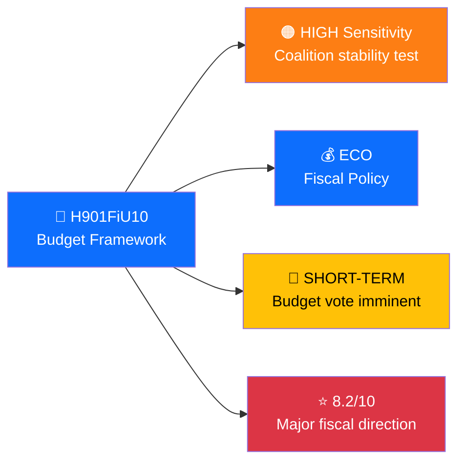
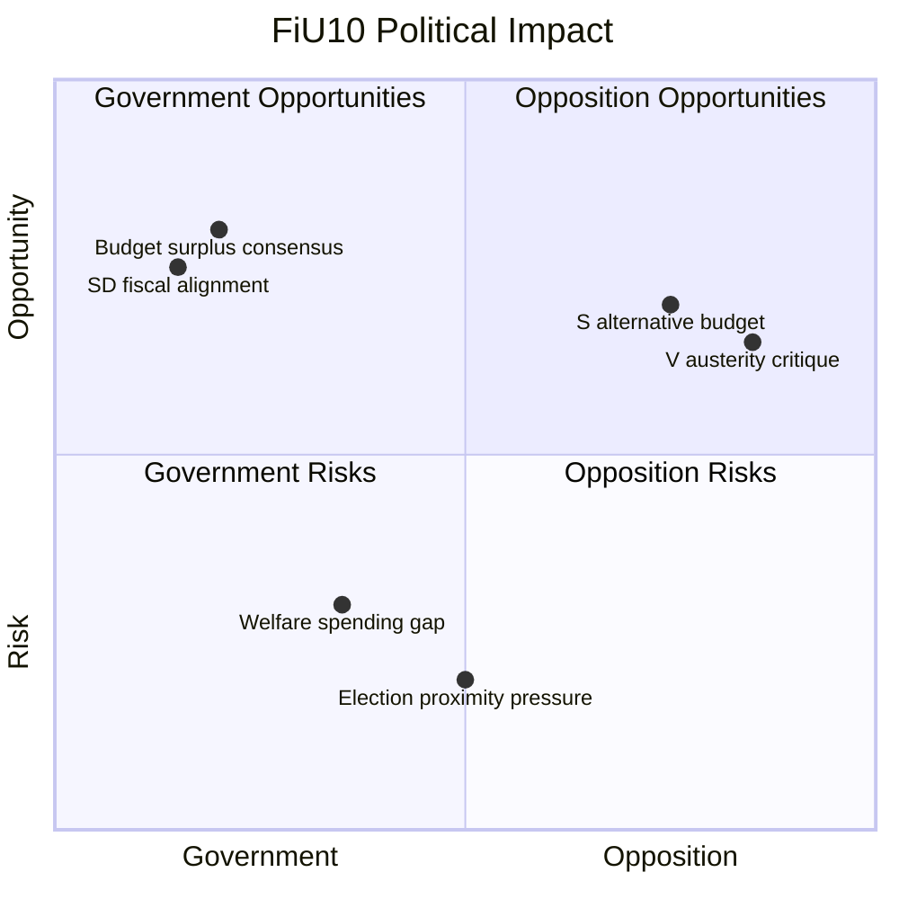

# Per-File Intelligence Analysis Prompt v2

<!-- version: 2.1.0 | updated: 2026-03-28 | author: Hack23 AB -->
<!-- Purpose: Instructs AI agents to perform deep per-file analysis of downloaded MCP data -->
<!-- Output: {id}.analysis.md alongside each data file in analysis/data/ -->

## Overview

You are performing **per-file political intelligence analysis** for Riksdagsmonitor. For each downloaded MCP data file, you will produce a comprehensive analysis markdown file stored alongside the data. This replaces the old batch daily analysis with deeper, evidence-based, per-document intelligence.

**Quality Standard:** Every analysis file must match the formatting quality of [SWOT.md](../../SWOT.md) and [THREAT_MODEL.md](../../THREAT_MODEL.md) — rich headers, color-coded Mermaid diagrams, evidence tables, and confidence labels.

> ⚠️ **CRITICAL:** You must **read the actual JSON data** in each file and base your analysis on what you find there. Do NOT write generic template text. Every claim must reference specific data from the file. If the file contains a vote record, cite the actual vote counts. If it's a proposition, cite the actual title and proposer. Empty or boilerplate analysis is a failure.

---

## Required Reading (Before Analyzing ANY File)

Before starting analysis, you **MUST** read and internalize these methodology documents. Use the `view` tool or `cat` command to read each file fully:

1. **`analysis/methodologies/ai-driven-analysis-guide.md`** — Master per-file analysis guide
2. **`analysis/methodologies/political-swot-framework.md`** — Evidence hierarchy, confidence levels, temporal decay
3. **`analysis/methodologies/political-risk-methodology.md`** — 5×5 risk matrix, calibration examples
4. **`analysis/methodologies/political-threat-framework.md`** — STRIDE political adaptation, severity calibration
5. **`analysis/methodologies/political-classification-guide.md`** — Sensitivity and domain taxonomy
6. **`analysis/methodologies/political-style-guide.md`** — Writing standards, prohibited patterns
7. **`analysis/templates/per-file-political-intelligence.md`** — Output template (fill ALL fields)

### Additional Context via MCP (When Available)

Use MCP tools to enrich your analysis with contextual data:
- **`search_voteringar`** — Find related voting records to cross-reference
- **`search_dokument`** — Find related documents (amendments, committee reports)
- **`search_anforanden`** — Find speeches referencing this document
- **`search_ledamoter`** — Get party affiliations and committee assignments
- **World Bank / SCB** — Economic context for fiscal policy documents

---

## Step-by-Step Protocol

### Step 1: Get the Catalog

```bash
npx tsx scripts/catalog-downloaded-data.ts --pending-only
```

This returns a JSON catalog. Each entry has:
- `id` — file identifier (e.g., `H901FiU10`)
- `type` — document type (propositions, motions, votes, etc.)
- `path` — path to the JSON data file
- `analysisPath` — where to write the analysis markdown
- `meta` — sidecar metadata (fetch timestamp, source tool)

### Step 2: For Each Pending File

**Read the actual JSON data file** using `view` or `cat`, then apply the full analysis framework based on what you find:

#### 2a. Extract Key Information

| Document Type | Key Fields to Extract |
|--------------|----------------------|
| **Propositions** | `dok_id`, `titel`, `rm`, `organ`, `datum`, `undertitel`, `summary` |
| **Motions** | `dok_id`, `titel`, `parti`, `rm`, `undertitel` |
| **Committee Reports** | `dok_id`, `titel`, `organ`, `rm`, `reservationer` |
| **Votes** | `votering_id`, `datum`, `ja`, `nej`, `avstar`, `franvarande`, `punkt` |
| **Speeches** | `anforande_id`, `talare`, `parti`, `debattnamn`, `anforandetext` |
| **Questions** | `dok_id`, `titel`, `parti`, `mottagare`, `svar` |
| **Interpellations** | `dok_id`, `titel`, `parti`, `mottagare`, `status` |
| **Government Docs** | `title`, `type`, `department`, `date`, `url` |
| **World Bank** | `indicator`, `country`, `date`, `value` |
| **SCB** | `table_id`, `variables`, `values` |

#### 2b. Apply Political Classification

Determine:
- **Sensitivity Level**: CRITICAL / HIGH / MEDIUM / LOW
- **Primary Domain**: MIG, DEF, ECO, ENV, JUS, HEA, EDU, FOR, etc.
- **Urgency**: IMMEDIATE / SHORT-TERM / MEDIUM-TERM / LONG-TERM
- **Significance Score**: 0–10

Use the classification decision tree from `political-classification-guide.md`.

#### 2c. Generate SWOT Impact

For each document, assess impact on:
1. **Government coalition** (M + KD + L + SD support)
2. **Opposition** (S, V, MP, C)

Each SWOT entry MUST have:
- Evidence (dok_id or statistical reference)
- Confidence level (HIGH / MEDIUM / LOW)
- Impact level (HIGH / MEDIUM / LOW)

**No opinion-based entries.** If you cannot find evidence, note "Insufficient evidence" rather than speculating.

#### 2d. Risk Assessment

Apply the 5×5 Likelihood × Impact matrix:
- **Coalition Stability Risk** — does this threaten SD support agreement?
- **Policy Implementation Risk** — can the government deliver on this?
- **Electoral Risk** — how does this affect 2026 election positioning?
- **Democratic Process Risk** — any institutional or procedural concerns?

#### 2e. STRIDE Threat Analysis

Map to political STRIDE categories (only where applicable — not every document has threats):
- 🎭 **Spoofing** → Misrepresentation of political positions
- 🔧 **Tampering** → Process manipulation, rule bending
- 📝 **Repudiation** → Accountability evasion, position reversal
- 🔓 **Info Disclosure** → Premature intelligence leaks
- 🚫 **Denial of Service** → Parliamentary obstruction
- ⬆️ **Elevation** → Executive overreach

#### 2f. Stakeholder Impact Matrix

Apply all 6 analytical lenses:
1. 🏛️ Government — coalition stability, policy agenda
2. ⚖️ Opposition — scrutiny opportunities, policy alternatives
3. 👥 Citizens — service impact, rights, daily life
4. 💰 Economic — fiscal, business, labour market
5. 🌍 International — EU, Nordic, foreign policy
6. 📰 Media — newsworthiness, narrative potential

#### 2g. Forward Indicators

List 1–3 specific things to monitor as consequences of this document. Be specific:
- ❌ Bad: "Monitor the situation"
- ✅ Good: "Watch for SD floor vote on budget motion FiU10 (expected week 14)"

### Step 3: Write Analysis File

Write the completed analysis to `{analysisPath}` using the per-file-political-intelligence template. Ensure:

- All `[REQUIRED]` placeholders are replaced with actual analysis
- At least 1 Mermaid diagram uses document-specific data (not just template placeholders)
- Color-coded Mermaid styles follow the convention:
  ```
  style X fill:#dc3545,color:#fff   /* Red — critical */
  style X fill:#fd7e14,color:#fff   /* Orange — high */
  style X fill:#ffc107,color:#000   /* Yellow — medium */
  style X fill:#28a745,color:#fff   /* Green — low/good */
  style X fill:#0d6efd,color:#fff   /* Blue — info */
  style X fill:#6f42c1,color:#fff   /* Purple — special */
  ```

### Step 4: Compose Synthesis

After analyzing all pending files, compose the daily synthesis:

1. Read all `.analysis.md` files from the analysis period
2. Rank documents by significance score
3. Aggregate SWOT entries per the aggregation rules in `political-swot-framework.md`
4. Compute overall risk landscape
5. Write to `analysis/daily/YYYY-MM-DD/synthesis-summary.md`

---

## Quality Checklist (Self-Assessment)

Before finalizing each analysis file, verify:

| # | Check | Pass? |
|---|-------|:-----:|
| 1 | Executive summary is intelligence-level (not surface) | ☐ |
| 2 | ≥ 3 evidence points with dok_id or source | ☐ |
| 3 | Every analytical claim has confidence label | ☐ |
| 4 | At least 1 Mermaid diagram with document-specific data | ☐ |
| 5 | SWOT has at least 2 filled quadrants | ☐ |
| 6 | Risk matrix has numeric scores | ☐ |
| 7 | Forward indicators are specific and actionable | ☐ |
| 8 | All `[REQUIRED]` placeholders are replaced | ☐ |
| 9 | Politicians named with party abbreviation | ☐ |
| 10 | No boilerplate or generic text | ☐ |

**Minimum passing score: 8/10**

---

## Prohibited Patterns

❌ Empty tables with `[REQUIRED]` placeholders still present
❌ Generic text like "This is significant because..." without evidence
❌ SWOT entries without dok_id or source reference
❌ Missing confidence labels on analytical claims
❌ Batch summaries that don't reference individual documents
❌ Re-running analysis on files that already have `.analysis.md`
❌ Template-only Mermaid diagrams (must contain real data)
❌ Unattributed political claims ("many believe...")

---

## Integration Notes

- **Catalog script**: `scripts/catalog-downloaded-data.ts`
- **Data download**: `scripts/populate-analysis-data.ts` (unchanged — scripts for downloading OK)
- **Template**: `analysis/templates/per-file-political-intelligence.md`
- **Methodology**: `analysis/methodologies/ai-driven-analysis-guide.md`
- **Output location**: `analysis/data/{type}/{id}.analysis.md` (next to `{id}.json`)
- **Daily synthesis**: `analysis/daily/YYYY-MM-DD/synthesis-summary.md` (composed from per-file analyses)

---

## Appendix: Filled Example — What a Completed Analysis Looks Like

Below is a **concrete example** of what a completed per-file analysis should look like for a proposition. Note: all data is derived from reading the actual JSON file — no boilerplate text.

---

### Example: Budget Proposition Analysis (H901FiU10)

<p align="center">
  
</p>

<h3 align="center">🔍 Political Intelligence Analysis: Budget Framework Proposition</h3>

<p align="center">
  <a href="#"></a>
  <a href="#"></a>
  <a href="#"></a>
  <a href="#"></a>
</p>

#### 📋 Document Identity

| Field | Value |
|-------|-------|
| **Document ID** | `H901FiU10` |
| **Document Type** | Committee Report (bet) |
| **Title** | Riktlinjer för den ekonomiska politiken |
| **Date** | 2026-03-15 |
| **Riksmöte** | 2025/26 |
| **Committee** | Finansutskottet (FiU) |
| **Source MCP Tool** | `search_dokument(doktyp=bet, organ=FiU)` |
| **Analysis Timestamp** | 2026-03-28 18:00 UTC |
| **Analyst** | news-evening-analysis |

#### 🎯 Executive Summary

The Finance Committee's budget framework report (FiU10) sets fiscal guidelines for 2027–2029 with a projected surplus target of 0.33% of GDP. The report passed with coalition support (M+KD+L) and SD backing on the main budget line, but 3 reservations were filed by S, V, and MP respectively challenging the austerity framing. **[HIGH confidence]** This signals stable coalition governance on fiscal matters but exposes vulnerability on welfare spending priorities as the 2026 election approaches.

#### 📊 Political Classification



#### 💪 SWOT Impact Assessment



| Quadrant | Statement | Evidence | Confidence | Impact |
|----------|-----------|----------|:----------:|:------:|
| ✅ Gov Strength | Coalition + SD aligned on fiscal framework | FiU10 vote: 176 Ja vs 173 Nej | **H** | **H** |
| ⚠️ Gov Weakness | Welfare spending cuts expose electoral vulnerability | 3 reservations filed (S, V, MP) | **H** | **M** |
| 🚀 Opp Opportunity | S presents alternative budget narrative for election | S reservation proposes +15B SEK welfare | **M** | **H** |
| 🔴 Gov Threat | Pre-election fiscal tightening risks voter backlash | SCB: consumer confidence declining Q1 | **M** | **M** |

#### ⚖️ Risk Assessment

| Risk Type | Likelihood (1–5) | Impact (1–5) | Score | Assessment |
|-----------|:-----------------:|:------------:|:-----:|------------|
| Coalition Stability | 2 | 3 | **6** | SD supported main line; minor risk from welfare debate |
| Policy Implementation | 3 | 4 | **12** | Budget surplus target ambitious given economic headwinds |
| Budget / Fiscal | 2 | 4 | **8** | Surplus target credible but depends on employment growth |
| Electoral Impact | 4 | 3 | **12** | Opposition has clear attack line on welfare for 2026 campaign |
| Democratic Process | 1 | 2 | **2** | Standard committee process with full reservation rights |

**Overall Risk Level:** 🟠 HIGH (Policy and Electoral risks both elevated)

#### 🔮 Forward Indicators

| # | Indicator | Timeline | Trigger Condition | Priority |
|---|-----------|----------|-------------------|:--------:|
| 1 | SD response to S welfare alternative budget | 2 weeks | If SD signals sympathy → coalition instability | 🟠 |
| 2 | Riksdag plenary vote on FiU10 | Week 14 | Watch margin — if <175 Ja → crisis | 🔴 |
| 3 | SCB employment data Q1 2026 | April 2026 | If unemployment rises → budget surplus target at risk | 🟡 |

---

> **Key takeaway for the AI agent:** Notice how every claim in this example cites specific data (vote counts, document IDs, reservation details, SCB data). The Mermaid diagrams contain real data points, not placeholders. This is the minimum quality standard.
